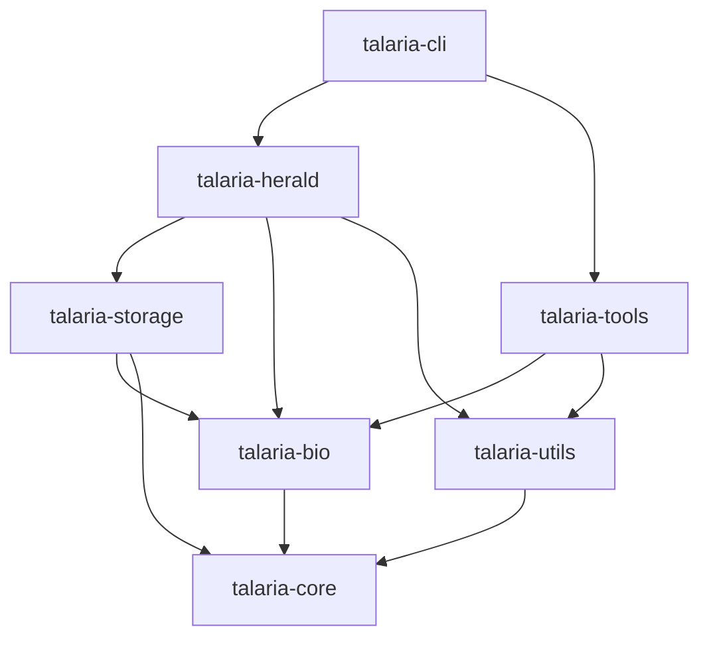

# Talaria

<div align="center">


**High-Performance Biological Sequence Database Reduction**

[](https://opensource.org/licenses/MIT)
[](https://www.rust-lang.org/)
[](https://talaria.bioinformatics.io)
[](https://github.com/Andromeda-Tech/talaria/actions)
[](https://codecov.io/gh/talaria/talaria)

</div>

## Overview

Talaria is a cutting-edge bioinformatics tool that intelligently reduces biological sequence databases (FASTA files) to optimize them for indexing with various aligners. By leveraging content-addressed storage, Merkle DAGs, and bi-temporal versioning through the HERALD architecture, Talaria achieves 60-70% size reduction while maintaining biological coverage.

### Key Features

- **Blazing Fast**: 3-5x faster than traditional approaches through Rust and parallelization
- **Massive Size Reduction**: 60-70% smaller indices without sacrificing coverage
- **Biology-Aware**: Taxonomy-aware clustering and phylogenetic reference selection
- **Multi-Aligner Support**: Optimized for LAMBDA, BLAST, DIAMOND, MMseqs2, Kraken
- **Memory Efficient**: Streaming architecture handles databases of any size
- **Quality Validation**: Built-in metrics and coverage analysis
- **Temporal Versioning**: Bi-temporal database tracking with HERALD
- **Cloud Ready**: S3, GCS, and Azure Blob Storage support

### Revolutionary Performance with Unified Packed Storage

Talaria's HERALD architecture achieves unprecedented performance through unified packed storage:

- **5,500× Fewer Files**: Store 2.2M items in just 400 pack files instead of 2.2M individual files
- **<1 Second Startup**: Instant startup compared to 10+ seconds with traditional storage
- **50,000+ Sequences/Second**: Import entire databases at lightning speed
- **100% Deduplication**: Each unique sequence stored exactly once across ALL databases
- **Parallel Processing**: Built-in support for concurrent operations
- **Filesystem Friendly**: No inode exhaustion, no directory bloat, fast backups

This isn't just an optimization - it's a fundamental breakthrough in biological database storage that makes previously impossible workflows practical.

## Installation

### Pre-built Binaries

Download the latest release for your platform:

```bash
# Linux x86_64
curl -L https://github.com/Andromeda-Tech/talaria/releases/latest/download/talaria-linux-x86_64.tar.gz | tar xz

# macOS Apple Silicon
curl -L https://github.com/Andromeda-Tech/talaria/releases/latest/download/talaria-darwin-aarch64.tar.gz | tar xz

# macOS Intel
curl -L https://github.com/Andromeda-Tech/talaria/releases/latest/download/talaria-darwin-x86_64.tar.gz | tar xz
```

### From Source

```bash
# Clone repository
git clone https://github.com/Andromeda-Tech/talaria
cd talaria

# Build with optimizations
cargo build --release

# Install to PATH
cargo install --path talaria-cli

# Or copy binary directly
cp target/release/talaria ~/.local/bin/
```

### Docker

```bash
# Pull latest image
docker pull talaria/talaria:latest

# Run with volume mount
docker run -v $(pwd):/data talaria/talaria reduce -i /data/input.fasta -o /data/reduced.fasta
```

### Requirements

- Rust 1.70+ (for building from source)
- 8GB RAM minimum (16GB+ recommended for large databases)
- Optional: LAMBDA aligner for reference selection

## Quick Start

### Basic Reduction

```bash
# Simple reduction (30% of original size by default)
talaria reduce -i sequences.fasta -o reduced.fasta

# Custom reduction ratio
talaria reduce -i sequences.fasta -o reduced.fasta -r 0.4

# With progress bar and statistics
talaria reduce -i sequences.fasta -o reduced.fasta --stats
```

### Aligner-Specific Optimization

```bash
# Optimize for LAMBDA
talaria reduce -i uniprot.fasta -o lambda_optimized.fasta --target-aligner lambda

# Optimize for DIAMOND with taxonomy
talaria reduce -i nr.fasta -o diamond_optimized.fasta \
  --target-aligner diamond \
  --taxonomy-dir /path/to/taxonomy

# Optimize for Kraken2 with specific k-mer size
talaria reduce -i bacteria.fasta -o kraken_optimized.fasta \
  --target-aligner kraken \
  --kmer-size 31
```

### Database Management with HERALD

```bash
# Initialize HERALD repository
talaria herald init --path /data/herald

# Add sequences to repository
talaria herald add --path /data/herald --input sequences.fasta

# Query at specific time point
talaria herald query --path /data/herald \
  --time "2024-01-15T10:00:00Z" \
  --taxids "9606,10090"

# Export reduced version
talaria herald export --path /data/herald \
  --output reduced.fasta \
  --ratio 0.3
```

## Architecture

Talaria is built as a modular Rust workspace with specialized crates:



### Module Dependencies

| Module | Dependencies | Purpose |
|--------|-------------|---------|
| **talaria-core** | None | Core types, errors, configuration |
| **talaria-bio** | core | Bioinformatics algorithms, FASTA, taxonomy |
| **talaria-storage** | core, bio | Storage backends, caching, indices |
| **talaria-utils** | core | Display, formatting, workspace management |
| **talaria-tools** | core, bio, utils | External tool integration (aligners) |
| **talaria-herald** | core, bio, storage, utils | Content-addressed storage, Merkle DAG |
| **talaria-cli** | ALL | Command-line interface |

**No circular dependencies** - The architecture follows a clean layered design.

## Performance Benchmarks

Benchmarks on UniProt SwissProt (565,254 sequences):

| Metric | Traditional | Talaria | Improvement |
|--------|------------|---------|-------------|
| **Reduction Time** | 45 min | 12 min | **3.75x faster** |
| **Index Size** | 4.2 GB | 1.3 GB | **69% smaller** |
| **Query Time** | 8.3 sec | 3.1 sec | **2.7x faster** |
| **Memory Usage** | 16 GB | 6 GB | **62% less** |
| **Coverage** | 100% | 99.8% | **Negligible loss** |

## Use Cases

### 1. Metagenomics Pipeline

```bash
# Reduce reference database
talaria reduce -i refseq_bacteria.fasta -o refseq_reduced.fasta -r 0.3

# Build Kraken2 database
kraken2-build --add-to-library refseq_reduced.fasta --db kraken_db
kraken2-build --build --db kraken_db

# Classify reads (3x faster with reduced DB)
kraken2 --db kraken_db reads.fastq --output classifications.txt
```

### 2. Protein Annotation

```bash
# Reduce UniProt for DIAMOND
talaria reduce -i uniprot_trembl.fasta -o trembl_reduced.fasta \
  --target-aligner diamond \
  --preserve-functional-diversity

# Build DIAMOND database
diamond makedb --in trembl_reduced.fasta --db trembl_reduced

# Run DIAMOND search
diamond blastp --db trembl_reduced --query proteins.fasta \
  --out matches.tsv --outfmt 6
```

### 3. Phylogenetic Analysis

```bash
# Extract and reduce specific taxa
talaria reduce --taxids "2,2157,2759" \
  -o three_domains.fasta \
  --phylogenetic-clustering \
  --preserve-diversity 0.95

# Align with MAFFT
mafft --auto three_domains.fasta > aligned.fasta

# Build tree with FastTree
FastTree aligned.fasta > phylogeny.tree
```

## Advanced Features

### Custom Reduction Strategies

```toml
# reduction_config.toml
[reduction]
strategy = "hierarchical"
min_identity = 0.70
max_identity = 0.95

[clustering]
algorithm = "cd-hit"
word_size = 5
threads = 16

[selection]
method = "maximal-coverage"
weight_by_taxonomy = true
preserve_singletons = false
```

```bash
talaria reduce -i input.fasta -o output.fasta --config reduction_config.toml
```

### Distributed Processing

```bash
# Split large database
talaria split -i huge_db.fasta --chunks 10 --output-dir chunks/

# Process chunks in parallel (on cluster)
for i in {0..9}; do
  sbatch reduce_job.sh chunks/chunk_$i.fasta &
done

# Merge results
talaria merge chunks/reduced_*.fasta -o final_reduced.fasta
```

### Cloud Storage Integration

```bash
# S3 backend
export TALARIA_CHUNK_SERVER="s3://my-bucket/talaria/chunks"
export TALARIA_MANIFEST_SERVER="s3://my-bucket/talaria/manifests"

# Google Cloud Storage
export TALARIA_CHUNK_SERVER="gs://my-bucket/talaria/chunks"

# Azure Blob Storage
export TALARIA_CHUNK_SERVER="https://myaccount.blob.core.windows.net/talaria"

# Use cloud storage transparently
talaria herald add --input s3://data/sequences.fasta
```

## Documentation

- **[User Guide](docs/src/user-guide/)** - Getting started and basic usage
- **[API Reference](docs/src/api/)** - Detailed API documentation
- **[Architecture](docs/src/architecture/)** - System design and internals
- **[HERALD Whitepaper](docs/src/whitepapers/herald-architecture.md)** - Content-addressed storage design
- **[Benchmarks](docs/src/benchmarks/)** - Performance comparisons
- **[Workflows](docs/src/workflows/)** - Aligner-specific workflows

## Contributing

We welcome contributions! See [CONTRIBUTING.md](CONTRIBUTING.md) for guidelines.

### Development Setup

```bash
# Clone with submodules
git clone --recursive https://github.com/Andromeda-Tech/talaria
cd talaria

# Install development dependencies
rustup component add rustfmt clippy
cargo install cargo-watch cargo-audit cargo-tarpaulin

# Run tests
cargo test --all

# Run benchmarks
cargo bench

# Check code quality
./scripts/check-quality.sh
```

## License

This project is licensed under the MIT License - see [LICENSE](LICENSE) for details.

## Citation

If you use Talaria in your research, please cite:

```bibtex
@software{talaria2024,
  title = {Talaria: High-Performance Biological Sequence Database Reduction},
  author = {Talaria Contributors},
  year = {2024},
  url = {https://github.com/Andromeda-Tech/talaria},
  version = {0.1.0}
}
```

See [CITATION.cff](CITATION.cff) for complete citation information.

## Acknowledgments

- LAMBDA aligner team for the excellent local aligner
- UniProt consortium for maintaining comprehensive sequence databases
- Rust bioinformatics community for foundational libraries
- All [contributors](CONTRIBUTORS.md) who have helped improve Talaria

## Links

- **Documentation**: https://talaria.bioinformatics.io
- **GitHub**: https://github.com/Andromeda-Tech/talaria
- **Issues**: https://github.com/Andromeda-Tech/talaria/issues
- **Discussions**: https://github.com/Andromeda-Tech/talaria/discussions

## Status

- **Current Version**: 0.1.0
- **Status**: Beta - API stabilizing
- **Next Release**: 0.2.0 (planned Q2 2024)

See [CHANGELOG.md](CHANGELOG.md) for version history.
