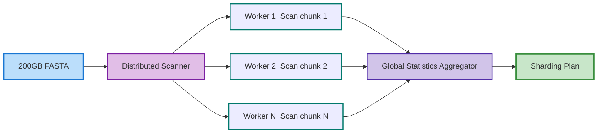
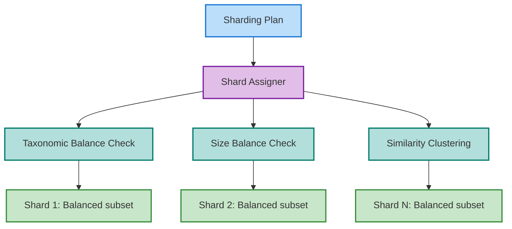
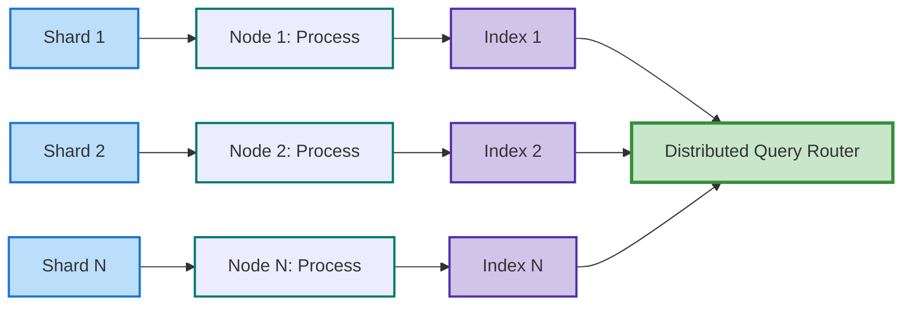

# Distributed Processing Design

## Overview

Processing massive FASTA files (200GB+) requires distributed computing strategies that respect biological constraints. Unlike generic data processing, biological sequence databases cannot be arbitrarily sharded without affecting alignment accuracy and statistical significance.

## The Challenge

### Scale Issues
- **Memory constraints**: A 200GB FASTA file may expand to 500GB+ in memory during processing
- **Index size**: LAMBDA/BLAST indices can be 2-3x the size of input data
- **Processing time**: Single-node processing may take days for large databases

### Biological Constraints
- **Taxonomic balance**: Random sharding creates severe imbalances
  - Example: Shard A gets 90% E. coli sequences, Shard B gets 0.0001%
  - This skews E-values, bit scores, and statistical significance
- **Sequence similarity clusters**: Related sequences should ideally stay together
- **Database composition affects scoring**: BLAST E-values depend on database size and composition

## Proposed Solution: Biology-Aware Sharding

### 1. Taxonomic-Balanced Sharding

```rust
pub struct TaxonomicShardStrategy {
    // Ensure each shard has representative taxonomic diversity
    target_shards: usize,
    min_taxa_per_shard: usize,
    balance_threshold: f64, // Max deviation from uniform distribution
}
```

**Algorithm:**
1. Pre-scan: Build taxonomic profile of entire database
2. Create taxonomic bins at appropriate level (genus/family)
3. Distribute bins across shards maintaining diversity
4. Use consistent hashing for deterministic shard assignment

### 2. Similarity-Preserving Sharding

```rust
pub struct SimilarityShardStrategy {
    // Keep similar sequences together for better compression
    clustering_threshold: f64,
    min_cluster_size: usize,
    max_shard_size: usize,
}
```

**Benefits:**
- Better delta encoding within shards
- Improved cache locality during alignment
- Reduced redundancy across shards

### 3. Statistical Correction Framework

```rust
pub struct ShardedStatistics {
    // Maintain global statistics across all shards
    global_db_size: u64,
    global_composition: HashMap<TaxonId, f64>,
    shard_correction_factors: Vec<f64>,
}
```

**E-value Correction:**
```
E_corrected = E_shard * (N_global / N_shard) * composition_factor
```

## Implementation Architecture

### Phase 1: Distributed Scanning


### Phase 2: Smart Sharding


### Phase 3: Parallel Processing


## Shard Assignment Strategies

### 1. MinHash-based Assignment
```rust
pub fn assign_sequence_to_shard(seq: &Sequence, k: usize, num_shards: usize) -> ShardId {
    let sketch = minhash_sketch(seq, k, 128);
    let shard = consistent_hash(sketch) % num_shards;
    
    // Check balance constraints
    if shard_is_overloaded(shard) {
        find_next_available_shard(sketch, num_shards)
    } else {
        shard
    }
}
```

### 2. Taxonomic Round-Robin
```rust
pub fn distribute_by_taxonomy(sequences: &[Sequence], num_shards: usize) -> Vec<ShardAssignment> {
    // Group by taxonomy
    let mut taxon_groups = group_by_taxonomy(sequences);
    
    // Sort by group size (largest first)
    taxon_groups.sort_by_key(|g| g.len()).reverse();
    
    // Round-robin assignment with load balancing
    let mut assignments = Vec::new();
    let mut shard_sizes = vec![0; num_shards];
    
    for group in taxon_groups {
        let target_shard = shard_sizes.iter().position_min().unwrap();
        assignments.push(ShardAssignment {
            sequences: group,
            shard_id: target_shard,
        });
        shard_sizes[target_shard] += group.len();
    }
    
    assignments
}
```

## Query Processing in Sharded Environment

### Distributed Query Coordination
```rust
pub struct DistributedQueryCoordinator {
    shard_indices: Vec<ShardIndex>,
    statistics_aggregator: StatisticsAggregator,
}

impl DistributedQueryCoordinator {
    pub async fn search(&self, query: &Sequence) -> Vec<Alignment> {
        // Parallel search across all shards
        let shard_results = futures::future::join_all(
            self.shard_indices.iter().map(|shard| {
                shard.search_async(query)
            })
        ).await;
        
        // Merge and re-score with global statistics
        let merged = self.merge_results(shard_results);
        self.apply_statistical_correction(merged)
    }
}
```

## Challenges and Solutions

### Challenge 1: Shard Boundary Effects
**Problem**: Sequences at shard boundaries may miss potential alignments.
**Solution**: Implement overlap regions or cross-shard verification for boundary sequences.

### Challenge 2: Load Imbalance
**Problem**: Some taxonomic groups are much larger than others.
**Solution**: Implement dynamic shard splitting for oversized groups.

### Challenge 3: Statistical Accuracy
**Problem**: Local E-values don't reflect global database properties.
**Solution**: Maintain global statistics service that all shards query.

## Configuration Example

```toml
[distributed]
enabled = true
num_shards = 16
max_shard_size_gb = 20

[sharding]
strategy = "taxonomic-balanced"
min_taxa_per_shard = 100
balance_threshold = 0.2
overlap_size_mb = 100

[statistics]
maintain_global = true
correction_method = "compositional"
cache_statistics = true

[cluster]
coordinator = "node1.cluster.local:8080"
workers = [
    "node2.cluster.local:8081",
    "node3.cluster.local:8082",
    "node4.cluster.local:8083",
]
```

## Performance Considerations

### Expected Improvements
- **Memory**: 200GB / 16 shards = ~12.5GB per node (manageable)
- **Speed**: Near-linear scaling with proper load balancing
- **Accuracy**: Maintained through statistical correction

### Trade-offs
- **Complexity**: Significant infrastructure requirements
- **Network overhead**: Cross-shard communication for statistics
- **Storage**: Temporary storage for intermediate results

## Future Research Directions

1. **Adaptive Sharding**: Dynamically adjust shard boundaries based on query patterns
2. **Hierarchical Indices**: Multi-level sharding for extremely large databases (TB+)
3. **GPU Acceleration**: Combine distributed CPU processing with GPU acceleration
4. **Streaming Processing**: Process sequences in streaming fashion without full materialization
5. **Cloud-Native Design**: Kubernetes operators for automatic scaling

## Implementation Roadmap

### Phase 1: Foundation (v0.2.0)
- [ ] Basic sharding infrastructure
- [ ] Simple round-robin distribution
- [ ] Local statistics tracking

### Phase 2: Biology-Aware (v0.3.0)
- [ ] Taxonomic sharding
- [ ] Global statistics service
- [ ] E-value correction

### Phase 3: Production-Ready (v0.4.0)
- [ ] Distributed query coordination
- [ ] Fault tolerance
- [ ] Auto-scaling

### Phase 4: Advanced Features (v0.5.0)
- [ ] Similarity-based sharding
- [ ] Cross-shard optimization
- [ ] Real-time rebalancing

## References

1. Altschul, S.F., et al. (1997). "Gapped BLAST and PSI-BLAST"
2. Buchfink, B., et al. (2021). "Sensitive protein alignments at tree-of-life scale using DIAMOND"
3. Steinegger, M., Söding, J. (2017). "MMseqs2 enables sensitive protein sequence searching"
4. Cloud-BLAST: Combining MapReduce and Virtualization on Distributed Resources