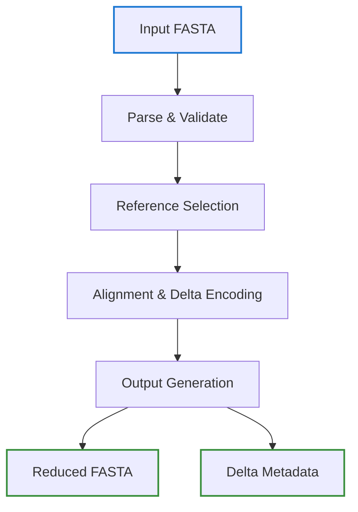
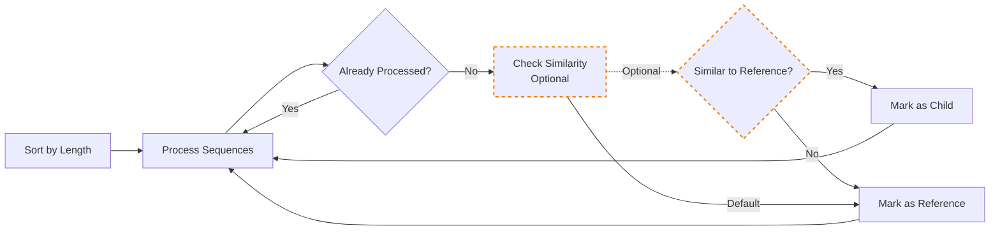
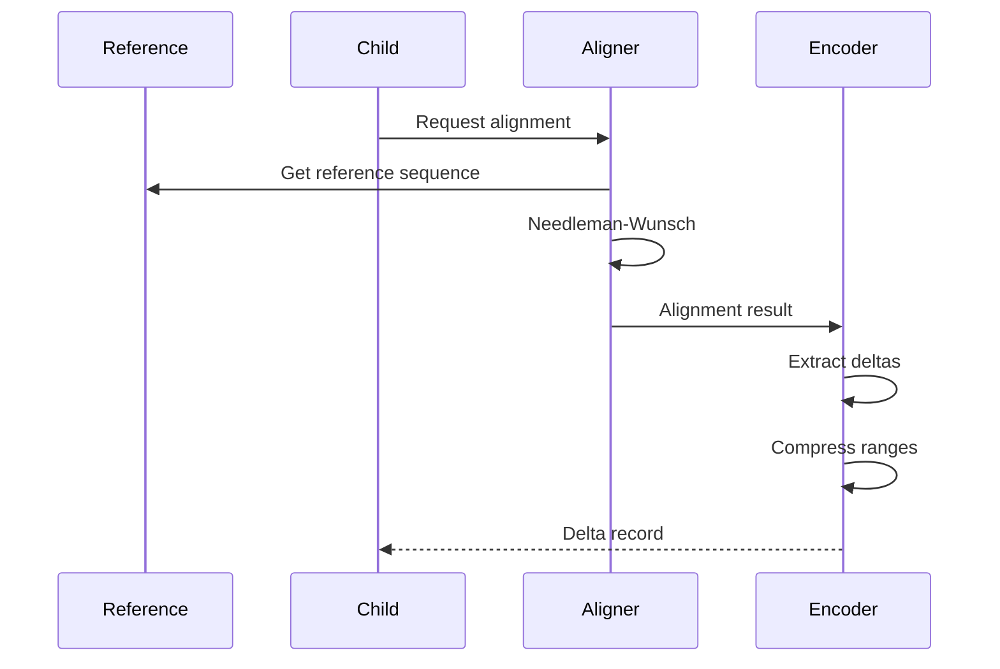

# Reduction Algorithm

The core of Talaria is its intelligent reduction algorithm that selects representative sequences and encodes similar sequences as deltas.

## Overview

The reduction process consists of four main phases:



## Phase 1: Parse and Validate

The input FASTA file is parsed with these steps:

1. **Memory-mapped I/O** for efficient reading
2. **Parallel parsing** for large files
3. **Sequence validation** and sanitization
4. **Taxonomy extraction** from headers

```rust
// Efficient parallel parsing
let sequences = parse_fasta_parallel(input_path, chunk_size)?;

// Validate sequences
sequences.par_iter()
    .filter(|seq| seq.len() >= min_length)
    .collect()
```

## Phase 2: Reference Selection

### Default Behavior

By default, references are selected using a simple greedy algorithm based on sequence length (matching original db-reduce):


### Optional: Advanced Selection

With optional flags, more sophisticated selection is available:



### Selection Strategy

#### Default (Simple Greedy)
1. **Sort sequences** by length (descending)
2. **Select top N%** as references (based on reduction ratio)
3. **Assign remaining** sequences to closest reference by length

#### Optional (Advanced)
Enable with `--similarity-threshold` or `--align-select` flags:
1. **Sort sequences** by length (descending)
2. **Iterate through sequences**:
   - Skip if already processed
   - Check similarity to existing references (Optional)
   - If similar: mark as child of reference
   - If unique: mark as new reference
3. **Continue until** target reduction ratio achieved

### Similarity Metrics

#### Default
- **Sequence length** - Only metric used by default

#### Optional Metrics
Enable with specific flags:

- **K-mer Jaccard similarity** for fast screening (Optional: `--similarity-threshold`)
- **Sequence length ratio** for quick filtering (Optional: used with similarity)
- **Full alignment** for accurate similarity (Optional: `--align-select`)
- **Taxonomic ID proximity** (Optional: `--taxonomy-aware`)
  - Note: Currently uses simple ID difference, not true taxonomic distance
  - Requires taxon IDs in FASTA headers (e.g., `OX=9606`)

## Phase 3: Alignment and Delta Encoding

Once references are selected, child sequences are aligned and encoded:



### Needleman-Wunsch Algorithm

The alignment uses Needleman-Wunsch with:

- **Affine gap penalties**: Gap open = 20, extend = 10
- **BLOSUM62** for proteins
- **Custom matrix** for nucleotides
- **Semi-global mode** for partial alignments

### Delta Compression

Consecutive mutations are compressed into ranges:

```
Original deltas: [10:A→T], [11:C→T], [12:G→T]
Compressed: [10-12:ACG→TTT]
```

This reduces metadata size significantly.

## Phase 4: Output Generation

The final phase generates output files:

1. **Reduced FASTA**: Contains only reference sequences
2. **Delta metadata**: Compact representation of children
3. **Reference mapping**: Links references to children
4. **Statistics report**: Reduction metrics

## Optimization Strategies

### Parallelization

- **Batch processing** of sequences
- **Parallel alignment** using Rayon
- **Concurrent I/O** operations
- **Lock-free data structures** (DashMap)

### Memory Efficiency

- **Streaming architecture** for large files
- **Memory-mapped I/O** reduces RAM usage
- **Incremental processing** prevents memory bloat
- **Cache management** for alignments

### Aligner-Specific Optimizations

Different aligners benefit from different strategies:

| Aligner | Default Strategy | Similarity Threshold | Taxonomy-Aware |
|---------|-----------------|---------------------|----------------|
| LAMBDA | Simple greedy | 0.0 (disabled) | No |
| BLAST | Simple greedy | 0.0 (disabled) | No |
| Kraken | Simple greedy | 0.0 (disabled) | No |
| Diamond | Simple greedy | 0.0 (disabled) | No |
| MMseqs2 | Simple greedy | 0.0 (disabled) | No |
| Generic | Simple greedy | 0.0 (disabled) | No |

**Note**: Advanced features can be enabled with flags:
- `--similarity-threshold 0.9` - Enable similarity-based clustering
- `--align-select` - Use full alignment for selection
- `--taxonomy-aware` - Consider taxonomic IDs (Optional)

## Performance Characteristics

### Time Complexity

- **Parsing**: O(n) where n = sequence count
- **Selection**: O(n log n) for sorting + O(n²) worst case
- **Alignment**: O(m×l²) where m = children, l = sequence length
- **Total**: O(n² × l²) worst case, O(n log n × l²) typical

### Space Complexity

- **Memory usage**: O(n × l) for sequences
- **Cache**: O(k) for k cached alignments
- **Output**: O(r + d) for r references + d deltas

## Configuration Parameters

Key parameters affecting reduction:

```toml
[reduction]
target_ratio = 0.3          # Target size (30% of original)
min_sequence_length = 50    # Minimum sequence length
max_delta_distance = 100    # Maximum alignment distance
similarity_threshold = 0.0  # Default: disabled (0.0 = no similarity check)
taxonomy_aware = false      # Default: disabled (Optional feature)
```

To enable optional features:
```toml
[reduction]
similarity_threshold = 0.9  # Optional: Enable similarity clustering
taxonomy_aware = true       # Optional: Use taxonomic IDs
```

## Quality Metrics

The algorithm maintains quality through:

1. **Sequence coverage**: >95% of original sequences represented
2. **Taxonomic coverage**: All major taxa preserved
3. **Alignment accuracy**: Minimal information loss
4. **K-mer preservation**: Critical for classification tools

## Example Results

Typical reduction on UniProt/SwissProt:

- **Input**: 565,928 sequences, 204 MB
- **Output**: 169,778 references (30%), 61 MB
- **Deltas**: 396,150 children encoded
- **Sequence coverage**: 99.8% (references + deltas cover input)
- **Taxonomic coverage**: 98.5% of unique taxa preserved
- **Size reduction**: 70% (file size reduced by 70%)
- **Time**: 12 minutes on 16 cores
- **Memory**: Peak 4.2 GB

## Further Reading

- [Reference Selection](./reference-selection.md) - Detailed selection algorithms
- [Delta Encoding](./delta-encoding.md) - Compression techniques
- [Performance Optimization](../advanced/performance.md) - Tuning for speed