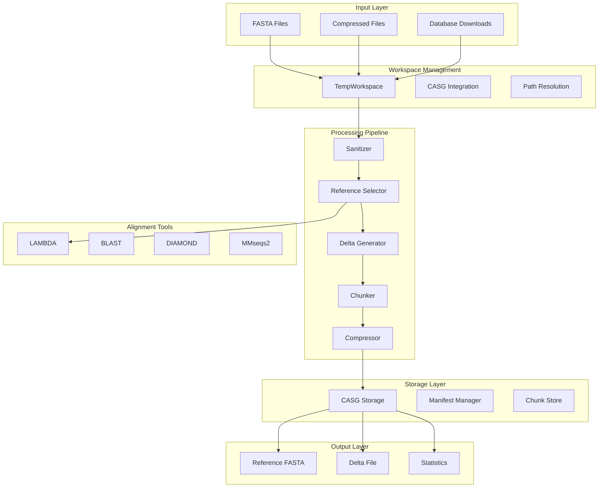

# Reduction Pipeline Architecture

## Overview

The Talaria reduction pipeline is a sophisticated multi-stage system that transforms large sequence databases into compact, efficient representations. This document provides a detailed technical view of the pipeline architecture, component interactions, and data flow.

## System Architecture



## Component Details

### 1. Workspace Management (`src/utils/temp_workspace.rs`)

The workspace system provides isolated, tracked environments for each reduction operation:

```rust
pub struct TempWorkspace {
    pub id: String,                  // Unique workspace identifier
    pub root: PathBuf,               // Root path: ${TALARIA_HOME}/casg/temporal/{id}
    config: WorkspaceConfig,         // Configuration options
    had_error: bool,                 // Error tracking for preservation
    metadata: WorkspaceMetadata,     // Operation metadata
}

impl TempWorkspace {
    pub fn new(command: &str) -> Result<Self> {
        let talaria_home = crate::core::paths::talaria_home();
        let casg_root = talaria_home.join("casg");
        // Creates structured directory hierarchy
        // Initializes metadata tracking
        // Returns workspace handle
    }

    pub fn get_path(&self, component: &str) -> PathBuf {
        // Returns path for specific component
        // e.g., "alignments" -> workspace/alignments/
    }

    pub fn get_iteration_path(&self, iteration: usize, filename: &str) -> PathBuf {
        // Returns path for iteration-specific files
        // e.g., workspace/alignments/iterations/iter_001/results.m8
    }
}
```

**Key Features**:
- Automatic cleanup on drop (RAII pattern)
- Preservation on failure for debugging
- Metadata tracking for analysis
- Thread-safe with Arc<Mutex> wrapper

### 2. Sanitization Module (`src/processing/sanitizer.rs`)

Ensures data quality before processing:

```rust
pub struct Sanitizer {
    min_length: usize,
    max_length: Option<usize>,
    remove_duplicates: bool,
    validate_alphabet: bool,
}

impl Sanitizer {
    pub fn sanitize(&self, sequences: Vec<Sequence>) -> SanitizationResult {
        sequences.into_par_iter()
            .filter(|seq| self.validate_sequence(seq))
            .filter(|seq| seq.len() >= self.min_length)
            .filter(|seq| self.max_length.map_or(true, |max| seq.len() <= max))
            .collect()
    }

    fn validate_sequence(&self, seq: &Sequence) -> bool {
        // Check for valid amino acid or nucleotide characters
        // Validate header format
        // Remove sequences with too many ambiguous characters
    }
}
```

### 3. Reference Selection (`src/core/reference_selector.rs`)

The heart of the reduction algorithm:

```rust
pub struct ReferenceSelector {
    selection_algorithm: SelectionAlgorithm,
    similarity_threshold: f64,
    workspace: Arc<Mutex<TempWorkspace>>,
    aligner: Option<Box<dyn Aligner>>,
}

pub enum SelectionAlgorithm {
    SinglePass,       // Fast, greedy selection
    SimilarityMatrix, // Matrix-based optimization
    Hybrid,          // Combines both approaches
}

impl ReferenceSelector {
    pub fn select_references(
        &mut self,
        sequences: Vec<Sequence>,
        target_ratio: f64
    ) -> Result<SelectionResult> {
        match self.selection_algorithm {
            SelectionAlgorithm::SinglePass => {
                self.single_pass_selection(sequences, target_ratio)
            }
            SelectionAlgorithm::SimilarityMatrix => {
                self.matrix_based_selection(sequences, target_ratio)
            }
            SelectionAlgorithm::Hybrid => {
                self.hybrid_selection(sequences, target_ratio)
            }
        }
    }

    fn single_pass_selection(&mut self, sequences: Vec<Sequence>, target_ratio: f64) -> Result<SelectionResult> {
        let mut references = Vec::new();
        let mut coverage = 0.0;
        let target_count = (sequences.len() as f64 * target_ratio) as usize;

        // Build initial similarity matrix using LAMBDA if available
        let similarity_matrix = if let Some(aligner) = &mut self.aligner {
            self.build_similarity_matrix_with_aligner(&sequences, aligner)?
        } else {
            self.build_kmer_similarity_matrix(&sequences)?
        };

        // Greedy selection
        while references.len() < target_count && coverage < 0.95 {
            let best = self.find_best_candidate(&sequences, &references, &similarity_matrix);
            references.push(best);
            coverage = self.calculate_coverage(&references, &sequences);

            // Update progress
            self.update_progress(references.len(), coverage);
        }

        Ok(SelectionResult { references, coverage })
    }
}
```

### 4. LAMBDA Integration (`src/tools/lambda.rs`)

High-performance alignment with workspace integration:

```rust
pub struct LambdaAligner {
    config: LambdaConfig,
    workspace: Option<Arc<Mutex<TempWorkspace>>>,
    progress_tracker: ProgressTracker,
}

impl LambdaAligner {
    pub fn with_workspace(mut self, workspace: Arc<Mutex<TempWorkspace>>) -> Self {
        self.workspace = Some(workspace);
        self.initialize_temp_dir();
        self
    }

    fn get_temp_path(&mut self, filename: &str) -> PathBuf {
        if let Some(ws) = &self.workspace {
            let workspace = ws.lock().unwrap();
            workspace.get_path("alignments").join("temp").join(filename)
        } else {
            // Fallback to system temp
            std::env::temp_dir().join(format!("talaria-lambda-{}", filename))
        }
    }

    pub fn search(&mut self, query: &[Sequence], reference: &[Sequence]) -> Result<Vec<AlignmentResult>> {
        // Write sequences to workspace
        let query_path = self.get_temp_path("query.fasta");
        let ref_path = self.get_temp_path("reference.fasta");
        let output_path = self.get_temp_path("results.m8");

        write_sequences(&query_path, query)?;
        write_sequences(&ref_path, reference)?;

        // Build index
        self.build_index(&ref_path)?;

        // Run search with progress tracking
        let lambda_verbose = std::env::var("TALARIA_LAMBDA_VERBOSE").is_ok();

        let mut cmd = Command::new("lambda3");
        cmd.arg("searchp")
           .arg("-q").arg(&query_path)
           .arg("-d").arg(&ref_path)
           .arg("-o").arg(&output_path);

        if !lambda_verbose {
            // Suppress LAMBDA output, show progress bar
            cmd.stdout(Stdio::null())
               .stderr(Stdio::null());

            self.progress_tracker.start(query.len());
        }

        let output = cmd.output()?;

        // Parse results
        self.parse_results(&output_path)
    }
}
```

### 5. Delta Generation (`src/casg/delta/generator.rs`)

Efficient encoding of non-reference sequences:

```rust
pub struct DeltaGenerator {
    workspace: Arc<Mutex<TempWorkspace>>,
    similarity_cache: HashMap<(String, String), f32>,
}

impl DeltaGenerator {
    pub fn generate_delta_chunks(
        &mut self,
        sequences: &[Sequence],
        references: &[Sequence],
        reference_hash: SHA256Hash
    ) -> Result<Vec<DeltaChunk>> {
        let mut delta_chunks = Vec::new();
        let mut current_chunk = DeltaChunk::new();

        for seq in sequences {
            // Find best reference
            let (best_ref, similarity) = self.find_best_reference(seq, references)?;

            if similarity >= self.threshold {
                // Generate delta operations
                let ops = self.calculate_edit_operations(seq, best_ref);

                let delta = Delta {
                    sequence_id: seq.id.clone(),
                    reference_id: best_ref.id.clone(),
                    operations: ops,
                    similarity,
                };

                current_chunk.add_delta(delta);

                // Split chunk if too large
                if current_chunk.size() > MAX_CHUNK_SIZE {
                    delta_chunks.push(current_chunk);
                    current_chunk = DeltaChunk::new();
                }
            }
        }

        if !current_chunk.is_empty() {
            delta_chunks.push(current_chunk);
        }

        Ok(delta_chunks)
    }

    fn calculate_edit_operations(&self, seq: &Sequence, reference: &Sequence) -> Vec<DeltaOp> {
        // Use Needleman-Wunsch for optimal alignment
        let alignment = nw_align(&seq.data, &reference.data);

        // Convert alignment to edit operations
        let mut ops = Vec::new();
        let mut pos = 0;

        for (op_type, length, data) in alignment.operations() {
            match op_type {
                OpType::Match => pos += length,
                OpType::Insert => {
                    ops.push(DeltaOp::Insert { position: pos, sequence: data });
                }
                OpType::Delete => {
                    ops.push(DeltaOp::Delete { position: pos, length });
                    pos += length;
                }
                OpType::Replace => {
                    ops.push(DeltaOp::Replace {
                        position: pos,
                        old: data.0,
                        new: data.1
                    });
                    pos += length;
                }
            }
        }

        ops
    }
}
```

### 6. CASG Storage (`src/casg/storage.rs`)

Content-addressed storage with deduplication:

```rust
pub struct CASGStorage {
    root: PathBuf,  // ${TALARIA_HOME}/databases
    chunks_dir: PathBuf,
    manifests_dir: PathBuf,
}

impl CASGStorage {
    pub fn store_chunk(&self, data: &[u8], compress: bool) -> Result<SHA256Hash> {
        // Calculate content hash
        let hash = sha256(data);

        // Check if already exists (deduplication)
        let chunk_path = self.chunk_path(&hash);
        if chunk_path.exists() {
            return Ok(hash);
        }

        // Compress if requested
        let final_data = if compress {
            compress_gzip(data)?
        } else {
            data.to_vec()
        };

        // Store atomically
        let temp_path = chunk_path.with_extension("tmp");
        std::fs::write(&temp_path, final_data)?;
        std::fs::rename(temp_path, chunk_path)?;

        Ok(hash)
    }

    pub fn create_manifest(&self, metadata: ManifestMetadata) -> Result<Manifest> {
        let manifest = Manifest {
            version: "1.0.0".to_string(),
            created: Utc::now(),
            metadata,
            chunks: self.enumerate_chunks()?,
            merkle_root: self.calculate_merkle_root()?,
        };

        let manifest_path = self.manifests_dir.join(format!(
            "{}-{}-{}.json",
            manifest.metadata.source,
            manifest.metadata.dataset,
            manifest.created.format("%Y%m%d")
        ));

        let json = serde_json::to_string_pretty(&manifest)?;
        std::fs::write(manifest_path, json)?;

        Ok(manifest)
    }
}
```

## Data Flow Pipeline

### Stage 1: Input Processing
```
Input FASTA → Parse → Validate → Sanitize → Store in workspace/input/
```

### Stage 2: Reference Selection
```
Sanitized sequences → K-mer analysis → LAMBDA alignment →
Similarity matrix → Greedy selection → References list
```

### Stage 3: Delta Encoding
```
Non-references → Find best reference → Calculate alignment →
Generate edit operations → Compress → Delta chunks
```

### Stage 4: Storage
```
References + Deltas → Taxonomic grouping → Chunk creation →
Content addressing → Compression → Storage with deduplication
```

### Stage 5: Output Generation
```
Storage → Manifest creation → Reference FASTA export →
Delta file generation → Statistics calculation → Cleanup
```

## Performance Characteristics

### Memory Usage

| Component | Memory Usage | Scaling |
|-----------|-------------|---------|
| Workspace | O(1) | Constant per reduction |
| Sanitizer | O(n) | Linear with sequences |
| Reference Selection | O(n²) worst case | Quadratic for similarity matrix |
| LAMBDA Alignment | O(n·m) | n queries × m references |
| Delta Generation | O(n·k) | n sequences × k operations |
| CASG Storage | O(c) | Linear with unique chunks |

### Time Complexity

| Operation | Complexity | Optimization |
|-----------|------------|--------------|
| Sanitization | O(n) | Parallel processing |
| K-mer Analysis | O(n·k) | k-mer size |
| LAMBDA Search | O(n·m·log(m)) | Index-based |
| Reference Selection | O(n²) → O(n·log(n)) | With heuristics |
| Delta Encoding | O(n·m) | m = avg sequence length |
| Compression | O(n) | Streaming |

### Parallelization

The pipeline leverages Rust's Rayon for data parallelism:

```rust
use rayon::prelude::*;

sequences.par_iter()
    .map(|seq| process_sequence(seq))
    .collect()
```

Parallel stages:
- Sanitization (per-sequence)
- K-mer generation (per-sequence)
- Delta calculation (per-sequence)
- Chunk compression (per-chunk)

## Error Handling and Recovery

### Workspace Preservation

```rust
impl Drop for TempWorkspace {
    fn drop(&mut self) {
        let should_preserve = self.config.preserve_always
            || (self.config.preserve_on_failure && self.had_error);

        if should_preserve {
            // Move to preserved directory
            let preserved_dir = self.config.casg_root.join("preserved");
            fs::rename(&self.root, preserved_dir.join(&self.id)).ok();
            eprintln!("Workspace preserved at: {:?}", preserved_dir);
        } else {
            // Clean up
            fs::remove_dir_all(&self.root).ok();
        }
    }
}
```

### Error Propagation

The pipeline uses Rust's Result type with custom error types:

```rust
#[derive(Debug, thiserror::Error)]
pub enum ReductionError {
    #[error("IO error: {0}")]
    Io(#[from] std::io::Error),

    #[error("Alignment failed: {0}")]
    Alignment(String),

    #[error("Workspace error: {0}")]
    Workspace(String),

    #[error("Storage error: {0}")]
    Storage(#[from] StorageError),
}
```

## Configuration and Tuning

### Pipeline Configuration

```toml
[reduction]
min_sequence_length = 50
similarity_threshold = 0.85
selection_algorithm = "hybrid"

[workspace]
preserve_on_failure = true
max_age_seconds = 86400

[alignment]
tool = "lambda"
max_align_length = 10000
batch_size = 1000

[storage]
compression = true
chunk_size = 50000
deduplication = true

[performance]
threads = 16
memory_limit = "32GB"
```

### Environment Variables

```bash
# Core paths
export TALARIA_HOME="${HOME}/.talaria"
export TALARIA_DATA_DIR="${TALARIA_HOME}"

# Workspace behavior
export TALARIA_PRESERVE_ON_FAILURE=1
export TALARIA_PRESERVE_ALWAYS=0

# Tool-specific
export TALARIA_LAMBDA_VERBOSE=1

# Performance
export TALARIA_THREADS=16
export RAYON_NUM_THREADS=16
```

## Monitoring and Metrics

### Progress Tracking

```rust
pub struct ProgressTracker {
    total: usize,
    current: usize,
    start_time: Instant,
}

impl ProgressTracker {
    pub fn update(&mut self, current: usize) {
        self.current = current;
        let percentage = (current as f64 / self.total as f64) * 100.0;
        let elapsed = self.start_time.elapsed();
        let rate = current as f64 / elapsed.as_secs_f64();

        print!("\r[{:=>20}] {:.1}% | {}/{} | {:.0} seq/s",
            "=".repeat((percentage / 5.0) as usize),
            percentage,
            current,
            self.total,
            rate
        );
    }
}
```

### Metrics Collection

```rust
pub struct PipelineMetrics {
    pub input_sequences: usize,
    pub sanitized_sequences: usize,
    pub reference_sequences: usize,
    pub delta_sequences: usize,
    pub compression_ratio: f64,
    pub coverage: f64,
    pub processing_time: Duration,
    pub memory_peak: usize,
}
```

## Security Considerations

1. **Input Validation**: All input is sanitized before processing
2. **Path Traversal**: Workspace paths are validated and confined
3. **Resource Limits**: Memory and disk usage are bounded
4. **Atomic Operations**: File operations use atomic rename
5. **Content Verification**: SHA256 hashes verify data integrity

## Future Enhancements

1. **Distributed Processing**: Cluster-aware reduction
2. **Incremental Updates**: Add sequences without full re-reduction
3. **Machine Learning**: ML-based reference selection
4. **GPU Acceleration**: CUDA/OpenCL for alignment
5. **Real-time Mode**: Streaming reduction for continuous data

## See Also

- [Reduction Workflow](../workflows/reduction-workflow.md) - User guide
- [CASG Architecture](../casg/architecture.md) - Storage details
- [Trait Architecture](../ARCHITECTURE.md) - System design
- [Performance Guide](../advanced/performance.md) - Optimization