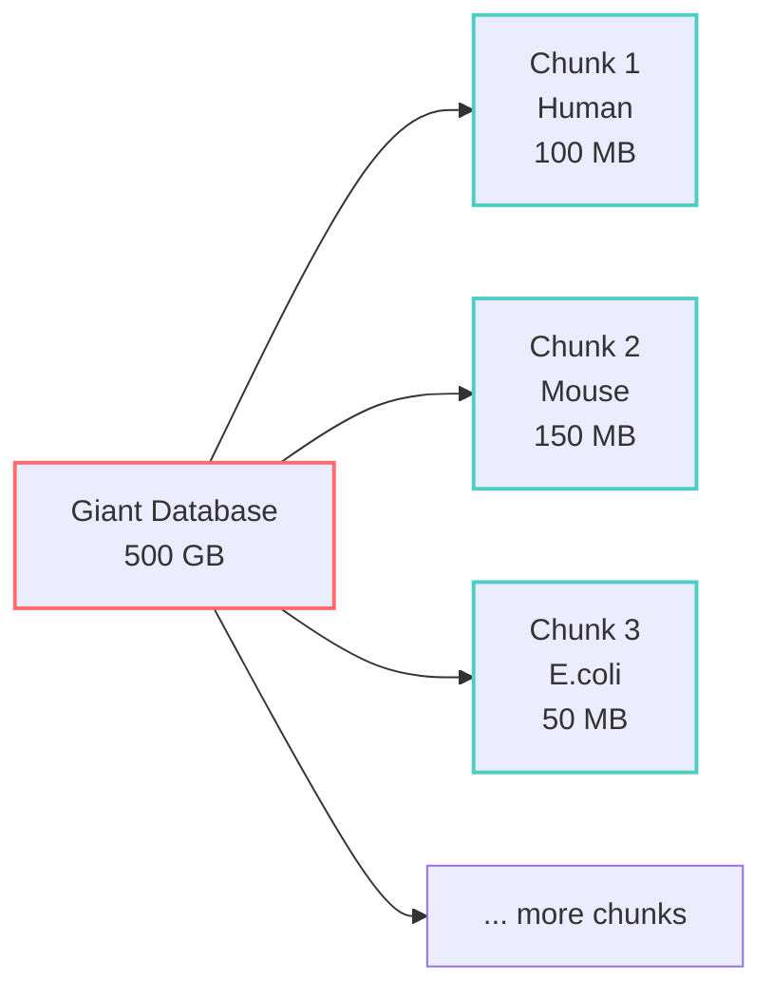
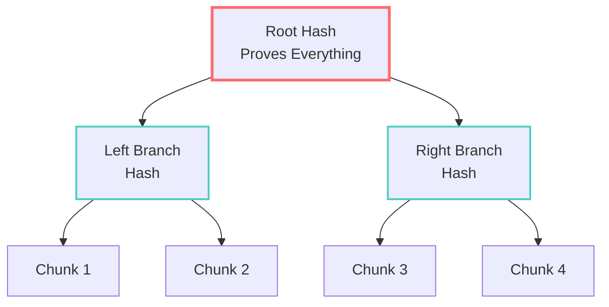
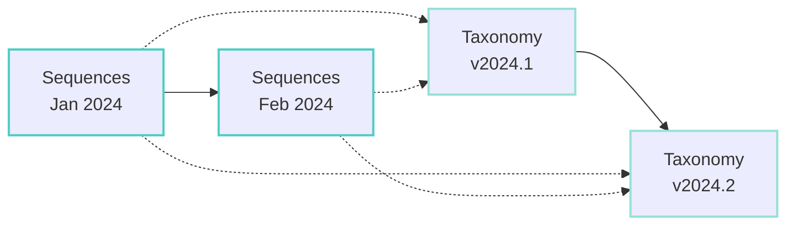

# Core CASG Concepts

This guide explains the fundamental concepts behind CASG in plain language. No PhD required!

## Content Addressing

### Traditional Approach: Names Point to Data
```
database_v1.fasta → [data that can change]
database_v2.fasta → [completely different data]
```

Problems:
- Same name might have different content
- No way to verify if data is correct
- Must trust the source completely

### CASG Approach: Content Defines the Name
```
SHA256(data) = abc123... → [data that never changes]
```

Benefits:
- Content creates its own unique ID
- Any change creates a new ID
- Can verify data independently
- Perfect deduplication

**Simple Analogy**: It's like using fingerprints instead of names. A fingerprint uniquely identifies a person and can't be faked.

## Chunks

Instead of treating a database as one giant file, CASG breaks it into manageable pieces called chunks.

### What's in a Chunk?
- Related sequences (often from the same organism or family)
- Typically 50-500 MB in size
- Each has its own unique hash ID

### Why Chunks?
- **Efficient Updates**: Only download changed chunks
- **Parallel Processing**: Work on multiple chunks simultaneously
- **Better Caching**: Keep frequently used chunks in memory
- **Fault Tolerance**: One corrupted chunk doesn't affect others



## Manifests

A manifest is like a recipe or blueprint that tells CASG how to reconstruct a complete database from chunks.

### What's in a Manifest?
```yaml
database: uniprot_swissprot
version: 2024-03-15
total_sequences: 571282
chunks:
  - hash: abc123def456...
    taxon: 9606  # Human
    size: 104857600
  - hash: 789ghi012jkl...
    taxon: 10090  # Mouse
    size: 157286400
```

### Manifest Benefits
- **Version Tracking**: Know exactly what's in each version
- **Quick Updates**: Compare manifests to find changes
- **Verification**: Confirm all chunks are present and correct
- **Reproducibility**: Recreate exact database state anytime

## Merkle Trees

Merkle trees provide cryptographic proof that data is correct without checking every single piece.

### How It Works



**Benefits**:
- Verify any chunk belongs to the database
- Detect tampering immediately
- Prove database integrity with just the root hash

## Bi-Temporal Versioning

Biological databases change in two independent ways:

### 1. Sequence Time
When new sequences are added or existing ones updated:
- New protein discovered
- Sequence correction
- Additional annotations

### 2. Taxonomy Time
When our understanding of relationships changes:
- Species reclassification
- New evolutionary insights
- Taxonomic corrections

### Why It Matters


You can:
- Use January sequences with February taxonomy
- Apply current taxonomy to historical sequences
- Track how classifications changed over time

## Delta Compression

Instead of storing similar sequences multiple times, CASG stores one reference and the differences (deltas) for similar sequences.

### Example
```
Reference: MKTAYIAKQRQISFVKSHFSRQ...  (Human insulin)
Delta 1:   ----------E---------...     (Mouse: position 11 K→E)
Delta 2:   ---S----------------...     (Rat: position 4 T→S)
```

**Storage Savings**:
- Full storage: 3 complete sequences
- Delta storage: 1 sequence + 2 small changes
- Savings: ~70% for similar sequences

## Summary

These concepts work together to create a storage system that's:
- **Efficient**: Minimal storage and bandwidth usage
- **Verifiable**: Cryptographic proof of correctness
- **Flexible**: Handle updates and versions elegantly
- **Scientific**: Designed for biological data patterns

Ready to see these concepts in action? Continue to [How CASG Works](./how-it-works.md)