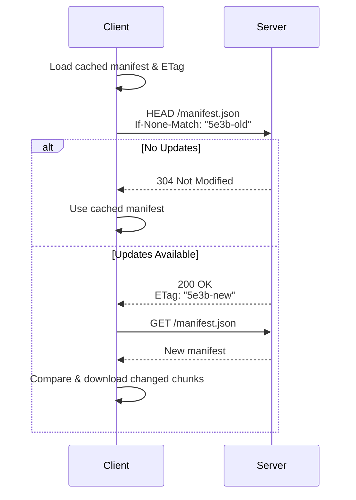
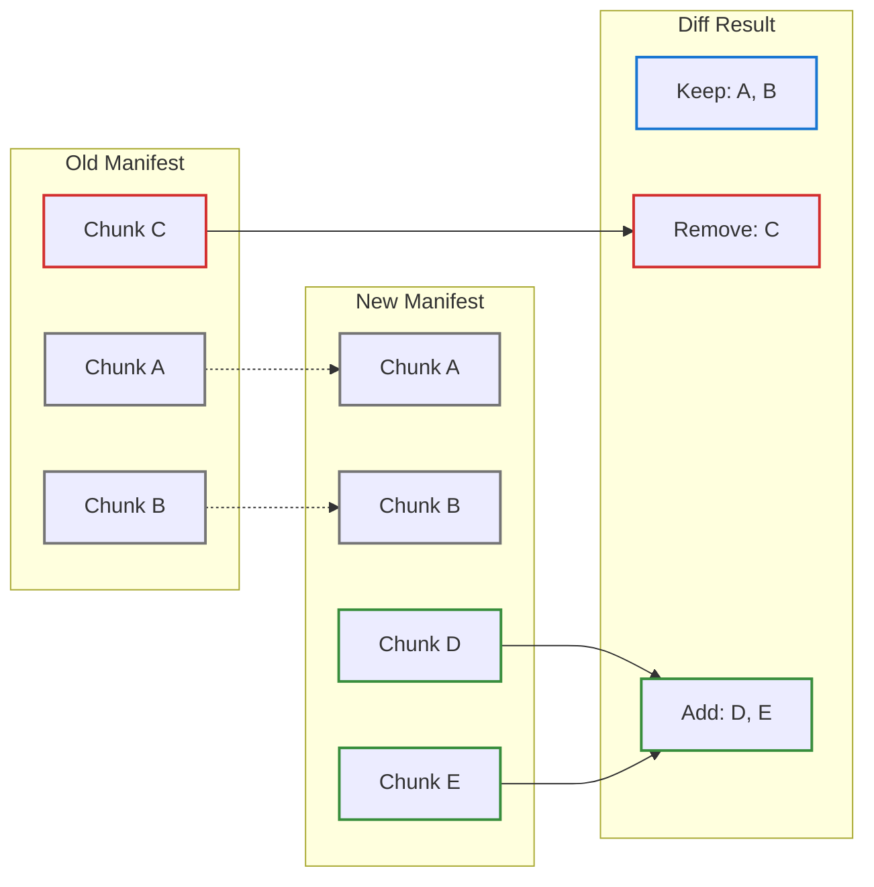
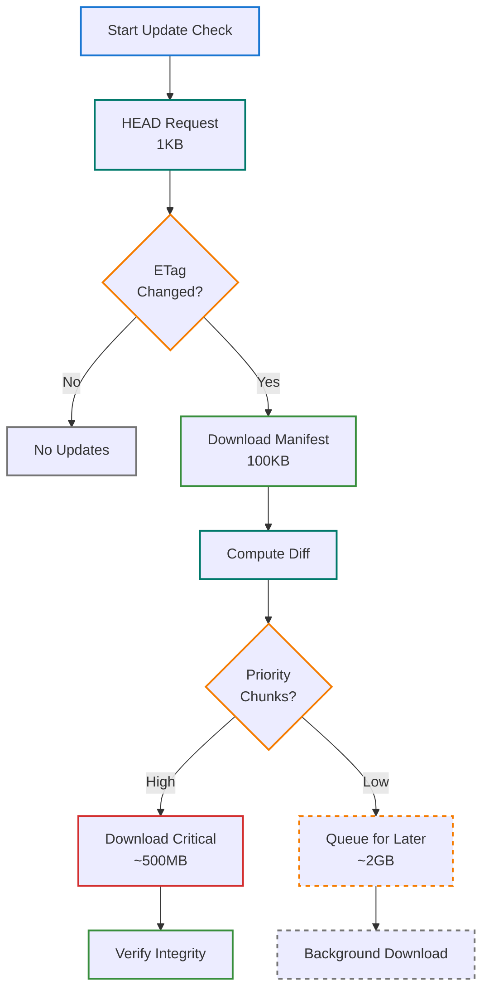
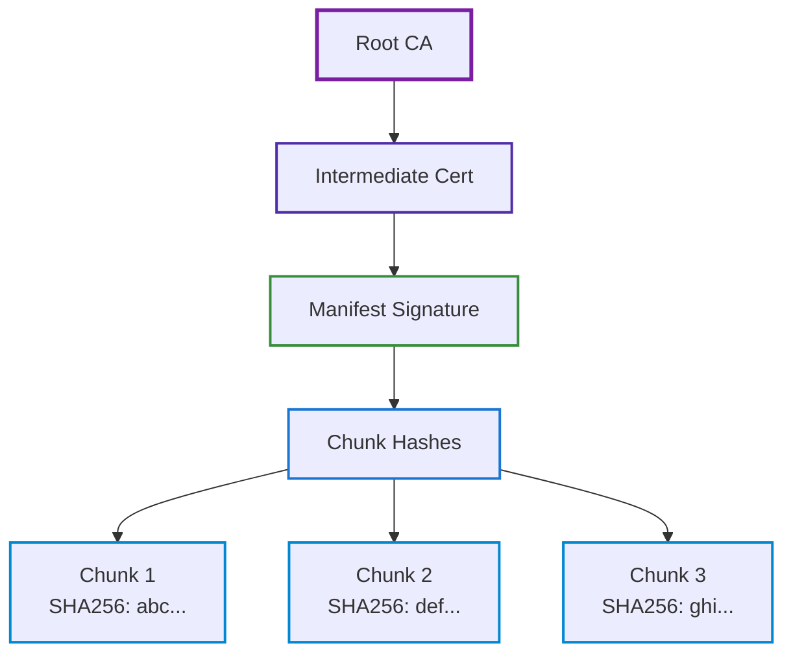

# Manifest Format Specification: The Database Genome

## Overview: Small Files, Massive Impact

The manifest is the heart of the CASG system—a small, efficiently-structured JSON file that completely describes the state of a multi-gigabyte sequence database. Think of it as the "genome" of your database: just as DNA encodes an entire organism in a tiny molecule, the manifest encodes an entire database in typically 50-500KB.

### Why Manifests Matter

Consider the traditional approach to checking for database updates: you either trust that your local copy is current (dangerous for reproducibility) or you re-download the entire database to be sure (wasteful). The manifest solves this elegantly:

1. **Instant Update Checks**: A simple HTTP HEAD request (1KB) tells you if updates exist
2. **Precise Diffs**: The manifest lists every chunk, so you know exactly what changed
3. **Cryptographic Proof**: Merkle roots prove the database hasn't been tampered with
4. **Perfect Reproducibility**: A manifest hash uniquely identifies a database state forever

### The Power of Indirection

Instead of moving massive databases around, we move tiny manifests. A researcher can email a colleague a 100KB manifest that precisely describes a 100GB database. The colleague downloads only the chunks they need, verified against the manifest's cryptographic proofs. This indirection transforms database distribution from a bandwidth problem to a metadata problem.

## Format Structure: Anatomy of a Manifest

The manifest uses JSON for human readability and tooling compatibility, with a carefully designed schema that balances completeness with compactness.

### Core Design Principles

1. **Self-Contained**: Everything needed to reconstruct the database is in the manifest
2. **Verifiable**: Multiple cross-checks ensure integrity
3. **Efficient**: Optimized for rapid parsing and diff computation
4. **Extensible**: Forward-compatible with future enhancements

### JSON Schema

```json
{
  "$schema": "http://json-schema.org/draft-07/schema#",
  "type": "object",
  "required": ["version", "created_at", "taxonomy_root", "sequence_root", "chunk_index", "etag"],
  "properties": {
    "version": {
      "type": "string",
      "pattern": "^\\d{8}_\\d{6}$",
      "description": "Version identifier (YYYYMMDD_HHMMSS)"
    },
    "created_at": {
      "type": "string",
      "format": "date-time",
      "description": "ISO 8601 timestamp"
    },
    "taxonomy_root": {
      "type": "string",
      "pattern": "^[a-f0-9]{64}$",
      "description": "SHA256 hash of taxonomy Merkle tree root"
    },
    "sequence_root": {
      "type": "string",
      "pattern": "^[a-f0-9]{64}$",
      "description": "SHA256 hash of sequence Merkle tree root"
    },
    "chunk_index": {
      "type": "array",
      "items": {
        "$ref": "#/definitions/ChunkMetadata"
      }
    },
    "discrepancies": {
      "type": "array",
      "items": {
        "$ref": "#/definitions/TaxonomicDiscrepancy"
      }
    },
    "etag": {
      "type": "string",
      "description": "HTTP ETag for efficient update checking"
    },
    "previous_version": {
      "type": "string",
      "description": "Previous manifest version for chaining"
    }
  }
}
```

### Example Manifest

```json
{
  "version": "20240315_143022",
  "created_at": "2024-03-15T14:30:22.000Z",
  "taxonomy_root": "abc123def456789012345678901234567890123456789012345678901234567",
  "sequence_root": "fedcba098765432109876543210987654321098765432109876543210987654",
  "chunk_index": [
    {
      "hash": "1234567890abcdef1234567890abcdef1234567890abcdef1234567890abcd",
      "taxon_ids": [562, 563, 564],
      "sequence_count": 15234,
      "size": 52428800,
      "compressed_size": 18350080
    },
    {
      "hash": "abcdef1234567890abcdef1234567890abcdef1234567890abcdef12345678",
      "taxon_ids": [9606],
      "sequence_count": 42150,
      "size": 157286400,
      "compressed_size": 48234496
    }
  ],
  "discrepancies": [
    {
      "sequence_id": "NP_123456.1",
      "header_taxon": 562,
      "mapped_taxon": 563,
      "confidence": 0.85,
      "discrepancy_type": "Conflict"
    }
  ],
  "etag": "W/\"5e3b-1710513022000\"",
  "previous_version": "20240215_120000"
}
```

## Chunk Metadata: The Building Blocks

Each chunk entry in the manifest provides complete information about that chunk without requiring access to the chunk itself. This enables intelligent decisions about which chunks to download.

### Understanding Chunk Metadata

Each chunk in the index contains:

| Field | Type | Description | Example |
|-------|------|-------------|---------|
| `hash` | SHA256 | Content hash of chunk | `abc123...` |
| `taxon_ids` | Array<TaxonId> | Taxonomic IDs in chunk | `[562, 563]` |
| `sequence_count` | usize | Number of sequences | `15234` |
| `size` | usize | Uncompressed size in bytes | `52428800` |
| `compressed_size` | Optional<usize> | Compressed size if applicable | `18350080` |

Note: ChunkMetadata does not contain a `taxonomy_version` field. Taxonomy version is tracked at the manifest level.

## ETag-Based Update Checking: Efficiency Through HTTP

ETags (Entity Tags) are an HTTP mechanism originally designed for web caching, but CASG repurposes them brilliantly for database update detection. Instead of downloading megabytes to check for changes, we send a tiny HTTP header and get a definitive answer.

### The ETag Advantage

Traditional database update checking:
1. Download the database (or at least its index)
2. Compare with local version
3. Realize nothing changed
4. Waste: 100GB downloaded for nothing

CASG with ETags:
1. Send HTTP HEAD with cached ETag (1KB)
2. Receive 304 Not Modified (instant)
3. Done
4. Savings: 99.999% bandwidth reduction

### How It Works



### Implementation

```rust
// Check for updates
async fn check_updates(cached_etag: Option<&str>) -> Result<bool> {
    let client = reqwest::Client::new();
    let mut request = client.head(MANIFEST_URL);

    if let Some(etag) = cached_etag {
        request = request.header(IF_NONE_MATCH, etag);
    }

    let response = request.send().await?;

    // 304 = No updates
    Ok(response.status() != StatusCode::NOT_MODIFIED)
}
```

## Manifest Diffing: Surgical Precision Updates

Manifest diffing is where CASG's efficiency becomes apparent. By comparing two manifests, we can determine exactly which chunks changed, enabling surgical updates that download only what's new.

### The Diff Process

Think of manifest diffing like comparing two shopping lists. Instead of buying everything again, you only buy what's new or different. But unlike shopping lists, manifest diffs are computed in milliseconds and are cryptographically verifiable.

### Algorithm

When a new manifest is downloaded, compute the differential:

```rust
fn diff_manifests(old: &Manifest, new: &Manifest) -> ManifestDiff {
    let old_chunks: HashSet<_> = old.chunk_index
        .iter()
        .map(|c| c.hash.clone())
        .collect();

    let new_chunks: HashSet<_> = new.chunk_index
        .iter()
        .map(|c| c.hash.clone())
        .collect();

    ManifestDiff {
        added: new_chunks.difference(&old_chunks).cloned().collect(),
        removed: old_chunks.difference(&new_chunks).cloned().collect(),
        taxonomy_changed: old.taxonomy_root != new.taxonomy_root,
    }
}
```

### Visualization



## Discrepancy Tracking: Data Quality Assurance

One of CASG's unique features is active discrepancy detection and tracking. Biological databases often contain inconsistencies—sequences claimed to be from one organism but actually from another, outdated taxonomic classifications, or missing annotations. The manifest doesn't hide these issues; it documents them.

### Why Track Discrepancies?

1. **Scientific Integrity**: Researchers need to know about potential data quality issues
2. **Reproducibility**: Papers can reference specific discrepancies they handled
3. **Continuous Improvement**: Database maintainers can prioritize fixes
4. **Audit Trail**: Track how classifications change over time

### Discrepancy Format

The manifest includes detected discrepancies:

```json
{
  "discrepancies": [
    {
      "sequence_id": "NP_123456.1",
      "header_taxon": 562,      // E. coli claimed
      "mapped_taxon": 563,       // Shigella in accession2taxid
      "inferred_taxon": 562,     // E. coli by similarity
      "confidence": 0.92,
      "detection_date": "2024-03-15T14:30:22Z",
      "discrepancy_type": "Conflict"
    },
    {
      "sequence_id": "XP_789012.2",
      "header_taxon": null,      // No taxonomy in header
      "mapped_taxon": 1578,      // Old Lactobacillus
      "inferred_taxon": 134567,  // New classification
      "confidence": 0.78,
      "detection_date": "2024-03-15T14:30:22Z",
      "discrepancy_type": "Reclassified"
    }
  ]
}
```

## Bandwidth Optimization: The Economics of Updates

Bandwidth costs money and time. For researchers in bandwidth-constrained environments or institutions with metered connections, CASG's optimizations can mean the difference between feasible and impossible.

### Real-World Impact

Consider a lab checking for UniProt updates daily:
- **Traditional**: 365 × 100GB = 36.5TB/year (mostly redundant)
- **CASG**: 365 × 1KB checks + 12 × 2GB updates = 24GB/year
- **Savings**: 99.93% bandwidth reduction

For cloud users paying for egress:
- **Traditional**: $3,285/year (at $0.09/GB)
- **CASG**: $2.16/year
- **Savings**: $3,283/year per database

### Size Comparison

| Component | Traditional | CASG | Savings |
|-----------|------------|------|---------|
| Check for updates | Download full DB (100GB) | HEAD request (1KB) | 99.999% |
| Manifest download | N/A | 100KB | - |
| Typical update (1% change) | 100GB | 1GB + 100KB | 99% |
| Taxonomic subset | Full DB | Only relevant chunks | 80-95% |

### Progressive Download Strategy



## Compression: Every Byte Counts

While manifests are already small, compression reduces them further. This matters when serving millions of manifest checks daily or when every kilobyte counts in bandwidth-constrained environments.

### Compression Strategy

Manifests compress exceptionally well because:
1. **Repetitive Structure**: JSON has repeated keys
2. **Hash Patterns**: SHA256 hashes have predictable entropy
3. **Taxonomic IDs**: Often sequential or clustered

Manifests support multiple compression formats:

| Format | Extension | Typical Size | Use Case |
|--------|-----------|--------------|----------|
| Raw JSON | `.json` | 200KB | Development |
| Gzip | `.json.gz` | 50KB | Standard distribution |
| Brotli | `.json.br` | 35KB | CDN optimization |
| Zstandard | `.json.zst` | 40KB | Fast decompression |

## Security: Trust Through Verification

In scientific computing, trust is earned through verification. CASG manifests include multiple layers of cryptographic proof, ensuring that the data you download is exactly what was published.

### Defense in Depth

CASG employs multiple security layers:
1. **Content Addressing**: Chunks are identified by their hash
2. **Merkle Proofs**: Prove chunks belong to the database
3. **Manifest Integrity**: ETags and internal consistency checks
4. **Optional Signatures**: Cryptographic signatures from publishers

### Integrity Verification

Every manifest includes cross-validation:

```rust
fn verify_manifest(manifest: &Manifest) -> Result<bool> {
    // 1. Verify internal consistency
    let computed_etag = compute_etag(&manifest);
    if computed_etag != manifest.etag {
        return Ok(false);
    }

    // 2. Verify Merkle roots
    let chunks_root = compute_merkle_root(&manifest.chunk_index);
    if chunks_root != manifest.sequence_root {
        return Ok(false);
    }

    // 3. Optional: Verify signature
    if let Some(sig) = &manifest.signature {
        verify_signature(manifest, sig)?;
    }

    Ok(true)
}
```

### Trust Chain



## Performance Metrics: Speed at Scale

Manifest operations are designed to be fast enough for interactive use while scaling to databases with millions of chunks.

### Optimization Techniques

1. **Streaming Parsers**: Begin processing before download completes
2. **Lazy Evaluation**: Only parse what's needed
3. **Hash Tables**: O(1) lookup for chunk comparison
4. **Parallel Processing**: Diff computation uses all CPU cores

Typical manifest operations:

| Operation | Time | Memory |
|-----------|------|--------|
| Parse manifest (200KB) | <10ms | 2MB |
| Compute diff (10K chunks) | <50ms | 20MB |
| Verify integrity | <100ms | 5MB |
| Generate subset manifest | <20ms | 10MB |

## Best Practices: Lessons from Production

### 1. Cache Manifests Locally
Always cache manifests with their ETags:
```bash
${TALARIA_HOME}/cache/manifests/
├── uniprot-swissprot-20240315.json
├── uniprot-swissprot-20240315.etag
└── ncbi-nr-20240310.json
```
This enables instant local operations and offline work.

### 2. Check Updates Frequently
HEAD requests are essentially free:
- 1KB request
- <100ms response
- No computational cost
- Can check hourly without impact

### 3. Batch Chunk Downloads
Download multiple chunks in parallel:
```rust
let chunks_to_download = vec![hash1, hash2, hash3];
let downloads = chunks_to_download
    .par_iter()
    .map(|hash| download_chunk(hash))
    .collect();
```
10-20 parallel downloads optimal for most networks.

### 4. Verify Manifest Integrity
Always verify before trusting:
1. Check ETag matches content
2. Verify Merkle roots
3. Validate chunk hashes during download
4. Optional: Verify publisher signature

### 5. Keep Manifest History
Maintain a git-like history:
```
manifests/
├── current -> 20240315_143022
├── 20240315_143022/
├── 20240215_120000/
└── 20240115_090000/
```
Enables rollback and historical analysis.

### 6. Implement Progressive Downloads
Prioritize important chunks:
1. Download manifest
2. Identify model organism chunks (high priority)
3. Download those immediately
4. Queue others for background download
5. Users can work while rest downloads

### 7. Monitor Manifest Metrics
Track key indicators:
- Update frequency (how often do manifests change?)
- Chunk churn (what percentage changes per update?)
- Download patterns (which chunks are hot?)
- Compression ratios achieved

These metrics inform optimization strategies.

## See Also

- [Chunking Algorithms](chunking.md)
- [Merkle DAG Structure](merkle.md)
- [API Reference](../api/manifest.md)