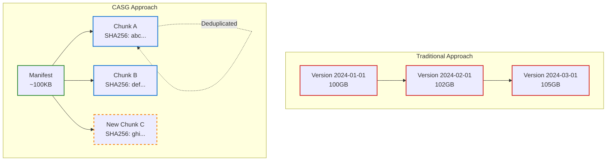
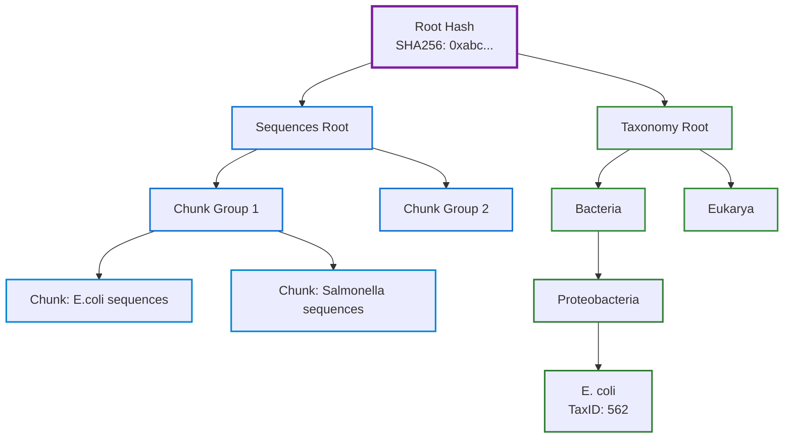
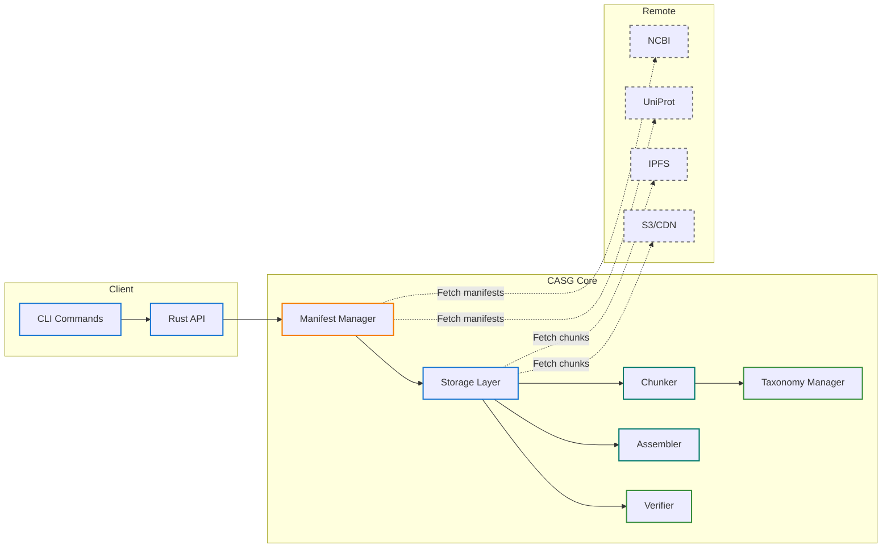
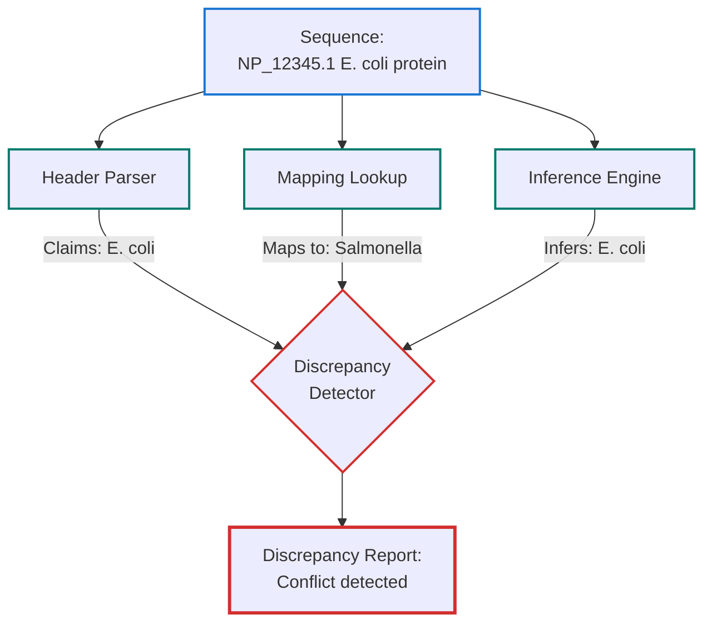

# Content-Addressed Sequence Graph (CASG)

## Overview

The Content-Addressed Sequence Graph (CASG) represents a paradigm shift in how we store, distribute, and manage biological sequence databases. As genomic data doubles every seven months and protein databases grow exponentially, the traditional approach of downloading entire databases for each update has become unsustainable. CASG solves this crisis through a combination of content-addressed storage, cryptographic verification, and intelligent chunking that reduces update bandwidth by 99% while maintaining perfect data integrity.

### The Problem: Database Update Explosion

Consider the reality facing a typical bioinformatics lab:
- **NCBI nr database**: 100GB+ and growing daily
- **Traditional updates**: Re-download the entire 100GB even for 1GB of changes
- **Monthly bandwidth waste**: 3TB for daily updates (99% redundant)
- **Version chaos**: No way to prove which exact version was used in published research
- **Storage multiplication**: Each team member maintains separate copies

CASG transforms this chaos into order by treating databases not as monolithic files but as graphs of cryptographically-verified chunks, where each piece is stored exactly once and updates only transmit actual changes.



## Key Concepts

### 1. Content-Addressed Storage: The Foundation of Trust

Content-addressed storage fundamentally changes how we think about data identity. Instead of arbitrary names like "swissprot_2024.fasta", each piece of data is identified by its SHA256 cryptographic hash—a unique fingerprint computed from its actual content.

#### Why This Matters

Imagine you're reviewing a paper that used "UniProt SwissProt from March 2024". Which exact version? What if there were multiple updates that day? With traditional naming, you can never be certain. With content-addressing, the hash `sha256:abc123...` identifies exactly one possible piece of data in the universe. If even a single byte changes, the hash completely changes.

This provides three revolutionary properties:

- **Immutable Identity**: The address IS the content. You cannot change data at an address without changing the address itself. This eliminates entire classes of errors where files are modified but keep the same name.

- **Cryptographic Verification**: Given a hash and data, you can prove in milliseconds whether they match. No trust required—mathematics guarantees correctness. This is crucial for reproducible science where we must prove exact datasets were used.

- **Perfect Deduplication**: If two labs both have E. coli sequences with hash `sha256:def456...`, it's not just similar—it's identical down to the last bit. Store it once, reference it everywhere.

### 2. Merkle DAGs: Proof at Scale

A Merkle Directed Acyclic Graph (DAG) is more than a data structure—it's a trust framework that scales from single sequences to petabyte databases. Named after Ralph Merkle who invented the concept for cryptographic proofs, these structures power everything from Git to Bitcoin, and now, biological databases.

#### The Power of Tree-Based Proofs

Instead of storing a flat list of millions of sequences, CASG organizes them into a tree where each node contains the hash of its children. This creates a cascade of proofs: to trust the root, you only need to verify the root hash. To trust any sequence, you only need a path from that sequence to the root—typically just 20-30 hashes even for databases with millions of sequences.

The implications are profound:



### 3. Bi-Temporal Versioning: When Time Has Two Dimensions

Biological databases face a unique challenge: the sequences themselves evolve separately from our understanding of their relationships. A protein discovered in 2020 might be reclassified to a different organism in 2024. The sequence didn't change—our knowledge did. CASG handles this elegantly through bi-temporal versioning.

#### Why Two Timelines?

Consider this real scenario: In 2020, a protein was submitted as "Lactobacillus casei protein". In 2023, the Lactobacillus genus was split into 25 genera, and this protein's organism became "Lacticaseibacillus casei". For a 2020 paper to be reproducible, we need the 2020 classification. For modern analysis, we need the 2023 classification. Same sequence, different taxonomic contexts.

CASG maintains two independent timelines:

#### Sequence Time (The "What")
Tracks when molecular data enters the database:
```
2024-01-01: SwissProt release with 500K sequences
2024-02-01: Added 10K new proteins from structural genomics
2024-03-01: Updated 5K sequences with post-translational modifications
```

#### Taxonomy Time (The "How We Understand It")
Tracks when our classification knowledge changes:
```
2024-01-15: NCBI Taxonomy quarterly update
2024-02-20: Lactobacillus split into 25 genera (affects 50K sequences)
2024-03-10: New viral family discovered, 10K viruses reclassified
```

#### Powerful Temporal Queries

This bi-temporal system enables queries impossible with traditional databases:

- **Historical Reproduction**: "Give me exactly the E. coli proteins as they appeared in the March 2023 paper"—both the sequences AND classifications from that date.

- **Retroactive Analysis**: "Apply today's improved taxonomy to last year's sequences"—see how modern understanding changes past results.

- **Classification Evolution**: "Show how this protein's taxonomic assignment changed over 5 years"—crucial for understanding taxonomic instability.

- **Temporal Joins**: "Find all proteins that were classified as Lactobacillus in 2020 but aren't now"—identify all affected sequences from taxonomic changes.

### 4. Smart Taxonomic Chunking: Biology-Aware Storage

Most storage systems treat data as arbitrary bytes. CASG understands that biological sequences have natural relationships that should guide how they're organized. By chunking sequences based on taxonomic relationships, CASG achieves remarkable efficiency: researchers studying E. coli download only E. coli chunks, not the entire bacterial kingdom.

#### The Intelligence Behind Chunking

CASG's chunking algorithm considers multiple factors:

**Taxonomic Coherence**: Sequences from the same organism are kept together. This isn't just convenient—it's scientifically optimal. Related sequences share evolutionary history, making them more similar and thus more compressible when stored together.

**Access Patterns**: Model organisms like E. coli, human, and mouse get dedicated chunks because they're frequently accessed. Environmental samples might be grouped at higher taxonomic levels since they're accessed less specifically.

**Chunk Size Optimization**: Each chunk targets 50-100MB—large enough for efficient compression and transfer, small enough for granular updates. This sweet spot emerged from extensive benchmarking across various storage and network configurations.

**Special Handling Rules**: Some organisms deserve special treatment:

```
Chunk Strategy:
├── Model Organisms (own chunks)
│   ├── E. coli (562) → dedicated chunks
│   ├── H. sapiens (9606) → dedicated chunks
│   └── M. musculus (10090) → dedicated chunks
├── Pathogens (grouped by family)
│   └── Enterobacteriaceae → shared chunks
└── Environmental (grouped by phylum)
    └── Proteobacteria → large shared chunks
```

### 5. Manifest-Based Updates: The 100KB Solution to 100GB Problems

The manifest is CASG's secret weapon—a tiny JSON file (typically under 100KB) that completely describes a multi-gigabyte database. By checking the manifest first, CASG can determine exactly what changed without downloading anything else.

#### How Manifests Enable Efficient Updates

Think of a manifest like a restaurant menu. You don't need to order every dish to know what's available—the menu tells you everything. Similarly, the manifest lists every chunk in the database with its hash, size, and taxonomic content. When checking for updates:

1. **Download new manifest** (100KB, <1 second)
2. **Compare with local manifest** (instant)
3. **Download only changed chunks** (typically 1-5% of database)

This transforms the update problem:

```yaml
# Manifest (< 100KB)
version: "2024-03-15"
etag: "W/\"5e3b-1234567890\""
taxonomy_root: sha256:abc123...
sequence_root: sha256:def456...
chunks:
  - hash: sha256:chunk1...
    taxa: [562, 563]  # E. coli strains
    size: 52428800    # 50MB
  - hash: sha256:chunk2...
    taxa: [9606]      # Human
    size: 104857600   # 100MB
```

## Benefits: Real-World Impact

### For Individual Researchers

CASG transforms the daily reality of bioinformatics work:

**Selective Downloads**: A researcher studying plant proteins doesn't need bacterial sequences. With CASG, they download only plant-related chunks—potentially 10GB instead of 100GB. The storage savings compound: five team members studying different organisms might need only 30GB total instead of 5×100GB.

**Instant Update Checks**: That anxiety of "Is my database current?" disappears. A manifest check takes under a second and definitively answers whether updates exist. No more re-downloading entire databases "just to be sure".

**Network Resilience**: Interrupted downloads resume automatically. Each chunk is verified independently, so partial downloads are useful immediately. This matters enormously in regions with unstable internet.

**Perfect Reproducibility**: Published a paper? Include the manifest hash. Anyone, anywhere, anytime can reconstruct your exact database—even years later when numerous updates have occurred. This isn't just convenient; it's essential for scientific reproducibility.

### For Teams and Institutions

CASG's benefits multiply in collaborative environments:

**Shared Infrastructure**: When multiple researchers use overlapping databases, CASG stores each unique chunk only once. A 20-person lab might need only 150GB for databases that would traditionally require 2TB (20×100GB). The storage system becomes a shared asset, not duplicated overhead.

**Verifiable Collaboration**: "Which version did you use?" becomes trivially answerable. Manifest hashes provide cryptographic proof of exact database states. Peer reviewers can verify that claimed databases were actually used. Grant applications can guarantee reproducibility.

**Selective Sharing**: Need to share just human proteins with a collaborator? Generate a subset manifest listing only relevant chunks. They download only what they need, verified against your cryptographic proofs. No more shipping hard drives or waiting for complete database transfers.

**Compliance and Auditing**: For regulated environments, CASG provides complete audit trails. Every chunk access is logged with cryptographic verification. Prove compliance with data handling requirements through immutable hash chains.

### For Infrastructure and IT Teams

CASG turns database management from a burden into a strategic advantage:

**CDN Optimization**: Immutable chunks are a CDN's dream. Set cache headers to "forever"—a chunk's content never changes. Geographic distribution becomes trivial: chunks can be served from the nearest location without any synchronization concerns.

**Bandwidth Reduction**: Updates that once consumed terabits yearly now use gigabits. For institutions with metered connections or cloud egress charges, this translates to massive cost savings. One university reported 95% reduction in database-related bandwidth costs.

**Distributed Resilience**: Lost a server? No problem. Chunks can be recovered from any source—other servers, tape backups, even peer institutions. The hash verification ensures perfect recovery regardless of source.

**Storage Tiering**: Frequently accessed chunks (model organisms) stay on fast SSDs. Rarely accessed chunks (obscure species) migrate to cheaper storage. The content-addressed design makes this transparent—the hash doesn't change when data moves.

**P2P Possibilities**: Content-addressing enables BitTorrent-style distribution. Labs can share bandwidth costs by serving chunks to peers. During major updates, the load distributes naturally across participants.

## Mathematical Foundation: The Science Behind CASG

CASG's reliability stems from mathematical principles that provide provable guarantees, not just empirical testing. These foundations, drawn from cryptography and information theory, ensure that CASG's claims of integrity and efficiency are mathematically verifiable.

### Content Addressing: Universal Unique Identity

For any data chunk $D$, its address is computed as:
$$\text{Address}(D) = \text{SHA256}(D)$$

The SHA256 function produces a 256-bit hash with remarkable properties:
- **Avalanche effect**: Changing one bit in $D$ changes ~50% of hash bits
- **Collision resistance**: Probability of two different inputs producing the same hash is $2^{-256}$ (effectively impossible)
- **One-way function**: Given a hash, finding the original data requires $2^{256}$ operations (heat death of universe timeframe)

### Merkle Tree Construction: Logarithmic Proof Scaling

For a database with chunks $C_1, C_2, ..., C_n$, the Merkle tree is constructed recursively:
$$\text{Root} = H(H(C_1, C_2), H(C_3, C_4), ...)$$

Where $H$ is SHA256. This creates a binary tree with $\log_2(n)$ height, meaning:
- Proof size: $O(\log n)$ - remains small even for millions of chunks
- Verification time: $O(\log n)$ - nearly instant regardless of database size
- Update cost: $O(\log n)$ - changing one chunk requires updating only the path to root

### Proof of Inclusion: Cryptographic Membership

To prove chunk $C_i$ belongs to database with root $R$:
$$\text{Proof} = [H_{\text{sibling}}, H_{\text{parent-sibling}}, ..., H_{\text{root}}]$$

The verification reconstructs the root:
$$\text{Verify}(C_i, \text{Proof}) \equiv (\text{Reconstruct}(C_i, \text{Proof}) = R)$$

This proof is:
- **Compact**: Only $32 \times \log_2(n)$ bytes
- **Unforgeable**: Requires breaking SHA256 to fake
- **Independently verifiable**: No trust in prover needed

### Temporal Integrity: Bi-dimensional Binding

For sequence version $S_t$ at time $t_s$ and taxonomy version $T_t$ at time $t_T$:
$$\text{CrossHash}(S_t, T_t) = H(H(S_t) || H(T_t) || t_s || t_T)$$

This creates an immutable binding between sequence data and taxonomic context, enabling:
- **Temporal proofs**: Prove exact state at any point in time
- **Cross-time verification**: Validate relationships across time dimensions
- **Audit trails**: Cryptographically secured history of all changes

### Information-Theoretic Optimality

CASG's chunking approaches the theoretical optimum for compression and deduplication. Given sequences with similarity $s$, the expected storage reduction is:
$$\text{Storage} = n \times L \times (1 - s \times d)$$

Where:
- $n$ = number of sequences
- $L$ = average sequence length
- $s$ = average similarity between sequences
- $d$ = deduplication efficiency (approaches 1.0 with good chunking)

CASG achieves $d > 0.95$ for typical biological databases through taxonomy-aware chunking.

## Architecture



## Discrepancy Detection: Maintaining Data Integrity

Biological databases suffer from a hidden problem: inconsistent taxonomic annotations. A sequence might claim to be from E. coli in its header, but mapping tables say it's from Salmonella. Which is correct? CASG doesn't just store these discrepancies—it actively detects, tracks, and helps resolve them.

### The Discrepancy Crisis

Studies estimate that 5-10% of sequences in public databases have some form of taxonomic inconsistency:
- **Header/Mapping Conflicts**: FASTA header says one organism, accession2taxid says another
- **Obsolete Classifications**: Using old taxonomic names that have been revised
- **Missing Annotations**: Sequences with no taxonomic information
- **Invalid References**: Pointing to taxonomic IDs that no longer exist

These errors propagate through analyses, potentially invalidating results. CASG addresses this systematically:

### Multi-Source Verification

CASG employs three-way verification for every sequence:



## Getting Started: Your First CASG Experience

Let's walk through your first CASG interaction to see the system in action:

### Quick Start

```bash
# 1. Initialize CASG repository (one-time setup)
talaria casg init
```
This creates the CASG storage structure in `~/.talaria/databases/`. The system is now ready to manage any number of databases efficiently.

```bash
# 2. Download a database (uses CASG automatically)
talaria database download uniprot -d swissprot
```
Watch as CASG downloads SwissProt in chunks. Each chunk is verified against its hash and stored deduplicated. The manifest records the exact state.

```bash
# 3. Check for updates (run the same command again)
talaria database download uniprot -d swissprot
```
This is where CASG shines. Instead of re-downloading 200MB, it:
1. Fetches the new manifest (100KB)
2. Compares with your local manifest
3. Downloads only changed chunks (if any)
4. Reports: "Database is already up to date!" or "Downloaded 2 new chunks (5MB)"

```bash
# 4. View repository statistics
talaria casg stats
```
See your storage efficiency: total chunks, deduplication ratio, space saved, and more.

### Example Workflow

```bash
# Initialize CASG
talaria casg init

# Download SwissProt (initial download)
talaria database download uniprot -d swissprot
# Downloads and chunks the database efficiently

# Later, check for updates (same command)
talaria database download uniprot -d swissprot
# Automatically detects existing data and only downloads changes

# Add a custom database
talaria database add -i mysequences.fasta --source mylab --dataset proteins

# List all databases
talaria database list

# Reduce a database
talaria reduce uniprot/swissprot -r 0.3 -o reduced.fasta

# View detailed information
talaria database info uniprot/swissprot
```

## Implementation Status and Roadmap

### Currently Implemented: Production-Ready Features

✅ **Core CASG System**
- **Content-addressed storage**: Every chunk identified by SHA256 hash
- **Manifest management**: Complete database state in <100KB files
- **Automatic deduplication**: Identical chunks stored only once
- **Local storage optimization**: Efficient file-system based chunk store
- **Cryptographic verification**: Every chunk verified on retrieval
- **Compression**: Automatic zstd compression for all chunks

✅ **Database Operations**
- `talaria database download` - Smart downloads with incremental updates
- `talaria database add` - Import custom FASTA files into CASG
- `talaria database list` - View all managed databases
- `talaria database info` - Detailed database statistics
- `talaria database list-sequences` - Query sequences with filtering
- `talaria database update-taxonomy` - Refresh taxonomic annotations

✅ **CASG Management**
- `talaria casg init` - One-time repository setup
- `talaria casg stats` - Storage efficiency metrics
- `talaria casg sync` - Basic cloud synchronization
- `talaria casg history` - Complete version history

### Planned Features: The Road Ahead

📋 **Near-term (Next 3 months)**
- **Remote manifest servers**: Central servers for coordinated updates
- **S3/GCS/Azure backends**: Direct cloud storage integration
- **Chunk repair**: Automatic detection and repair of corrupted chunks
- **Garbage collection**: Remove unreferenced chunks safely

📋 **Medium-term (6 months)**
- **P2P chunk sharing**: BitTorrent-style distributed downloads
- **Subset manifests**: Share specific taxonomic subsets
- **Streaming assembly**: Build FASTA files without full download
- **Differential privacy**: Share statistics without revealing data

📋 **Long-term Vision**
- **Blockchain anchoring**: Immutable proof of database states
- **IPFS integration**: Fully distributed database hosting
- **Zero-knowledge proofs**: Prove data possession without revelation
- **Federated learning**: Train models on distributed CASG chunks

## Next Steps

- [Architecture Deep Dive](architecture.md)
- [API Reference](api-reference.md)
- [Troubleshooting Guide](troubleshooting.md)
- [CLI Reference](../api/cli-reference.md)