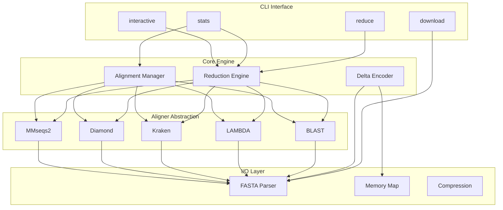
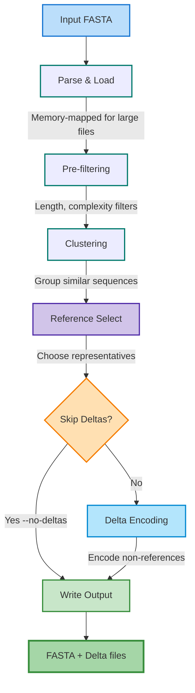
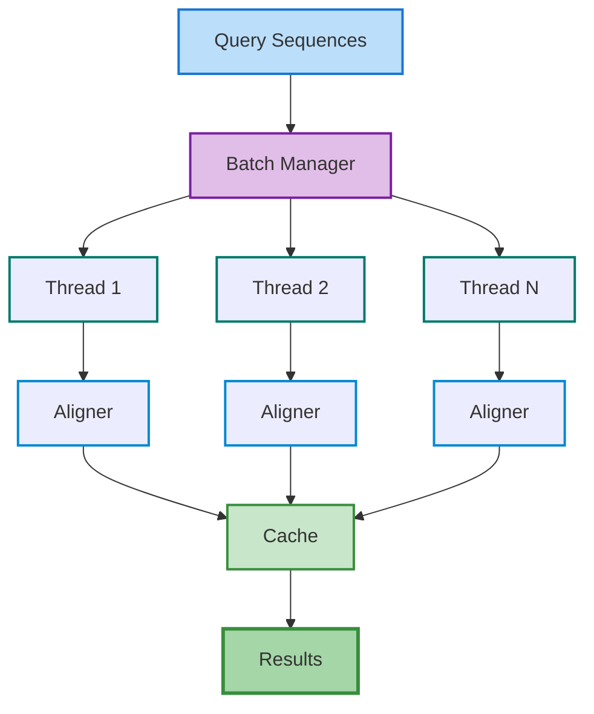
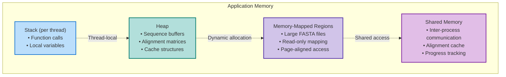
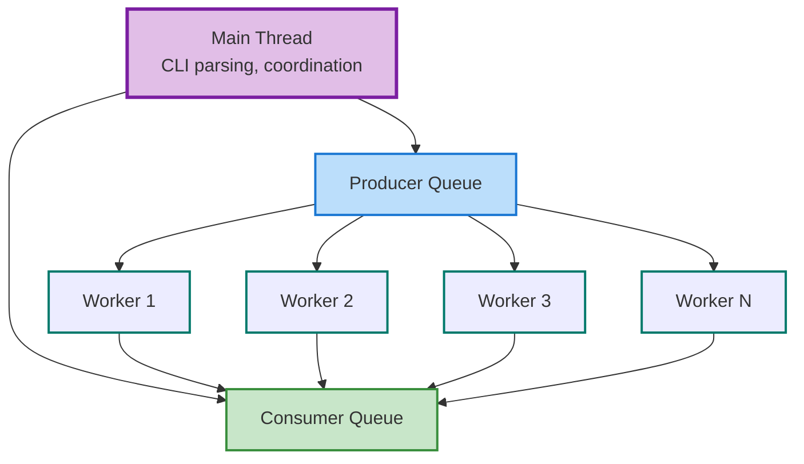

# Architecture

Comprehensive overview of Talaria's system architecture, design patterns, and internal structure.

## System Overview



## Module Structure

### Core Modules

```
src/
├── main.rs              # Entry point and CLI setup
├── lib.rs               # Library exports
│
├── bio/                 # Biological data structures
│   ├── mod.rs           # Module exports
│   ├── sequence.rs      # Sequence representation
│   ├── alignment.rs     # Alignment algorithms
│   ├── scoring.rs       # Scoring matrices
│   ├── delta.rs         # Delta encoding
│   └── stats.rs         # Statistics calculation
│
├── core/                # Core reduction logic
│   ├── mod.rs           # Module exports
│   ├── reducer.rs       # Main reduction engine
│   ├── selector.rs      # Reference selection
│   ├── clustering.rs    # Sequence clustering
│   ├── taxonomy.rs      # Taxonomy-aware reduction
│   └── config.rs        # Configuration management
│
├── aligners/            # Aligner implementations
│   ├── mod.rs           # Aligner trait and registry
│   ├── blast.rs         # BLAST integration
│   ├── lambda.rs        # LAMBDA integration
│   ├── kraken.rs        # Kraken optimization
│   ├── diamond.rs       # Diamond integration
│   └── mmseqs2.rs       # MMseqs2 integration
│
├── io/                  # Input/Output handling
│   ├── mod.rs           # Module exports
│   ├── fasta.rs         # FASTA parser and writer
│   ├── compression.rs   # Compression utilities
│   ├── mmap.rs          # Memory-mapped I/O
│   └── streaming.rs     # Stream processing
│
├── cli/                 # Command-line interface
│   ├── mod.rs           # CLI setup
│   ├── commands/        # Command implementations
│   │   ├── reduce.rs    # Reduce command
│   │   ├── stats.rs     # Statistics command
│   │   ├── download.rs  # Download command
│   │   └── expand.rs    # Expand command
│   ├── interactive/     # Interactive TUI
│   │   ├── mod.rs       # TUI framework
│   │   ├── reduce.rs    # Reduction wizard
│   │   ├── stats.rs     # Statistics viewer
│   │   └── config.rs    # Configuration editor
│   └── visualize.rs     # Visualization utilities
│
├── download/            # Database download
│   ├── mod.rs           # Download manager
│   ├── uniprot.rs       # UniProt downloader
│   ├── ncbi.rs          # NCBI downloader
│   └── pdb.rs           # PDB downloader
│
└── utils/               # Utility functions
    ├── mod.rs           # Module exports
    ├── parallel.rs      # Parallel processing
    ├── progress.rs      # Progress reporting
    └── error.rs         # Error handling
```

## Design Patterns

### 1. Strategy Pattern for Aligners

```rust
pub trait Aligner: Send + Sync {
    fn align(&self, seq1: &[u8], seq2: &[u8]) -> AlignmentResult;
    fn optimization_hints(&self) -> OptimizationHints;
}

pub struct AlignerRegistry {
    aligners: HashMap<String, Box<dyn Aligner>>,
}

impl AlignerRegistry {
    pub fn get_aligner(&self, name: &str) -> Option<&dyn Aligner> {
        self.aligners.get(name).map(|b| b.as_ref())
    }
}
```

### 2. Builder Pattern for Configuration

```rust
pub struct ReductionBuilder {
    config: ReductionConfig,
}

impl ReductionBuilder {
    pub fn new() -> Self {
        Self {
            config: ReductionConfig::default(),
        }
    }
    
    pub fn threshold(mut self, threshold: f64) -> Self {
        self.config.threshold = threshold;
        self
    }
    
    pub fn aligner(mut self, aligner: String) -> Self {
        self.config.aligner = aligner;
        self
    }
    
    pub fn build(self) -> Result<ReductionEngine> {
        ReductionEngine::new(self.config)
    }
}
```

### 3. Iterator Pattern for Streaming

```rust
pub struct FastaIterator<R: BufRead> {
    reader: R,
    buffer: String,
}

impl<R: BufRead> Iterator for FastaIterator<R> {
    type Item = Result<Sequence>;
    
    fn next(&mut self) -> Option<Self::Item> {
        // Parse next sequence
    }
}

pub trait StreamProcessor {
    fn process_stream<I>(&self, iter: I) -> Result<()>
    where
        I: Iterator<Item = Result<Sequence>>;
}
```

### 4. Observer Pattern for Progress

```rust
pub trait ProgressObserver: Send + Sync {
    fn on_progress(&self, current: usize, total: usize);
    fn on_complete(&self);
    fn on_error(&self, error: &Error);
}

pub struct ProgressManager {
    observers: Vec<Box<dyn ProgressObserver>>,
}

impl ProgressManager {
    pub fn notify_progress(&self, current: usize, total: usize) {
        for observer in &self.observers {
            observer.on_progress(current, total);
        }
    }
}
```

## Data Flow

### Reduction Pipeline



### Alignment Processing



## Memory Management

### Memory Layout



### Object Pooling

```rust
pub struct AlignmentMatrixPool {
    available: Vec<AlignmentMatrix>,
    in_use: HashSet<usize>,
}

impl AlignmentMatrixPool {
    pub fn acquire(&mut self, rows: usize, cols: usize) -> PooledMatrix {
        let matrix = self.available.pop()
            .unwrap_or_else(|| AlignmentMatrix::new(rows, cols));
        PooledMatrix::new(matrix, self)
    }
    
    pub fn release(&mut self, matrix: AlignmentMatrix) {
        if self.available.len() < MAX_POOL_SIZE {
            self.available.push(matrix);
        }
    }
}
```

## Concurrency Model

### Thread Pool Architecture



### Synchronization Primitives

```rust
pub struct SharedState {
    // Read-heavy data
    config: RwLock<Config>,
    
    // Write-heavy data
    progress: Mutex<Progress>,
    
    // Lock-free structures
    stats: AtomicU64,
    
    // Channel communication
    results: mpsc::Sender<Result>,
}
```

## Error Handling

### Error Hierarchy

```rust
#[derive(Debug, thiserror::Error)]
pub enum TalariaError {
    #[error("I/O error: {0}")]
    Io(#[from] std::io::Error),
    
    #[error("Parse error: {0}")]
    Parse(String),
    
    #[error("Alignment error: {0}")]
    Alignment(String),
    
    #[error("Configuration error: {0}")]
    Config(String),
    
    #[error("Download error: {0}")]
    Download(#[from] reqwest::Error),
}

pub type Result<T> = std::result::Result<T, TalariaError>;
```

### Error Recovery

```rust
pub trait ErrorRecovery {
    fn recover(&self, error: &TalariaError) -> RecoveryAction;
}

pub enum RecoveryAction {
    Retry,
    Skip,
    Abort,
    Fallback(Box<dyn Fn() -> Result<()>>),
}
```

## Plugin System

### Plugin Interface

```rust
pub trait Plugin: Send + Sync {
    fn name(&self) -> &str;
    fn version(&self) -> &str;
    fn initialize(&mut self, config: &Config) -> Result<()>;
    fn execute(&self, context: &mut Context) -> Result<()>;
}

pub struct PluginManager {
    plugins: Vec<Box<dyn Plugin>>,
    hooks: HashMap<String, Vec<PluginHook>>,
}
```

### Hook Points


## Testing Architecture

### Test Structure

```
tests/
├── unit/               # Unit tests
│   ├── alignment_test.rs
│   ├── delta_test.rs
│   └── parser_test.rs
│
├── integration/        # Integration tests
│   ├── reduce_test.rs
│   ├── download_test.rs
│   └── cli_test.rs
│
├── fixtures/           # Test data
│   ├── small.fasta
│   ├── large.fasta
│   └── edge_cases.fasta
│
└── benchmarks/         # Performance tests
    ├── alignment_bench.rs
    ├── parsing_bench.rs
    └── reduction_bench.rs
```

### Testing Strategy

```rust
#[cfg(test)]
mod tests {
    use super::*;
    use proptest::prelude::*;
    
    // Property-based testing
    proptest! {
        #[test]
        fn test_alignment_symmetry(seq1 in sequence_strategy(),
                                   seq2 in sequence_strategy()) {
            let score1 = align(&seq1, &seq2);
            let score2 = align(&seq2, &seq1);
            prop_assert_eq!(score1, score2);
        }
    }
    
    // Fuzz testing
    #[test]
    fn fuzz_parser() {
        let data = include_bytes!("../fuzz/corpus/parser/crash-1");
        let _ = parse_fasta(data);
    }
}
```

## Performance Considerations

### Hot Paths

1. **Alignment Inner Loop**: SIMD-optimized
2. **FASTA Parsing**: Zero-copy parsing
3. **Delta Encoding**: Bit-packed representation
4. **Cache Lookup**: Lock-free hash maps

### Optimization Techniques

```rust
// Branch prediction hints
#[inline(always)]
#[cold]
fn handle_error(e: Error) { /* ... */ }

// Cache-friendly data layout
#[repr(C, align(64))]
struct CacheAligned {
    data: [u8; 64],
}

// SIMD operations
#[target_feature(enable = "avx2")]
unsafe fn simd_compare(a: &[u8], b: &[u8]) -> u32 {
    // AVX2 implementation
}
```

## Security Considerations

### Input Validation

```rust
pub struct InputValidator {
    max_sequence_length: usize,
    max_file_size: usize,
    allowed_characters: HashSet<u8>,
}

impl InputValidator {
    pub fn validate(&self, input: &[u8]) -> Result<()> {
        if input.len() > self.max_file_size {
            return Err(TalariaError::InvalidInput("File too large"));
        }
        // Additional validation
        Ok(())
    }
}
```

### Sandboxing

```rust
#[cfg(target_os = "linux")]
pub fn setup_sandbox() -> Result<()> {
    use syscallz::{Context, Syscall, Action};
    
    let mut ctx = Context::init()?;
    ctx.allow_syscall(Syscall::read)?;
    ctx.allow_syscall(Syscall::write)?;
    ctx.allow_syscall(Syscall::mmap)?;
    // Restrict other syscalls
    ctx.load()?;
    
    Ok(())
}
```

## Future Architecture

### Planned Enhancements

1. **Distributed Processing**: MPI support
2. **Cloud Integration**: S3/GCS backends
3. **GPU Acceleration**: CUDA/OpenCL kernels
4. **Web Assembly**: Browser-based version
5. **gRPC API**: Remote procedure calls

### Extensibility Points

```rust
pub trait Extension {
    fn extend_cli(&self, app: App) -> App;
    fn extend_config(&self, config: &mut Config);
    fn extend_pipeline(&self, pipeline: &mut Pipeline);
}
```

## See Also

- [Building](building.md) - Build instructions
- [Contributing](contributing.md) - Development guidelines
- [API Reference](../api/lib.md) - Library documentation
- [Performance](../advanced/performance.md) - Optimization guide