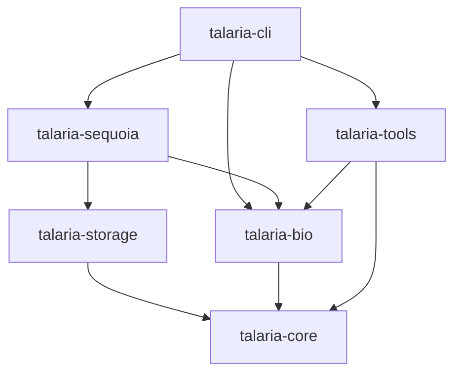
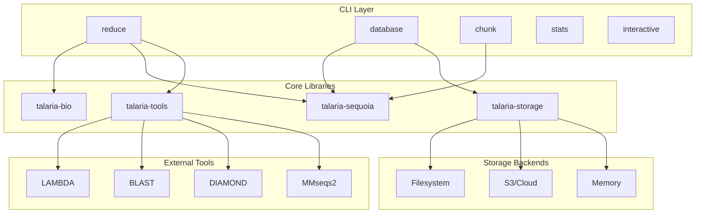
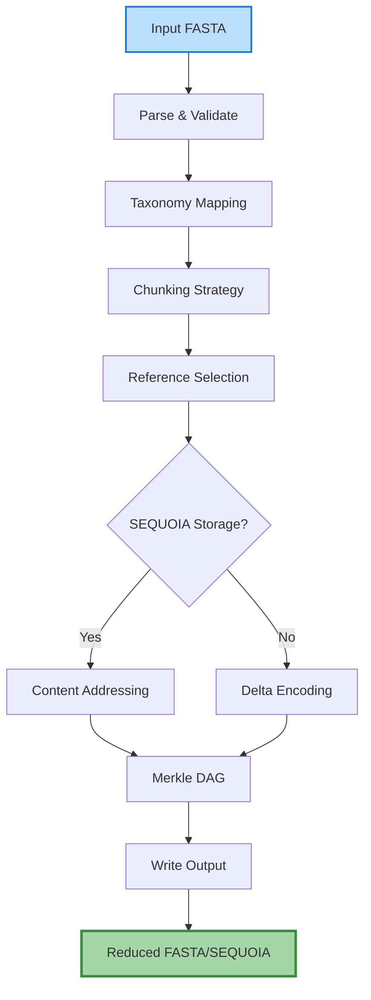

# Architecture

Comprehensive overview of Talaria's system architecture, design patterns, and internal structure.

## Workspace Architecture

Talaria is organized as a Rust workspace with modular crates for better separation of concerns:

```
talaria/
├── Cargo.toml           # Workspace configuration
├── talaria-core/        # Shared utilities and types
├── talaria-bio/         # Bioinformatics library
├── talaria-storage/     # Storage backend abstractions
├── talaria-sequoia/        # Content-addressed sequence graph
├── talaria-tools/       # External tool integrations
├── talaria-cli/         # Command-line interface
└── tests/               # Integration tests
    ├── sequoia_integration/
    ├── reduction_pipeline/
    ├── database_operations/
    ├── tool_integration/
    └── cross_module/
```

### Crate Dependencies



## Module Structure

### talaria-core
Shared utilities and fundamental types:

```
talaria-core/
├── src/
│   ├── lib.rs           # Public API
│   ├── error.rs         # Unified error types
│   ├── paths.rs         # Path management
│   ├── config.rs        # Configuration
│   └── version.rs       # Version utilities
```

**Key Features:**
- Centralized path management with environment variable support
- Unified error handling across all crates
- System-wide configuration management
- Semantic versioning utilities

### talaria-bio
Bioinformatics algorithms and data structures:

```
talaria-bio/
├── src/
│   ├── lib.rs           # Public API
│   ├── sequence.rs      # Sequence types
│   ├── fasta.rs         # FASTA I/O
│   ├── taxonomy.rs      # Taxonomy management
│   ├── stats.rs         # Statistics
│   ├── uniprot.rs       # UniProt parsing
│   └── alignment/       # Alignment algorithms
│       ├── mod.rs
│       ├── nw_aligner.rs
│       └── scoring.rs
```

**Key Features:**
- High-performance FASTA parsing with memory mapping
- Needleman-Wunsch and other alignment algorithms
- Taxonomy tree management and queries
- UniProt/NCBI format support

### talaria-storage
Storage backend implementations:

```
talaria-storage/
├── src/
│   ├── lib.rs           # Public API
│   ├── traits.rs        # Storage traits
│   ├── cache.rs         # Caching layer
│   ├── index.rs         # Chunk indexing
│   ├── metadata.rs      # Metadata storage
│   └── optimizer.rs     # Storage optimization
```

**Key Features:**
- Trait-based storage abstraction
- Multiple backend support (filesystem, S3, memory)
- Multi-level caching with various eviction policies
- Storage optimization strategies

### talaria-sequoia
Content-addressed sequence graph system:

```
talaria-sequoia/
├── src/
│   ├── lib.rs           # Public API
│   ├── storage.rs       # SEQUOIA storage
│   ├── manifest.rs      # Manifest management
│   ├── chunker/         # Chunking strategies
│   │   ├── mod.rs
│   │   ├── taxonomic.rs
│   │   └── advanced.rs
│   ├── merkle.rs        # Merkle DAG
│   ├── temporal.rs      # Temporal versioning
│   └── taxonomy/        # Taxonomy integration
```

**Key Features:**
- Content-addressed storage with SHA256
- Multi-objective optimization for chunking
- Dual Merkle DAGs for bi-temporal verification
- Evolution-aware delta encoding

### talaria-tools
External tool integration:

```
talaria-tools/
├── src/
│   ├── lib.rs           # Public API
│   ├── traits.rs        # Aligner traits
│   ├── lambda.rs        # LAMBDA aligner
│   └── tool_manager.rs  # Tool management
```

**Key Features:**
- Unified interface for multiple aligners
- Automatic tool download and installation
- Version management
- Tool-specific optimizations

### talaria-cli
Command-line interface:

```
talaria-cli/
├── src/
│   ├── main.rs          # Entry point
│   ├── cli/             # CLI modules
│   │   ├── commands/    # Command implementations
│   │   │   ├── reduce.rs
│   │   │   ├── database/
│   │   │   └── chunk/
│   │   ├── visualize.rs # Visualization
│   │   └── charts.rs    # Terminal charts
│   ├── download/        # Database downloads
│   ├── processing/      # Pipeline processing
│   ├── report/          # Report generation
│   └── utils/           # CLI utilities
```

**Key Features:**
- Rich command-line interface with subcommands
- Interactive terminal UI
- HTML report generation
- Progress visualization

## System Overview



## Design Patterns

### 1. Trait-Based Architecture

All major components use traits for flexibility:

```rust
// Storage trait
pub trait ChunkStorage: Send + Sync {
    fn store_chunk(&self, data: &[u8], compress: bool) -> Result<SHA256Hash>;
    fn get_chunk(&self, hash: &SHA256Hash) -> Result<Vec<u8>>;
    fn has_chunk(&self, hash: &SHA256Hash) -> bool;
}

// Aligner trait
pub trait Aligner: Send + Sync {
    fn search(&mut self, query: &[Sequence], reference: &[Sequence]) -> Result<Vec<AlignmentResult>>;
    fn version(&self) -> Result<String>;
    fn is_available(&self) -> bool;
}

// Chunker trait
pub trait Chunker: Send + Sync {
    fn chunk_sequences(&mut self, sequences: &[Sequence]) -> Result<Vec<ChunkMetadata>>;
    fn get_stats(&self) -> ChunkingStats;
}
```

### 2. Builder Pattern for Complex Objects

```rust
pub struct ChunkingStrategyBuilder {
    strategy: ChunkingStrategy,
}

impl ChunkingStrategyBuilder {
    pub fn target_size(mut self, size: usize) -> Self {
        self.strategy.target_chunk_size = size;
        self
    }

    pub fn taxonomic_coherence(mut self, coherence: f64) -> Self {
        self.strategy.taxonomic_coherence = coherence;
        self
    }

    pub fn build(self) -> ChunkingStrategy {
        self.strategy
    }
}
```

### 3. Repository Pattern for Data Access

```rust
pub struct SEQUOIARepository {
    storage: SEQUOIAStorage,
    manifest: Manifest,
    taxonomy: TaxonomyManager,
    temporal: TemporalIndex,
}

impl SEQUOIARepository {
    pub fn store_sequences(&mut self, sequences: Vec<Sequence>) -> Result<Vec<ChunkMetadata>>;
    pub fn extract_taxon(&self, taxon: &str) -> Result<Vec<Sequence>>;
    pub fn verify(&self) -> Result<VerificationResult>;
}
```

## Data Flow

### Reduction Pipeline



## Testing Architecture

### Test Organization

```
tests/
├── sequoia_integration/        # SEQUOIA system tests
│   ├── basic_operations.rs
│   ├── manifest_operations.rs
│   └── temporal_operations.rs
├── reduction_pipeline/      # Reduction workflow tests
│   ├── basic_reduction.rs
│   ├── sequoia_reduction.rs
│   └── reference_selection.rs
├── database_operations/     # Database management tests
│   ├── fetch_tests.rs
│   ├── add_tests.rs
│   └── taxonomy_tests.rs
├── tool_integration/        # External tool tests
│   └── lambda_tests.rs
└── cross_module/           # Cross-cutting tests
    ├── trait_tests.rs
    ├── versioning_tests.rs
    └── regression_tests.rs
```

### Testing Strategy

- **Unit Tests**: Within each crate's source
- **Integration Tests**: Workspace-level tests directory
- **Property Testing**: Using proptest for invariants
- **Regression Tests**: Specific bug prevention
- **Performance Tests**: Benchmarks with criterion

## Memory Management

### Strategies

1. **Memory Mapping**: Large FASTA files
2. **Streaming**: Processing without full load
3. **Chunking**: Bounded memory usage
4. **Object Pooling**: Reusable alignment matrices
5. **Reference Counting**: Shared immutable data

## Concurrency Model

### Parallelism Levels

1. **Sequence Level**: Process sequences in parallel
2. **Chunk Level**: Parallel chunk creation
3. **Alignment Level**: Concurrent alignments
4. **I/O Level**: Async file operations

### Synchronization

```rust
pub struct SharedState {
    config: RwLock<Config>,        // Read-heavy
    progress: Mutex<Progress>,     // Write-heavy
    stats: AtomicU64,             // Lock-free
    results: mpsc::Sender<Result>, // Channel-based
}
```

## Error Handling

### Unified Error Type

```rust
use thiserror::Error;

#[derive(Error, Debug)]
pub enum TalariaError {
    #[error("IO error: {0}")]
    Io(#[from] std::io::Error),

    #[error("Configuration error: {0}")]
    Configuration(String),

    #[error("Storage error: {0}")]
    Storage(String),

    // ... other variants
}
```

## Performance Considerations

### Optimization Techniques

1. **SIMD**: Alignment scoring
2. **Zero-Copy**: FASTA parsing
3. **Lazy Loading**: On-demand chunk retrieval
4. **Batch Processing**: Amortize overhead
5. **Cache Locality**: Data structure layout

### Hot Paths

- Sequence comparison (SIMD-optimized)
- Hash computation (hardware acceleration)
- Chunk lookup (O(1) with caching)
- Merkle proof generation (O(log n))

## Security Considerations

### Input Validation

- Maximum file size limits
- Sequence character validation
- Path traversal prevention
- Resource consumption limits

### Sandboxing

- Restricted file system access
- Network isolation for tools
- Memory limits per operation
- CPU time limits

## Future Architecture

### Planned Enhancements

1. **Distributed SEQUOIA**: Multi-node storage
2. **Cloud-Native**: Kubernetes operators
3. **GPU Acceleration**: CUDA/ROCm support
4. **WebAssembly**: Browser-based tools
5. **gRPC API**: Remote procedure calls

### Extension Points

- Custom chunking strategies
- Additional storage backends
- New alignment algorithms
- Alternative compression methods
- Plugin system for tools

## See Also

- [Building](building.md) - Build instructions
- [Contributing](contributing.md) - Development guidelines
- [API Reference](../api/cli-reference.md) - CLI documentation
- [Performance](../advanced/performance.md) - Optimization guide
- [SEQUOIA Architecture](../sequoia/architecture.md) - SEQUOIA deep dive