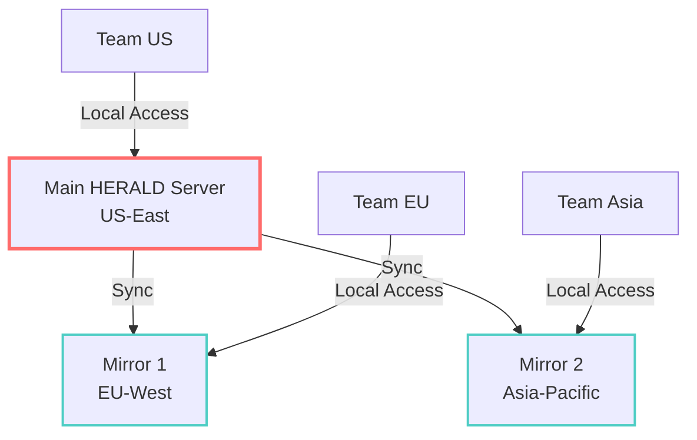

# HERALD Best Practices

This guide provides proven practices for getting the most out of HERALD in production environments.

## Storage Management

### Choose the Right Storage Location

**DO:** Use fast local storage for HERALD chunks
```bash
# Good: Fast NVMe storage
export TALARIA_HOME=/nvme/talaria

# Okay: Regular SSD
export TALARIA_HOME=/home/user/.talaria

# Avoid: Network storage for chunks (high latency)
export TALARIA_HOME=/nfs/shared/talaria
```

**Exception:** Network storage is fine for shared read-only access after initial download.

### Optimize Chunk Cache

For frequently accessed databases, keep chunks in memory:

```bash
# Prewarm cache for better performance
talaria database cache uniprot/swissprot --prewarm

# Configure cache size (default: 2GB)
export TALARIA_CACHE_SIZE=8G
```

### Regular Maintenance

```bash
# Weekly: Verify integrity
talaria database verify --all

# Monthly: Clean old versions
talaria database clean --keep-latest 3

# Quarterly: Defragment chunk storage
talaria herald defrag
```

## Update Strategies

### Automatic Updates

Set up automated updates for critical databases:

```bash
#!/bin/bash
# /etc/cron.daily/talaria-update

databases=(
    "uniprot/swissprot"
    "uniprot/trembl"
    "ncbi/nr"
)

for db in "${databases[@]}"; do
    talaria database update "$db" --quiet
    if [ $? -eq 0 ]; then
        logger "Talaria: Updated $db successfully"
    else
        logger "Talaria: Failed to update $db"
    fi
done
```

### Staged Updates

For production systems, use staged updates:

```bash
# 1. Download to staging
export TALARIA_HOME=/staging/talaria
talaria database download uniprot/swissprot

# 2. Verify in staging
talaria database verify uniprot/swissprot
./run_tests.sh

# 3. Sync to production
rsync -av /staging/talaria/ /production/talaria/
```

### Network Optimization

For slow connections, use parallel downloads:

```bash
# Increase parallel chunk downloads (default: 4)
export TALARIA_PARALLEL_DOWNLOADS=8

# Use compression for transfers
export TALARIA_COMPRESS_TRANSFER=true

# Resume interrupted downloads
talaria database download uniprot/swissprot --resume
```

## Team Collaboration

### Shared HERALD Repository

Set up a central HERALD repository for your team:

```bash
# On central server
mkdir -p /shared/talaria/{databases,cache}
chmod 755 /shared/talaria
chmod 775 /shared/talaria/databases  # Allow team writes

# Download databases as team lead
export TALARIA_HOME=/shared/talaria
talaria database download uniprot/swissprot

# On team machines (read-only)
export TALARIA_HOME=/shared/talaria
export TALARIA_READONLY=true
```

### Distributed Team Setup

For geographically distributed teams:



```bash
# Set up mirror sync (on mirror servers)
*/6 * * * rsync -av main-server:/shared/talaria/ /local/talaria/
```

## Performance Optimization

### Database-Specific Settings

Different databases benefit from different configurations:

```bash
# For large databases (NCBI nr)
export TALARIA_CHUNK_SIZE=500M
export TALARIA_PARALLEL_DOWNLOADS=16
export TALARIA_CACHE_SIZE=16G

# For small databases (SwissProt)
export TALARIA_CHUNK_SIZE=100M
export TALARIA_PARALLEL_DOWNLOADS=4
export TALARIA_CACHE_SIZE=2G
```

### Memory Management

```bash
# Monitor memory usage
talaria herald stats --memory

# Limit memory usage
export TALARIA_MAX_MEMORY=32G

# Use memory-mapped I/O for large operations
export TALARIA_USE_MMAP=true
```

### I/O Optimization

```bash
# Increase read-ahead for sequential access
echo 4096 > /sys/block/nvme0n1/queue/read_ahead_kb

# Use direct I/O to bypass page cache
export TALARIA_DIRECT_IO=true

# Tune for SSD
export TALARIA_SSD_MODE=true
```

## Reproducibility

### Version Pinning

Always pin versions for reproducible research:

```bash
# Specify exact version
talaria database download uniprot/swissprot --version 2024-03-15

# Record version used
talaria database status uniprot/swissprot > experiment_database_version.txt

# Include in publication methods
echo "Database: UniProt SwissProt version 2024-03-15 (SHA: 5a9b3c...)"
```

### Manifest Archiving

Archive manifests with your results:

```bash
# Save manifest with results
cp ~/.talaria/databases/manifests/uniprot_swissprot_2024-03-15.manifest \
   results/database_manifest.json

# Recreate exact database state later
talaria database restore --manifest results/database_manifest.json
```

## Security Considerations

### Verify Database Integrity

Always verify databases from untrusted sources:

```bash
# Verify against known good hash
expected_hash="5a9b3c8f2d1a7e6b4c9d3f8a2b7e1c9d"
actual_hash=$(talaria database hash uniprot/swissprot)

if [ "$actual_hash" != "$expected_hash" ]; then
    echo "WARNING: Database hash mismatch!"
    exit 1
fi
```

### Access Control

Implement proper access controls:

```bash
# Read-only for most users
chmod 755 ~/.talaria/databases/chunks
chmod 644 ~/.talaria/databases/chunks/*

# Write access only for updater service
chown updater:talaria ~/.talaria/databases/manifests
chmod 775 ~/.talaria/databases/manifests
```

## Monitoring

### Health Checks

Implement monitoring for production systems:

```bash
#!/bin/bash
# health_check.sh

# Check HERALD accessibility
if ! talaria herald status &>/dev/null; then
    alert "HERALD unavailable"
    exit 1
fi

# Check database freshness
for db in uniprot/swissprot ncbi/nr; do
    age=$(talaria database age "$db")
    if [ "$age" -gt 7 ]; then
        alert "Database $db is $age days old"
    fi
done

# Check storage usage
usage=$(df -h ~/.talaria | awk 'NR==2 {print $5}' | sed 's/%//')
if [ "$usage" -gt 90 ]; then
    alert "HERALD storage at ${usage}%"
fi
```

### Performance Metrics

Track key metrics:

```bash
# Log download performance
time talaria database update uniprot/swissprot 2>&1 | \
    tee -a /var/log/talaria_performance.log

# Monitor chunk cache hit rate
talaria herald stats --cache

# Track bandwidth usage
vnstat -i eth0 -h
```

## Disaster Recovery

### Backup Strategy

```bash
# Daily: Backup manifests (small, critical)
tar -czf manifests_$(date +%Y%m%d).tar.gz \
    ~/.talaria/databases/manifests/

# Weekly: Backup chunk index
talaria herald export --index-only > \
    chunk_index_$(date +%Y%m%d).json

# Monthly: Full backup (if feasible)
rsync -av ~/.talaria/databases/ \
    /backup/talaria/databases/
```

### Recovery Procedures

```bash
# Recover from manifest backup
tar -xzf manifests_20240315.tar.gz -C ~/.talaria/databases/

# Re-download missing chunks
talaria database repair --auto-download

# Verify recovery
talaria database verify --all
```

## Common Pitfalls to Avoid

### ❌ DON'T: Mix TALARIA_HOME environments

```bash
# BAD: Inconsistent environments
TALARIA_HOME=/path1 talaria database download uniprot/swissprot
TALARIA_HOME=/path2 talaria reduce ...  # Won't find database!
```

### ❌ DON'T: Ignore verification failures

```bash
# BAD: Continuing after verification failure
talaria database verify uniprot/swissprot || echo "Whatever, continuing..."
```

### ❌ DON'T: Manually modify chunk files

```bash
# BAD: Manual chunk manipulation
cd ~/.talaria/databases/chunks
rm *.chunk  # Breaks everything!
```

### ✓ DO: Use HERALD commands for all operations

```bash
# GOOD: Use provided tools
talaria database list
talaria database verify
talaria database update uniprot/swissprot
```

## Summary

Following these best practices ensures:
- **Reliability**: Verified, consistent database states
- **Performance**: Optimal speed for your hardware
- **Collaboration**: Efficient team-wide database sharing
- **Reproducibility**: Perfect recreation of analysis conditions
- **Maintainability**: Easy troubleshooting and recovery

For performance benchmarks and metrics, see [Performance Metrics](./performance.md)