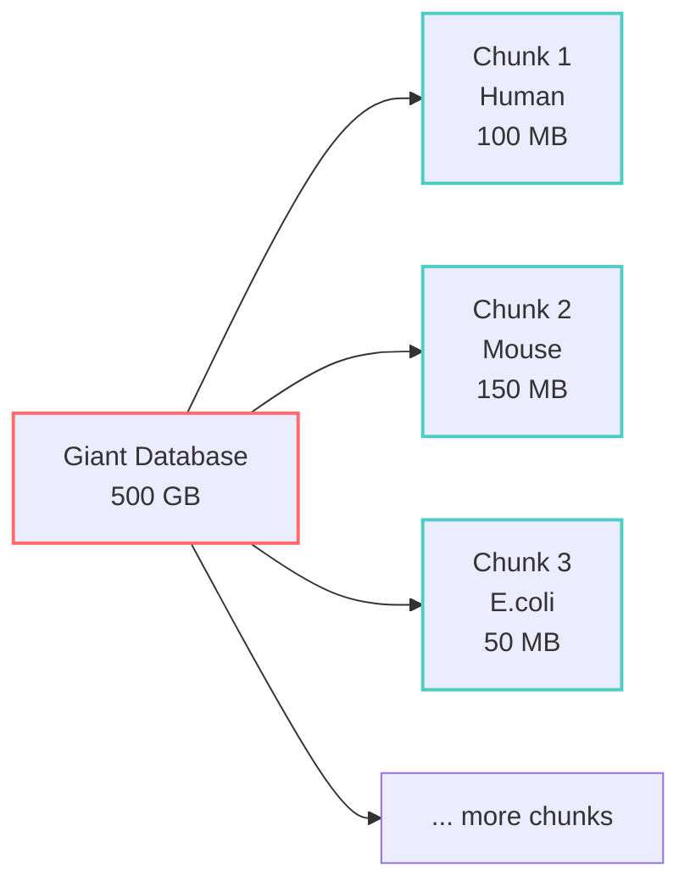
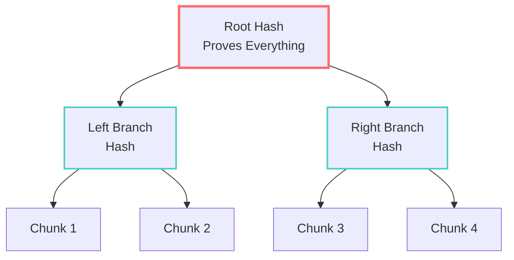
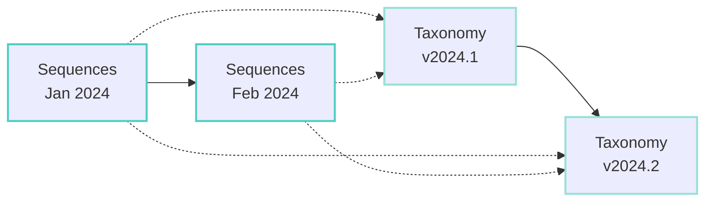

# Core HERALD Concepts

This guide explains the fundamental concepts behind HERALD in plain language. No PhD required!

## Canonical Sequences

### The Problem: Same Sequence, Different Headers
```
UniProt:  >sp|P0DSX6|MCEL_VARV OS=Variola virus GN=mcel
NCBI:     >gi|15618988|ref|NP_042163.1| mRNA capping enzyme
Custom:   >P0DSX6 Methyltransferase/RNA capping enzyme
```

All three are the SAME biological sequence with different headers!

### HERALD's Solution: Canonical Storage
```
Sequence: MSKGEELFTGVVPILVELDGDVNGH...
Hash: SHA256(sequence only) = abc123...

Stored once as: abc123.seq
With representations:
  - UniProt header
  - NCBI header
  - Custom header
```

**Key Innovation**: Separate identity (the sequence) from representation (headers/metadata)

## Content Addressing

### Traditional Approach: Names Point to Data
```
database_v1.fasta → [data that can change]
database_v2.fasta → [completely different data]
```

Problems:
- Same name might have different content
- No way to verify if data is correct
- Must trust the source completely

### HERALD Approach: Content Defines the Name
```
SHA256(sequence) = abc123... → [sequence that never changes]
```

Benefits:
- Sequence content creates its own unique ID
- Any change creates a new ID
- Can verify data independently
- **Perfect cross-database deduplication**

**Simple Analogy**: It's like using DNA fingerprints - the same person has the same DNA regardless of what name they use.

## Chunk Manifests

Instead of storing sequences in chunks, HERALD uses **chunk manifests** that reference canonical sequences.

### Old Way: Chunks Contain Sequences
```
Chunk 1: [Seq A, Seq B, Seq C] - 100 MB
Chunk 2: [Seq A, Seq D, Seq E] - 120 MB
// Seq A stored twice!
```

### New Way: Manifests Reference Sequences
```
Canonical Storage:
  Seq A: hash_A (stored once)
  Seq B: hash_B
  Seq C: hash_C
  Seq D: hash_D
  Seq E: hash_E

Manifest 1: [hash_A, hash_B, hash_C] - 1 KB
Manifest 2: [hash_A, hash_D, hash_E] - 1 KB
// Seq A referenced twice, stored once!
```

### Why Chunk Manifests?
- **True Deduplication**: Each sequence stored exactly once
- **Efficient Updates**: Only download new sequences
- **Cross-Database Sharing**: Same sequences referenced by multiple databases
- **Tiny Manifests**: KB instead of MB/GB
- **Parallel Processing**: Work on multiple manifests simultaneously
- **Better Caching**: Keep frequently used sequences in memory
- **Fault Tolerance**: One corrupted manifest doesn't affect others



## Manifests

A manifest is like a recipe or blueprint that tells HERALD how to reconstruct a complete database from chunks.

### What's in a Manifest?
```yaml
database: uniprot_swissprot
version: 2024-03-15
total_sequences: 571282
chunks:
  - hash: abc123def456...
    taxon: 9606  # Human
    size: 104857600
  - hash: 789ghi012jkl...
    taxon: 10090  # Mouse
    size: 157286400
```

### Manifest Benefits
- **Version Tracking**: Know exactly what's in each version
- **Quick Updates**: Compare manifests to find changes
- **Verification**: Confirm all chunks are present and correct
- **Reproducibility**: Recreate exact database state anytime

## Merkle Trees

Merkle trees provide cryptographic proof that data is correct without checking every single piece.

### How It Works



**Benefits**:
- Verify any chunk belongs to the database
- Detect tampering immediately
- Prove database integrity with just the root hash

## Bi-Temporal Versioning

Biological databases change in two independent ways:

### 1. Sequence Time
When new sequences are added or existing ones updated:
- New protein discovered
- Sequence correction
- Additional annotations

### 2. Taxonomy Time
When our understanding of relationships changes:
- Species reclassification
- New evolutionary insights
- Taxonomic corrections

### Why It Matters


You can:
- Use January sequences with February taxonomy
- Apply current taxonomy to historical sequences
- Track how classifications changed over time

## Delta Compression

Instead of storing similar sequences multiple times, HERALD stores one reference and the differences (deltas) for similar sequences.

### Example
```
Reference: MKTAYIAKQRQISFVKSHFSRQ...  (Human insulin)
Delta 1:   ----------E---------...     (Mouse: position 11 K→E)
Delta 2:   ---S----------------...     (Rat: position 4 T→S)
```

**Storage Savings**:
- Full storage: 3 complete sequences
- Delta storage: 1 sequence + 2 small changes
- Savings: ~70% for similar sequences

## Summary

These concepts work together to create a storage system that's:
- **Efficient**: Minimal storage and bandwidth usage
- **Verifiable**: Cryptographic proof of correctness
- **Flexible**: Handle updates and versions elegantly
- **Scientific**: Designed for biological data patterns

Ready to see these concepts in action? Continue to [How HERALD Works](./how-it-works.md)