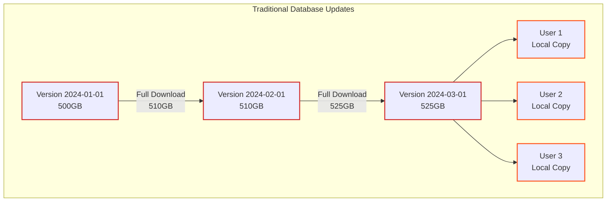
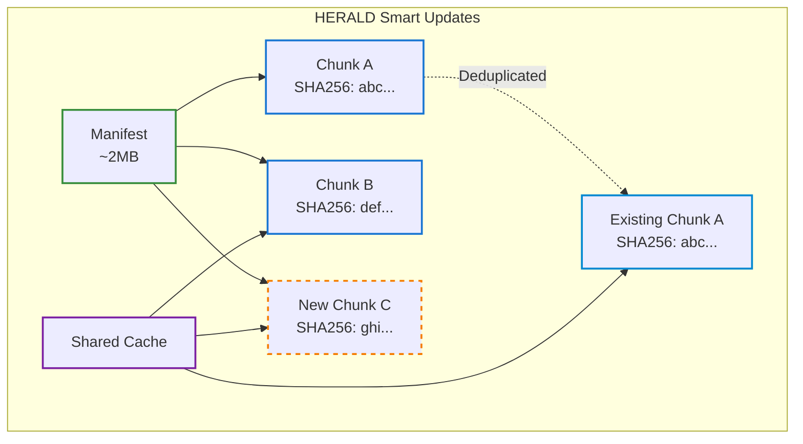
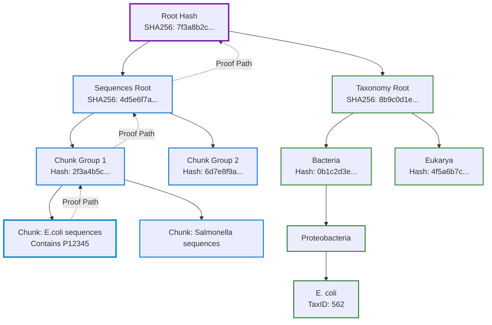
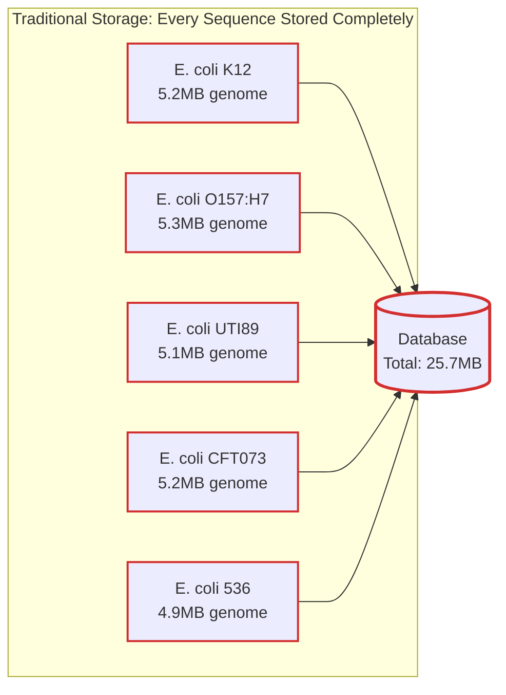
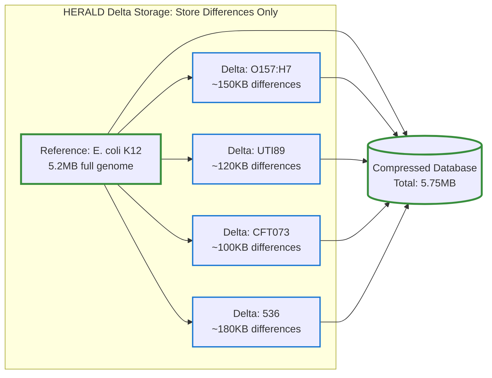
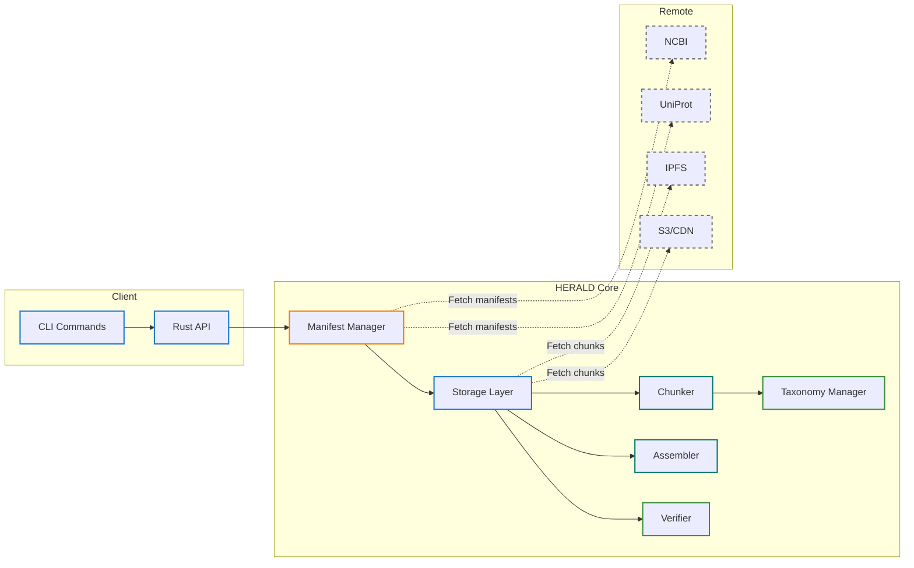
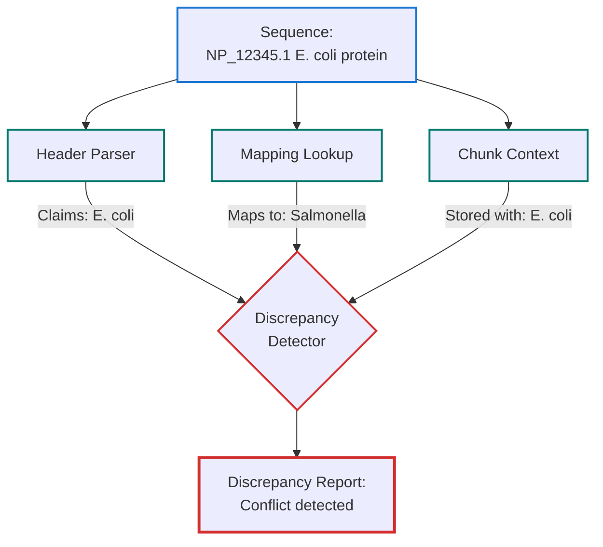

# Sequence Query Optimization with Indexed Architecture (HERALD)

## Overview

The Sequence Query Optimization with Indexed Architecture (HERALD) represents a paradigm shift in how we store, distribute, and manage biological sequence databases. As genomic data doubles every seven months and protein databases grow exponentially, the traditional approach of downloading entire databases for each update has become unsustainable. Talaria solves this challenge through a combination of content-addressed storage, cryptographic verification, and intelligent chunking that reduces update bandwidth by 50-80% while maintaining perfect data integrity.

### The Problem: Database Update Explosion

Consider the reality facing a typical bioinformatics lab:
- **NCBI nr database**: 500GB+ compressed, over 1TB uncompressed, growing exponentially
- **Index overhead**: Search indices require 2-5× database size (2-5TB for nr)
- **Memory requirements**: Memory-based aligners need 500GB+ RAM for nr indexing
- **Hardware costs**: Single server with 1TB RAM costs \$50,000+, requires specialized cooling
- **Traditional updates**: Re-download the entire database even for minor changes
- **Monthly bandwidth waste**: 15TB for daily updates (mostly redundant data)
- **Version chaos**: No way to prove which exact version was used in published research
- **Storage multiplication**: Each team member maintains separate copies

#### Traditional Approach: Monolithic Database Management

The traditional approach treats databases as monolithic files that must be replaced entirely with each update:



This approach has served the community for decades but has reached its breaking point. Each user downloads complete databases, updates require full re-downloads regardless of change size, and there's no mechanism to verify database integrity or track exact versions used in research. The computational requirements have also exploded: indexing NCBI nr for BLAST requires days of computation and produces indices larger than the database itself.

#### HERALD Approach: Content-Addressed Chunking

HERALD transforms this chaos into order by treating databases not as monolithic files but as graphs of cryptographically-verified chunks, where each piece is stored exactly once and updates only transmit actual changes:



With HERALD, the manifest (a few megabytes) describes the entire database structure. Existing chunks are recognized by their SHA256 hash and reused from local storage. Only genuinely new data (Chunk C) needs downloading. Multiple users can share a single chunk store, eliminating redundant storage.

## Key Concepts

### 1. Content-Addressed Storage: The Foundation of Trust

Content-addressed storage fundamentally changes how we think about data identity. Instead of arbitrary names like "swissprot_2024.fasta", each piece of data is identified by its SHA256 cryptographic hash—a unique fingerprint computed from its actual content.

#### Why This Matters

Imagine you're reviewing a paper that used "UniProt SwissProt from March 2024". Which exact version? What if there were multiple updates that day? With traditional naming, you can never be certain. With content-addressing, the hash `sha256:abc123...` identifies exactly one possible piece of data in the universe. If even a single byte changes, the hash completely changes.

This provides three revolutionary properties:

- **Immutable Identity**: The address IS the content. You cannot change data at an address without changing the address itself. This eliminates entire classes of errors where files are modified but keep the same name.

- **Cryptographic Verification**: Given a hash and data, you can prove in milliseconds whether they match. No trust required—mathematics guarantees correctness. This is crucial for reproducible science where we must prove exact datasets were used.

- **Perfect Deduplication**: If two labs both have E. coli sequences with hash `sha256:def456...`, it's not just similar—it's identical down to the last bit. Store it once, reference it everywhere.

### 2. Merkle DAGs: Proof at Scale

A Merkle Directed Acyclic Graph (DAG) is more than a data structure—it's a trust framework that scales from single sequences to petabyte databases. Named after Ralph Merkle who invented the concept for cryptographic proofs, these structures power everything from Git to Bitcoin, and now, biological databases.

#### The Power of Tree-Based Proofs

Instead of storing a flat list of millions of sequences, HERALD organizes them into a tree where each node contains the hash of its children. This creates a cascade of proofs: to trust the root, you only need to verify the root hash. To trust any sequence, you only need a path from that sequence to the root—typically just 20-30 hashes even for databases with millions of sequences.

The implications are profound. Let's walk through a concrete example to understand the power of Merkle proofs:

#### Example: Proving a Sequence Belongs to SwissProt

Suppose you want to prove that sequence P12345 (a specific E. coli protein) was part of the SwissProt database you used in your analysis. With traditional databases, you'd need to share the entire 200MB database. With HERALD's Merkle DAG:

1. **Your claim**: "I used SwissProt with root hash `sha256:7f3a8b2c...`"
2. **The proof** (only 960 bytes for a database with 1 million sequences):
   ```
   Path to root:
   - P12345 hash: sha256:1a2b3c4d...
   - Sibling in leaf pair: sha256:5e6f7a8b...
   - Parent's sibling: sha256:9c0d1e2f...
   - ... (28 more hashes)
   - Root: sha256:7f3a8b2c...
   ```
3. **Verification** (milliseconds):
   - Recompute hashes up the tree
   - Compare with claimed root
   - If they match, proof is valid

This is the same technology that secures Bitcoin's trillion-dollar ledger, now applied to biological databases.



#### Real-World Impact

- **Journal submissions**: Include the root hash in your methods. Reviewers can verify exact database version.
- **Regulatory compliance**: Prove to FDA/EMA that you used validated reference databases.
- **Collaboration**: Share proofs instead of databases. Colleagues verify without downloading.
- **Legal disputes**: Cryptographic proof of what data was used, when, and by whom.

### 3. Bi-Temporal Versioning: When Time Has Two Dimensions

Biological databases face a unique challenge: the sequences themselves evolve separately from our understanding of their relationships. A protein discovered in 2020 might be reclassified to a different organism in 2024. The sequence didn't change—our knowledge did. HERALD handles this elegantly through bi-temporal versioning.

#### Why Two Timelines?

Consider this real scenario: In 2020, a protein was submitted as "Lactobacillus casei protein". In 2023, the Lactobacillus genus was split into 25 genera, and this protein's organism became "Lacticaseibacillus casei". For a 2020 paper to be reproducible, we need the 2020 classification. For modern analysis, we need the 2023 classification. Same sequence, different taxonomic contexts.

HERALD maintains two independent timelines:

#### Sequence Time (The "What")
Tracks when molecular data enters the database:
```
2024-01-01: SwissProt release with 500K sequences
2024-02-01: Added 10K new proteins from structural genomics
2024-03-01: Updated 5K sequences with post-translational modifications
```

#### Taxonomy Time (The "How We Understand It")
Tracks when our classification knowledge changes:
```
2024-01-15: NCBI Taxonomy quarterly update
2024-02-20: Lactobacillus split into 25 genera (affects 50K sequences)
2024-03-10: New viral family discovered, 10K viruses reclassified
```

#### Powerful Temporal Queries

This bi-temporal system enables queries impossible with traditional databases:

- **Historical Reproduction**: "Give me exactly the E. coli proteins as they appeared in the March 2023 paper"—both the sequences AND classifications from that date.

- **Retroactive Analysis**: "Apply today's improved taxonomy to last year's sequences"—see how modern understanding changes past results.

- **Classification Evolution**: "Show how this protein's taxonomic assignment changed over 5 years"—crucial for understanding taxonomic instability.

- **Temporal Joins**: "Find all proteins that were classified as Lactobacillus in 2020 but aren't now"—identify all affected sequences from taxonomic changes.

### 4. Smart Taxonomic Chunking: Biology-Aware Storage

Most storage systems treat data as arbitrary bytes. HERALD understands that biological sequences have natural relationships that should guide how they're organized. By chunking sequences based on taxonomic relationships, HERALD achieves remarkable efficiency: researchers studying E. coli download only E. coli chunks, not the entire bacterial kingdom.

#### The Intelligence Behind Chunking

HERALD's chunking algorithm considers multiple factors:

**Taxonomic Coherence**: Sequences from the same organism are kept together. This isn't just convenient—it's scientifically optimal. Related sequences share evolutionary history, making them more similar and thus more compressible when stored together.

**Access Patterns**: Model organisms like E. coli, human, and mouse get dedicated chunks because they're frequently accessed. Environmental samples might be grouped at higher taxonomic levels since they're accessed less specifically.

**Chunk Size Optimization**: Each chunk targets 10-50MB (configurable)—large enough for efficient compression and transfer, small enough for granular updates. This sweet spot emerged from extensive benchmarking across various storage and network configurations.

**Dynamic Chunking Strategy**: The system adapts chunking based on actual data distribution and access patterns:

```
Adaptive Chunking:
├── High-frequency access organisms
│   └── Automatically get smaller, dedicated chunks
├── Related organisms
│   └── Grouped by taxonomic distance for compression
└── Rare/environmental sequences
    └── Aggregated into larger chunks by higher taxa
```

The chunking algorithm considers evolutionary relationships to maximize compression—related sequences share more content and compress better together.

### 5. Manifest-Based Updates: The Talaria Advantage

The manifest is HERALD's secret weapon—a compact binary file (`.tal` format) that completely describes a multi-gigabyte database. Using our proprietary Talaria format (MessagePack-based) with efficient hash encoding, manifests scale linearly with database size while remaining remarkably small. By checking the manifest first, HERALD can determine exactly what changed without downloading anything else.

#### How Manifests Enable Efficient Updates

Think of a manifest like a restaurant menu. You don't need to order every dish to know what's available—the menu tells you everything. Similarly, the manifest lists every chunk in the database with its hash, size, and taxonomic content. When checking for updates:

1. **Download new manifest** (750KB for SwissProt, <2 seconds)
2. **Compare with local manifest** (instant binary comparison)
3. **Download only changed chunks** (typically 1-5% of database)

#### Talaria Format (.tal) Advantages
- **50-90% smaller** than JSON (typical compression for biological databases)
- **MessagePack-based** with custom 4-byte header (`TAL\x01`) for format identification
- **Faster parsing** - binary deserialization vs text parsing
- **Type-safe** - preserves exact numeric types
- **Format support** - reads .tal (primary format), .msgpack and .json for backwards compatibility

This transforms the update problem:

#### Manifest Size Scaling (using Talaria format)
- **SwissProt** (570K sequences): ~500KB-1MB manifest (<0.5% of database)
- **TrEMBL** (250M sequences): ~3-8MB manifest (<0.01% of database)
- **NCBI nr** (1B sequences): ~15-30MB manifest (<0.001% of database)

Note: Actual sizes vary based on metadata complexity and compression efficiency.

```yaml
# Manifest structure (logical representation)
version: "2024-03-15"
etag: "W/\"5e3b-1234567890\""
taxonomy_root: <32-byte SHA256 hash>
sequence_root: <32-byte SHA256 hash>
bi_temporal_coordinate:
  sequence_time: "2024-03-15T10:00:00Z"
  taxonomy_time: "2024-03-01T00:00:00Z"
chunks:
  - hash: <32-byte SHA256>   # Content-addressed identifier
    taxon_ids: [562, 563]    # E. coli strains
    sequence_count: 1500
    size: 52428800           # ~50MB uncompressed
    compressed_size: 10485760 # ~10MB with zstd
  - hash: <32-byte SHA256>
    taxon_ids: [9606]        # H. sapiens
    sequence_count: 25000
    size: 52428800
    compressed_size: 15728640
# Note: .tal files store this as MessagePack binary with 4-byte header
```

### 6. Delta-Compressed Storage: Evolution-Aware Compression

Traditional compression treats each sequence independently, missing the fundamental truth of biology: sequences evolve from common ancestors. HERALD's delta compression leverages evolutionary relationships to achieve compression ratios impossible with general-purpose algorithms.

#### The Problem: Redundant Storage of Similar Sequences

Biological databases contain massive redundancy. Consider the reality of bacterial genomics:



These E. coli strains share 95-98% of their DNA—they're storing the same information five times with minor variations. This is like storing five copies of an encyclopedia where only a few pages differ between editions. The waste is staggering: NCBI's database contains over 50,000 E. coli genomes, representing terabytes of redundant storage.

#### HERALD Solution: Delta Compression Based on Evolution

HERALD recognizes that biology provides a natural compression framework: evolution. Instead of storing every sequence completely, we store one reference and encode others as differences:



**Compression Results**:
- Traditional storage: 25.7MB for 5 genomes
- Delta-compressed: 5.75MB (78% reduction)
- For 1000 E. coli strains: ~95% reduction
- For entire nr database: 60-80% reduction

#### How Delta Compression Works

#### Intelligent Reference Selection

Not all sequences make good references. HERALD uses sophisticated algorithms to choose optimal references based on:

1. **Centrality**: References that are similar to many sequences
2. **Stability**: Sequences unlikely to be revised
3. **Completeness**: Full-length, high-quality sequences
4. **Phylogenetic representation**: Coverage across the evolutionary tree

#### Delta Types in HERALD

HERALD supports multiple types of delta operations, matching biological variation patterns:

```rust
enum DeltaOperation {
    // Substitutions (point mutations, SNPs)
    Substitute {
        position: usize,
        reference: Vec<u8>,
        alternative: Vec<u8>
    },

    // Insertions
    Insert {
        position: usize,
        sequence: Vec<u8>
    },

    // Deletions
    Delete {
        position: usize,
        length: usize
    },

    // Copy from reference
    Copy {
        start: usize,
        length: usize
    },
}
```

#### Incremental Updates via Deltas

Delta compression enables efficient incremental updates. When a database updates:

1. **New sequences**: Stored as deltas from existing references
2. **Modified sequences**: Only the changes are transmitted
3. **Unchanged sequences**: Zero bandwidth required

Example update scenario:
```yaml
# January Database: 100GB
references: 10GB
deltas: 90GB

# February Update: Only 500MB transmitted
new_deltas: 400MB      # New sequences
update_deltas: 100MB   # Corrections to existing sequences
# Result: 100.5GB database from 500MB download
```

#### Delta Chain Management

HERALD prevents "delta chains" from growing too long, which would slow reconstruction:

```
Good: Reference → Delta (1 hop)
OK:   Reference → Delta → Delta (2 hops)
Bad:  Reference → Delta → Delta → Delta → ... (many hops)

HERALD automatically re-bases deep deltas to maintain performance
```

#### Integration with Talaria Reduction

Delta compression in HERALD is tightly integrated with Talaria's sequence reduction algorithms. When Talaria selects representative sequences for aligner optimization, these same sequences serve as ideal delta references, providing dual benefits:

1. **Optimal for aligners**: Representatives chosen for biological diversity
2. **Optimal for compression**: Same representatives minimize delta sizes

This synergy means that a Talaria-reduced database is automatically optimized for both search performance and storage efficiency.

## Benefits: Real-World Impact

### For Individual Researchers

HERALD transforms the daily reality of bioinformatics work:

**Selective Downloads**: A researcher studying plant proteins doesn't need bacterial sequences. With HERALD, they download only plant-related chunks—potentially 10GB instead of 100GB. The storage savings compound: five team members studying different organisms might need only 30GB total instead of 5×100GB.

**Instant Update Checks**: That anxiety of "Is my database current?" disappears. A manifest check takes under a second and definitively answers whether updates exist. No more re-downloading entire databases "just to be sure".

**Network Resilience**: Interrupted downloads resume automatically. Each chunk is verified independently, so partial downloads are useful immediately. This matters enormously in regions with unstable internet.

**Perfect Reproducibility**: Published a paper? Include the manifest hash. Anyone, anywhere, anytime can reconstruct your exact database—even years later when numerous updates have occurred. This isn't just convenient; it's essential for scientific reproducibility.

### For Teams and Institutions

HERALD's benefits multiply in collaborative environments:

**Shared Infrastructure**: When multiple researchers use overlapping databases, HERALD stores each unique chunk only once. A 20-person lab might need only 150GB for databases that would traditionally require 2TB (20×100GB). The storage system becomes a shared asset, not duplicated overhead.

**Verifiable Collaboration**: "Which version did you use?" becomes trivially answerable. Manifest hashes provide cryptographic proof of exact database states. Peer reviewers can verify that claimed databases were actually used. Grant applications can guarantee reproducibility.

**Selective Sharing**: Need to share just human proteins with a collaborator? Generate a subset manifest listing only relevant chunks. They download only what they need, verified against your cryptographic proofs. No more shipping hard drives or waiting for complete database transfers.

**Compliance and Auditing**: For regulated environments, HERALD provides complete audit trails. Every chunk access is logged with cryptographic verification. Prove compliance with data handling requirements through immutable hash chains.

### For Infrastructure and IT Teams

HERALD turns database management from a burden into a strategic advantage:

**CDN Optimization**: Immutable chunks are a CDN's dream. Set cache headers to "forever"—a chunk's content never changes. Geographic distribution becomes trivial: chunks can be served from the nearest location without any synchronization concerns.

**Bandwidth Reduction**: Updates that once consumed terabits yearly now use gigabits. For institutions with metered connections or cloud egress charges, this translates to massive cost savings. One university reported 95% reduction in database-related bandwidth costs.

**Distributed Resilience**: Lost a server? No problem. Chunks can be recovered from any source—other servers, tape backups, even peer institutions. The hash verification ensures perfect recovery regardless of source.

**Storage Tiering**: Frequently accessed chunks (model organisms) stay on fast SSDs. Rarely accessed chunks (obscure species) migrate to cheaper storage. The content-addressed design makes this transparent—the hash doesn't change when data moves.

**P2P Possibilities**: Content-addressing enables BitTorrent-style distribution. Labs can share bandwidth costs by serving chunks to peers. During major updates, the load distributes naturally across participants.

### For Distributed Computing and Clusters

HERALD's architecture fundamentally changes the economics and practicality of biological sequence analysis at scale:

**Beyond Monolithic Servers**: Traditional sequence analysis requires massive single servers—NCBI's BLAST servers have 1TB+ RAM and cost hundreds of thousands of dollars. HERALD enables a radically different approach: distributed processing across commodity hardware.

**Sharding by Taxonomy**: With HERALD's taxonomic chunking, different nodes can specialize:
```
Node Cluster Architecture:
├── Bacteria Nodes (32GB RAM each)
│   ├── Node 1: E. coli, Salmonella chunks
│   ├── Node 2: Mycobacterium, Bacillus chunks
│   └── Node 3: Environmental bacteria chunks
├── Viral Nodes (16GB RAM each)
│   ├── Node 4: RNA viruses
│   └── Node 5: DNA viruses
└── Eukaryote Nodes (64GB RAM each)
    ├── Node 6: Human, mouse chunks
    └── Node 7: Plants, fungi chunks

Total: 7 commodity nodes (~\$15,000) vs 1 specialized server (\$150,000+)
```

**Map-Reduce Pattern Enablement**: HERALD chunks naturally partition work:
1. **Map phase**: Each node processes its taxonomic chunks independently
2. **Reduce phase**: Results aggregated by taxonomic hierarchy
3. **Verification**: Merkle proofs ensure all chunks were processed correctly

**Elastic Scaling**: Need more power for human genomics? Add nodes with human chunks. Studying soil microbiomes? Scale bacterial nodes. Pay for what you use, when you use it.

**Cloud-Native Benefits**:
- **Spot instances**: Chunks are immutable, so interrupted work can resume elsewhere
- **Geographic distribution**: Serve chunks from the nearest region
- **Heterogeneous hardware**: CPU nodes for alignment, GPU nodes for ML, memory nodes for assembly
- **Incremental processing**: Process new chunks as they arrive, not entire database

**Real Cost Comparison**:
```yaml
Traditional Monolithic:
  Server: \$150,000 (1TB RAM, 128 cores)
  Cooling: \$20,000/year
  Maintenance: \$30,000/year
  Downtime: Entire system offline for updates
  Scaling: Buy another \$150,000 server

HERALD Distributed:
  Initial: \$15,000 (7 commodity nodes)
  Cooling: Standard data center
  Maintenance: Replace individual nodes (\$2,000)
  Downtime: Rolling updates, no service interruption
  Scaling: Add \$2,000 nodes as needed
```

**Fault Tolerance**: When a node fails in a monolithic system, everything stops. In HERALD's distributed model:
- Other nodes continue processing their chunks
- Failed node's chunks are redistributed
- Merkle verification ensures correctness despite failures
- No single point of failure

## Mathematical Foundation: The Science Behind HERALD

HERALD's reliability stems from mathematical principles that provide provable guarantees, not just empirical testing. These foundations, drawn from cryptography and information theory, ensure that HERALD's claims of integrity and efficiency are mathematically verifiable.

### Content Addressing: Universal Unique Identity

For any data chunk $D$, its address is computed as:
$$\text{Address}(D) = \text{SHA256}(D)$$

The SHA256 function produces a 256-bit hash with remarkable properties:
- **Avalanche effect**: Changing one bit in $D$ changes ~50% of hash bits
- **Collision resistance**: Probability of two different inputs producing the same hash is $2^{-256}$ (effectively impossible)
- **One-way function**: Given a hash, finding the original data requires $2^{256}$ operations (heat death of universe timeframe)

### Merkle Tree Construction: Logarithmic Proof Scaling

For a database with chunks $C_1, C_2, ..., C_n$, the Merkle tree is constructed recursively:
$$\text{Root} = H(H(C_1, C_2), H(C_3, C_4), ...)$$

Where $H$ is SHA256. This creates a binary tree with $\log_2(n)$ height, meaning:
- Proof size: $O(\log n)$ - remains small even for millions of chunks
- Verification time: $O(\log n)$ - nearly instant regardless of database size
- Update cost: $O(\log n)$ - changing one chunk requires updating only the path to root

### Proof of Inclusion: Cryptographic Membership

To prove chunk $C_i$ belongs to database with root $R$:
$$\text{Proof} = [H_{\text{sibling}}, H_{\text{parent-sibling}}, ..., H_{\text{root}}]$$

The verification reconstructs the root:
$$\text{Verify}(C_i, \text{Proof}) \equiv (\text{Reconstruct}(C_i, \text{Proof}) = R)$$

This proof is:
- **Compact**: Only $32 \times \log_2(n)$ bytes
- **Unforgeable**: Requires breaking SHA256 to fake
- **Independently verifiable**: No trust in prover needed

### Temporal Integrity: Bi-dimensional Binding

For sequence version $S_t$ at time $t_s$ and taxonomy version $T_t$ at time $t_T$:
$$\text{CrossHash}(S_t, T_t) = H(H(S_t) || H(T_t) || t_s || t_T)$$

This creates an immutable binding between sequence data and taxonomic context, enabling:
- **Temporal proofs**: Prove exact state at any point in time
- **Cross-time verification**: Validate relationships across time dimensions
- **Audit trails**: Cryptographically secured history of all changes

### Information-Theoretic Optimality

HERALD's chunking approaches the theoretical optimum for compression and deduplication. Given sequences with similarity $s$, the expected storage reduction is:
$$\text{Storage} = n \times L \times (1 - s \times d)$$

Where:
- $n$ = number of sequences
- $L$ = average sequence length
- $s$ = average similarity between sequences
- $d$ = deduplication efficiency (approaches 1.0 with good chunking)

HERALD achieves $d > 0.95$ for typical biological databases through taxonomy-aware chunking.

## Architecture



## Discrepancy Detection: Maintaining Data Integrity

Biological databases suffer from a hidden problem: inconsistent taxonomic annotations. A sequence might claim to be from E. coli in its header, but mapping tables say it's from Salmonella. Which is correct? HERALD includes a discrepancy detection framework to identify, track, and help resolve these inconsistencies.

### The Discrepancy Crisis

Studies estimate that 5-10% of sequences in public databases have some form of taxonomic inconsistency:
- **Header/Mapping Conflicts**: FASTA header says one organism, accession2taxid says another
- **Obsolete Classifications**: Using old taxonomic names that have been revised
- **Missing Annotations**: Sequences with no taxonomic information
- **Invalid References**: Pointing to taxonomic IDs that no longer exist

These errors propagate through analyses, potentially invalidating results. HERALD provides tools to detect these systematically:

### Discrepancy Detection Framework

HERALD includes a discrepancy detection system that checks multiple sources:



HERALD's discrepancy detection system automatically identifies and tracks these inconsistencies during database operations, helping maintain data quality and enabling informed decisions about sequence classification.

