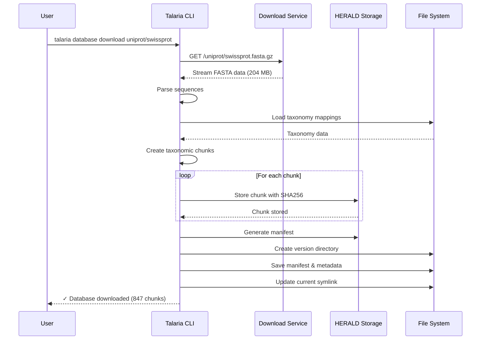
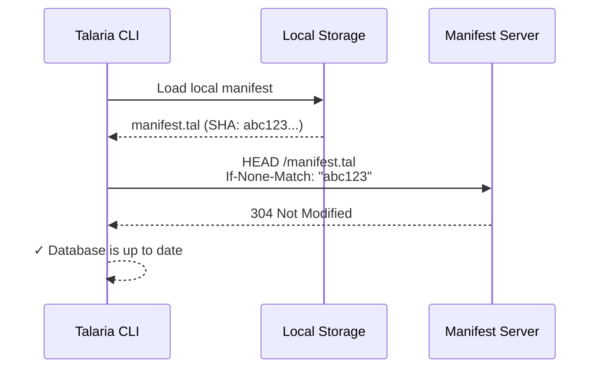
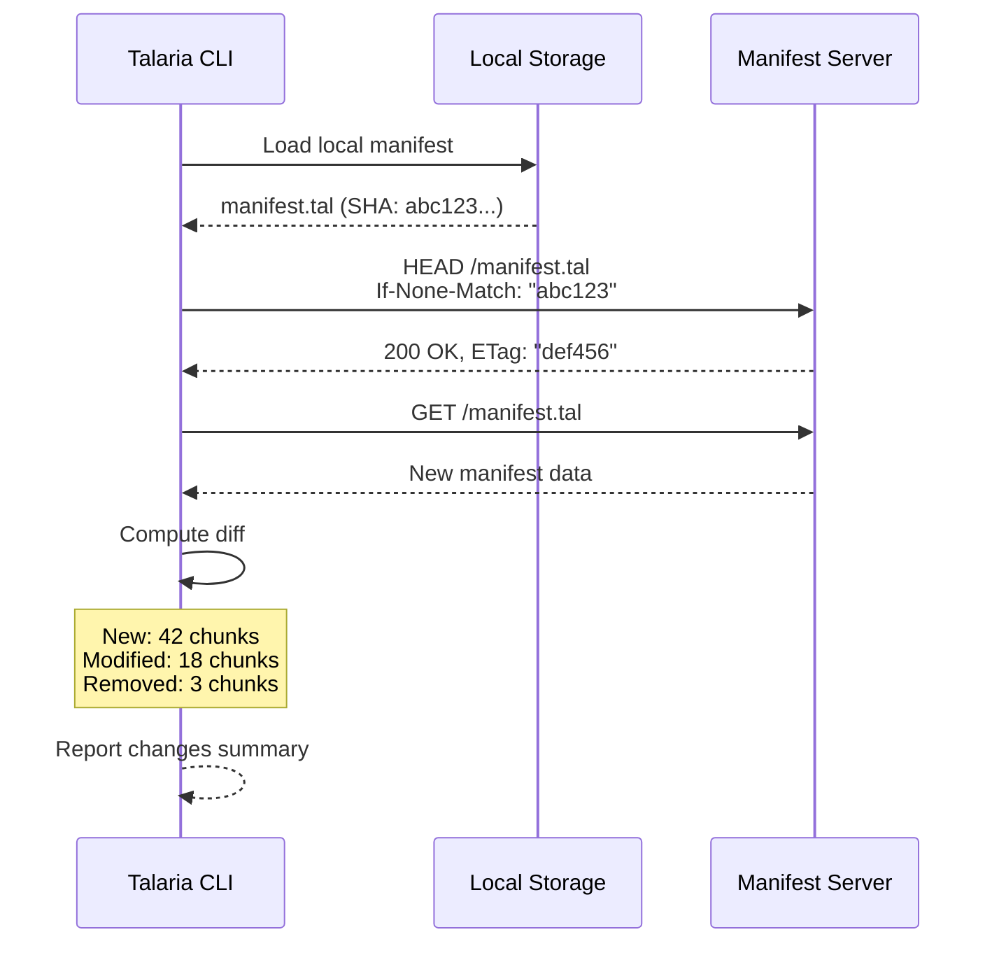
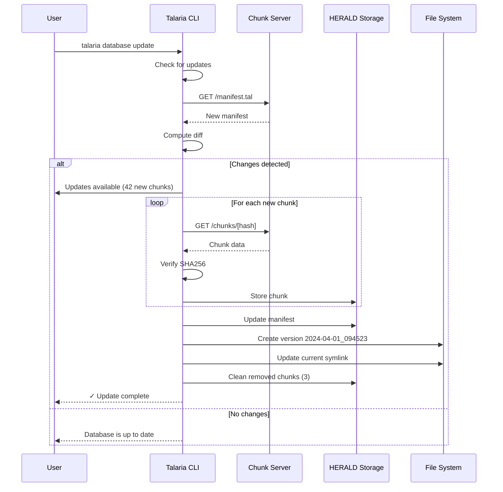
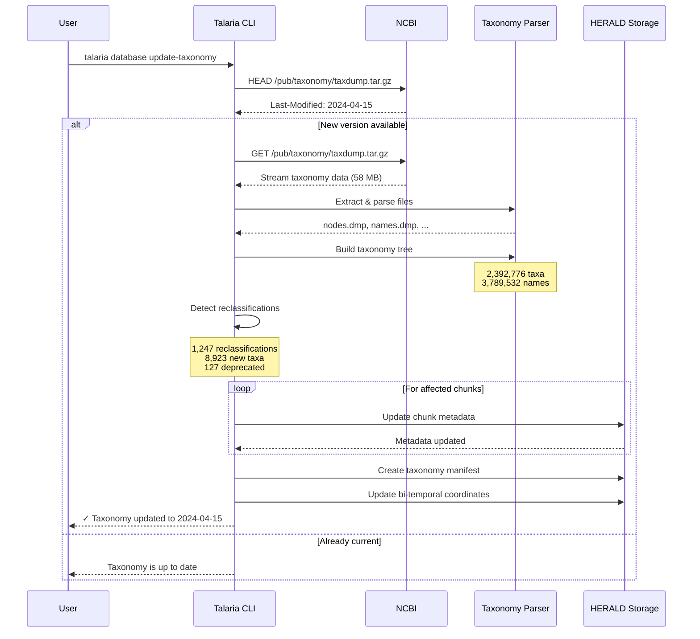
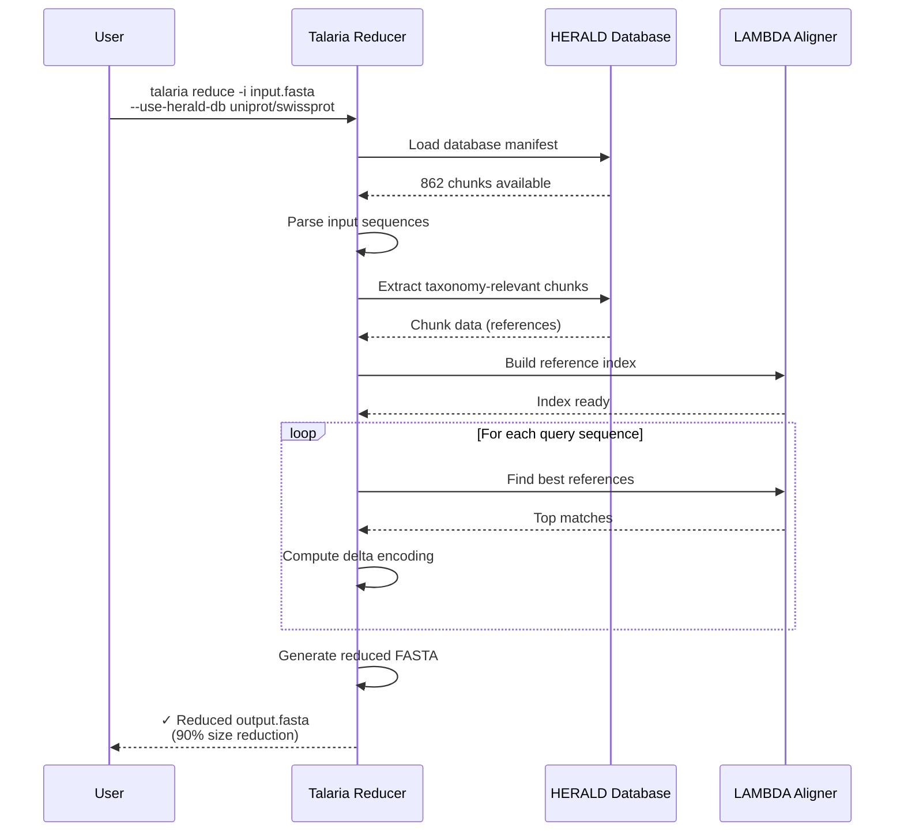

# HERALD Workflows and Operations

This document provides detailed, step-by-step explanations of how HERALD (Sequence Query Optimization with Indexed Architecture) operates in various scenarios, from initial database downloads to updates and synchronization.

## Table of Contents
1. [Initial Database Download](#1-initial-database-download)
2. [Checking for Updates (Dry-Run)](#2-checking-for-updates-dry-run)
3. [Performing Database Updates](#3-performing-database-updates)
4. [Taxonomy Synchronization](#4-taxonomy-synchronization)
5. [Reduce Operation with HERALD](#5-reduce-operation-with-herald)
6. [Taxonomy Sync During Updates](#6-should-taxonomy-be-checked-during-updates)

---

## 1. Initial Database Download

### What Happens the FIRST Time

When you download a database for the first time, HERALD performs a complete conversion from traditional FASTA format to its content-addressed storage system.

#### Command Example
```bash
talaria database download uniprot/swissprot
```

#### Step-by-Step Process



#### Detailed Operations

1. **Download Phase** (~5-10 minutes for SwissProt)
   ```
   Downloading UniProt/SwissProt...
   [============>] 204 MB / 204 MB
   ```

2. **Chunking Phase** (1-2 minutes)
   ```
   Reading sequences from FASTA file...
   Analyzing database structure...
     Total sequences: 565,928
     Unique taxa: 14,263
     High-volume taxa: 127
   Creating taxonomy-aware chunks...
   Created 847 chunks
   ```

3. **Storage Phase** (30-60 seconds)
   ```
   Storing chunks in HERALD repository
   [============>] 847/847 chunks
   All chunks stored
   ```

4. **Manifest Creation** (instant)
   ```
   Creating and saving manifest...
   Manifest saved to: ~/.talaria/databases/versions/uniprot/swissprot/2024-03-15_123456/manifest.tal
   Version: 2024-03-15_123456
   ```

#### File Structure After Initial Download

```
~/.talaria/databases/
├── chunks/                              # Content-addressed storage
│   ├── 1a/
│   │   └── 1a2b3c4d5e6f...             # Chunk file (compressed)
│   ├── 2b/
│   │   └── 2b3c4d5e6f7a...
│   └── ... (847 chunk files)
├── versions/
│   └── uniprot/
│       └── swissprot/
│           ├── 2024-03-15_123456/      # Timestamped version
│           │   ├── manifest.tal         # Binary manifest (500KB)
│           │   └── version.tal          # Version metadata
│           └── current -> 2024-03-15_123456  # Symlink
└── manifest.tal                         # Repository manifest
```

#### Key Points
- **One-time conversion**: The FASTA is downloaded and chunked only once
- **Chunks are permanent**: Once stored, chunks are immutable
- **Manifest is tiny**: 500KB manifest describes 204MB database
- **Future updates are incremental**: Only changed chunks download next time

---

## 2. Checking for Updates (Dry-Run)

### Command
```bash
talaria database update --dry-run uniprot/swissprot
```

### Scenario A: No Updates Available

#### What Happens


#### Output
```
► Checking for updates...
✓ Database is up to date
  Current version: 2024-03-15
  No changes detected
```

#### Behind the Scenes
1. **Manifest download**: 500KB, <2 seconds
2. **Comparison**: Binary hash comparison, instant
3. **Result**: No action needed

### Scenario B: Updates Available

#### What Happens


#### Output
```
► Checking for updates...
✓ Updates available
  Current version: 2024-03-15
  Latest version: 2024-04-01

  Changes summary:
  - New chunks: 42 (12.6 MB)
  - Modified chunks: 18 (5.4 MB)
  - Removed chunks: 3
  - Total download: 18 MB (8.8% of database)

  Taxonomy changes:
  - 127 sequences reclassified
  - 15 new taxa added

  Run without --dry-run to apply updates
```

#### Diff Analysis
The manifest diff tells us exactly what changed:
```json
{
  "new_chunks": ["3c4d5e6f...", "4d5e6f7a..."],
  "modified_chunks": ["5e6f7a8b..."],
  "removed_chunks": ["6f7a8b9c..."],
  "taxonomy_changes": {
    "reclassifications": 127,
    "new_taxa": 15
  }
}
```

---

## 3. Performing Database Updates

### Command
```bash
talaria database update uniprot/swissprot
```

### What Happens During Update



### Detailed Process

1. **Manifest Check** (2 seconds)
   ```
   Checking for updates...
   Updates available, downloading manifest...
   ```

2. **Incremental Download** (30-60 seconds for typical update)
   ```
   Need to download 42 new chunks, remove 3 old chunks
   Downloading new chunks...
   [============>] 42/42 chunks
   Downloaded 42 chunks, 18.00 MB
   ```

3. **Storage Update** (instant)
   ```
   Updating local manifest...
   Cleaning up removed chunks...
   ```

4. **Version Management**
   ```
   Creating version: 2024-04-01_094523
   Updating symlinks...
   ```

### File Structure After Update

```
~/.talaria/databases/
├── chunks/
│   ├── ... (existing chunks)
│   ├── 7a/
│   │   └── 7a8b9c0d1e2f...    # New chunk from update
│   └── 8b/
│       └── 8b9c0d1e2f3a...    # Another new chunk
├── versions/
│   └── uniprot/
│       └── swissprot/
│           ├── 2024-03-15_123456/      # Previous version
│           ├── 2024-04-01_094523/      # New version
│           │   ├── manifest.tal
│           │   └── version.tal
│           └── current -> 2024-04-01_094523  # Updated symlink
```

### Key Points
- **Only downloads changes**: 18MB instead of 204MB full database
- **Keeps version history**: Old versions remain accessible
- **Atomic updates**: Symlink switch makes update instant
- **Deduplication**: Unchanged chunks are shared between versions

---

## 4. Taxonomy Synchronization

### Command
```bash
talaria database update-taxonomy
```

### What Happens



### Process Details

1. **Check for Updates** (instant)
   ```
   ► Checking for taxonomy updates...
   New taxonomy version available: 2024-04-15
   ```

2. **Download & Extract** (1-2 minutes)
   ```
   Downloading NCBI taxdump...
   [============>] 58 MB / 58 MB
   Extracting taxonomy files...
   ```

3. **Parse & Build Tree** (30 seconds)
   ```
   Parsing nodes.dmp... 2,392,776 taxa
   Parsing names.dmp... 3,789,532 names
   Building taxonomy tree...
   ```

4. **Detect Changes** (10-20 seconds)
   ```
   Analyzing taxonomic changes...
   - Reclassifications: 1,247
   - New taxa: 8,923
   - Deprecated taxa: 127
   - Merged taxa: 43
   ```

5. **Update Sequences** (1-2 minutes)
   ```
   Updating sequence-taxonomy mappings...
   Processing affected chunks...
   [============>] 127/127 chunks updated
   ```

### Impact on HERALD Structure

#### Bi-Temporal Coordinate Update
```
Before: (seq_time: 2024-04-01, tax_time: 2024-03-01)
After:  (seq_time: 2024-04-01, tax_time: 2024-04-15)
```

#### Chunk Metadata Updates
Chunks containing reclassified sequences get updated metadata:
```json
{
  "chunk_hash": "7a8b9c0d...",
  "taxonomy_version": "2024-04-15",
  "taxon_ids": [562, 511145],  // Updated taxonomy
  "discrepancies": [
    {
      "sequence_id": "P12345",
      "old_taxon": 1578,        // Old Lactobacillus
      "new_taxon": 2742843,      // New genus
      "type": "Reclassified"
    }
  ]
}
```

---

## 5. Reduce Operation with HERALD

### How Reduce Uses HERALD Data

When you run `reduce` after downloading a HERALD database, it can leverage the existing chunk structure for efficiency.

### Command
```bash
talaria reduce -i ecoli_proteins.fasta -o reduced.fasta --use-herald-db uniprot/swissprot
```

### Process Flow



### After Initial Download (#1)

The reduce operation can:
1. **Use HERALD chunks as reference candidates** - No need to build indices from scratch
2. **Leverage taxonomy information** - Better reference selection for taxonomically similar sequences
3. **Access pre-computed similarities** - Chunks already group similar sequences

### After Database Update (#3)

When the database is updated, reduce automatically uses the new data:

```bash
# Before update (using 2024-03-15 version)
talaria reduce -i query.fasta -o reduced_old.fasta
# References selected from 847 chunks, version 2024-03-15

# After update (using 2024-04-01 version)
talaria reduce -i query.fasta -o reduced_new.fasta
# References selected from 862 chunks, version 2024-04-01
# Includes 42 new chunks with potentially better references
```

#### Key Benefits
- **Always current**: Reduce uses the `current` symlink to latest version
- **Incremental improvement**: New chunks may contain better reference sequences
- **Taxonomy-aware**: Updated taxonomy improves reference selection accuracy

---

## 6. Should Taxonomy Be Checked During Updates?

### Current Behavior

When running `talaria database update`, taxonomy is **NOT automatically checked** unless:
1. You explicitly include `--include-taxonomy` flag
2. You're updating a taxonomy database directly
3. You run update without specifying a database (checks all)

### Recommended Workflow

#### Option A: Separate Updates (Current Default)
```bash
# Update sequences only
talaria database update uniprot/swissprot

# Update taxonomy separately when needed
talaria database update-taxonomy
```

**Pros:**
- Faster sequence updates (no taxonomy download)
- Can update sequences without waiting for taxonomy
- More control over when taxonomy changes apply

**Cons:**
- Sequences and taxonomy can become out of sync
- May miss important reclassifications

#### Option B: Combined Updates (With Flag)
```bash
# Update sequences AND check taxonomy
talaria database update uniprot/swissprot --include-taxonomy
```

**Pros:**
- Ensures consistency between sequences and taxonomy
- Automatic detection of reclassifications
- Single command for complete update

**Cons:**
- Slower (downloads taxonomy even if unchanged)
- May introduce unexpected taxonomic changes

### Recommendation

**For production pipelines:** Use separate updates to maintain control
```bash
# Weekly sequence updates
talaria database update uniprot/swissprot

# Monthly taxonomy sync
talaria database update-taxonomy
talaria database check uniprot/swissprot  # Check for discrepancies
```

**For research use:** Use combined updates for consistency
```bash
talaria database update uniprot/swissprot --include-taxonomy
```

### Future Enhancement Proposal

The system could automatically check if taxonomy is significantly out of date:
```
► Updating UniProt/SwissProt...
⚠ Taxonomy is 89 days old (last updated: 2024-01-15)
  Recommendation: Run 'talaria database update-taxonomy'
  Or use --include-taxonomy to update both
```

---

## Summary of Key Concepts

### Manifest-Chunk Relationship
- **Manifest**: Compact index (500KB) listing all chunks with hashes
- **Chunks**: Actual sequence data (1-50MB each), content-addressed
- **Updates**: Compare manifests, download only new/changed chunks

### Version Management
- Every update creates a new timestamped version directory
- `current` symlink points to active version
- Old versions remain accessible for reproducibility

### Bi-Temporal Benefits
- **Sequence updates**: Change sequence timeline
- **Taxonomy updates**: Change taxonomy timeline
- **Independent updates**: Can update sequences without taxonomy and vice versa
- **Time-travel queries**: Can query any combination of sequence/taxonomy time

### Storage Efficiency
- **Initial download**: One-time conversion cost
- **Updates**: Only changed chunks (typically 5-10% of database)
- **Deduplication**: Identical chunks stored once
- **Compression**: Each chunk is zstd-compressed

### Performance Expectations
| Operation | Time | Network | Storage |
|-----------|------|---------|---------|
| Initial SwissProt download | 5-10 min | 204 MB | 180 MB |
| Typical update | 30-60 sec | 10-20 MB | +5-10 MB |
| Taxonomy update | 2-3 min | 58 MB | 45 MB |
| Dry-run check | 2-5 sec | 500 KB | 0 |
| Reduce with HERALD | (faster) | 0 | 0 |

This workflow documentation reflects the actual HERALD implementation and provides clear guidance on how the system operates in practice.