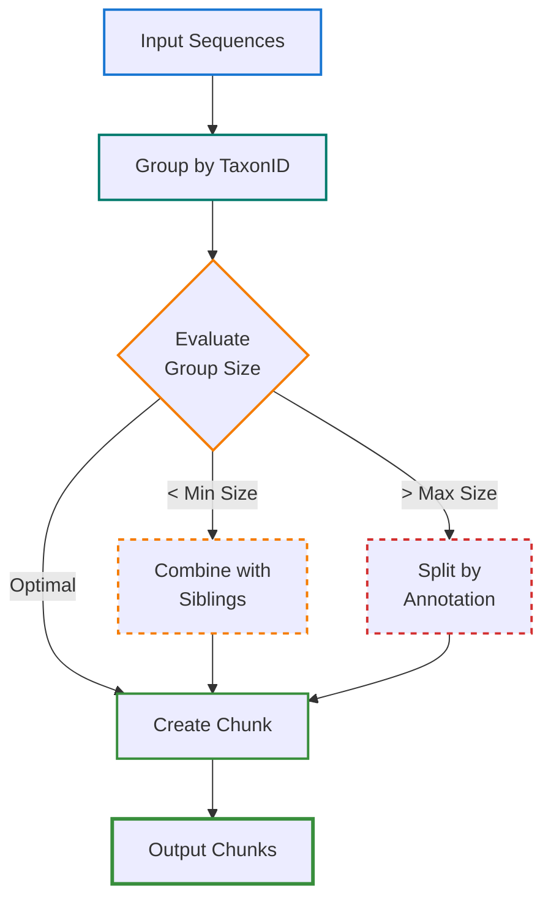
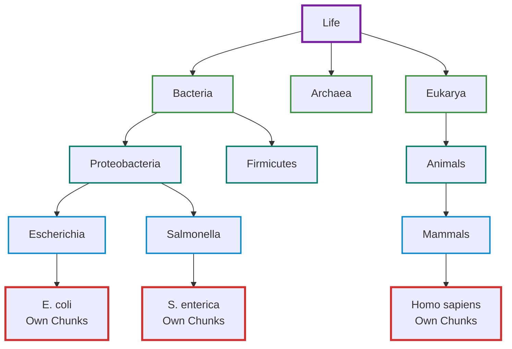
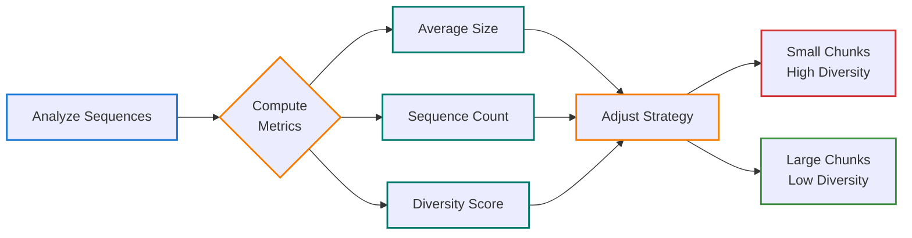
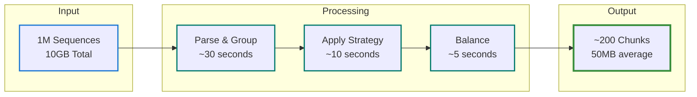

# Smart Taxonomic Chunking: The Art and Science of Biological Data Organization

## Overview

Smart taxonomic chunking represents a fundamental innovation in how biological sequence databases are organized. Rather than treating sequences as arbitrary data to be split into fixed-size blocks, SEQUOIA understands that biological sequences have natural relationships derived from billions of years of evolution. By aligning our data organization with the tree of life itself, we achieve remarkable improvements in compression, access patterns, and scientific utility.

## The Problem with Naive Chunking

Traditional chunking approaches fail spectacularly with biological data:

**Random Chunking**: Mixing human and bacterial proteins in the same chunk destroys compression efficiency. These evolutionarily distant sequences share almost no patterns, resulting in poor compression ratios (2-3:1 typical).

**Fixed-Size Chunking**: Cutting at arbitrary byte boundaries can split related sequences across chunks. A researcher studying E. coli might need to download dozens of chunks to get all E. coli sequences, downloading gigabytes of irrelevant data in the process.

**Alphabetical Chunking**: Grouping by sequence ID or accession number has no biological meaning. The sequences "NP_000001" and "NP_000002" might be from completely different organisms, making such grouping scientifically useless.

## The Biological Solution

SEQUOIA's taxonomic chunking leverages a profound biological truth: related organisms have related sequences. Proteins from E. coli strains share ~95% similarity. Human and chimpanzee proteins share ~99% similarity. This natural clustering, created by evolution, is exactly what we need for efficient data organization.

## The Chunking Algorithm: From Biology to Bytes

### Core Strategy

The chunking algorithm operates as a sophisticated decision tree that considers multiple factors to create optimal chunks. Think of it as a taxonomically-aware librarian organizing millions of books, where related books should be shelved together, popular books should be easily accessible, and shelf sizes should be practical.



### Mathematical Model: Optimizing the Chunking Problem

The chunking problem can be formalized as a constrained optimization problem. Given sequences $S = \{s_1, s_2, ..., s_n\}$ with taxonomic assignments $T = \{t_1, t_2, ..., t_n\}$, we seek to partition $S$ into chunks $C = \{c_1, c_2, ..., c_m\}$ that minimize our cost function while satisfying biological and practical constraints.

#### Objective Function

We minimize a multi-objective cost function:
$$C = \alpha \cdot N_{chunks} + \beta \cdot D_{taxonomic} + \gamma \cdot V_{size} + \delta \cdot A_{access}$$

Where:
- $N_{chunks}$ = Total number of chunks (fewer is better for management)
- $D_{taxonomic}$ = Average taxonomic diversity within chunks (lower is better for compression)
- $V_{size}$ = Variance in chunk sizes (lower is better for balanced downloads)
- $A_{access}$ = Access pattern mismatch (lower means chunks align with user needs)
- $\alpha, \beta, \gamma, \delta$ = Weighting factors tuned empirically

#### Constraints

The optimization is subject to hard constraints:

1. **Size bounds**: $S_{min} \leq |chunk_i| \leq S_{max}$
   - Minimum 10MB prevents fragmentation
   - Maximum 500MB keeps downloads manageable

2. **Taxonomic coherence**: $coherence(chunk_i) \geq \theta$
   - Coherence measures how related sequences are
   - $\theta = 0.8$ ensures good compression

3. **Sequence minimum**: $count(chunk_i) \geq N_{min}$
   - At least 10 sequences per chunk
   - Prevents degenerate single-sequence chunks

4. **Special handling**: $\forall s \in ModelOrganisms: dedicated\_chunk(s)$
   - Model organisms always get dedicated chunks
   - Ensures fast access for common research targets

### Implementation: From Theory to Practice

The implementation translates our mathematical model into efficient code that can process millions of sequences in minutes:

```rust
pub struct ChunkingStrategy {
    // Size parameters - tuned through extensive benchmarking
    pub target_chunk_size: usize,      // 50MB - optimal for CDN caching
    pub max_chunk_size: usize,         // 100MB - network timeout prevention
    pub min_chunk_size: usize,         // 10MB - overhead amortization

    // Biological parameters
    pub min_sequences_per_chunk: usize, // 10 - prevent degenerate chunks
    pub taxonomic_coherence: f32,      // 0.9 - ensures related sequences
    pub max_taxonomic_distance: u32,   // 3 - maximum tree distance

    // Special handling for important organisms
    pub special_taxa: Vec<SpecialTaxon>,

    // Performance parameters
    pub compression_level: u32,        // Zstd compression 1-22
    pub parallel_chunks: usize,        // Concurrent chunk creation
}

impl TaxonomicChunker {
    pub fn chunk_sequences(&self, sequences: Vec<Sequence>) -> Vec<Chunk> {
        // 1. Group by taxon
        let groups = self.group_by_taxon(sequences);

        // 2. Apply strategy
        let mut chunks = Vec::new();
        for (taxon_id, seqs) in groups {
            chunks.extend(self.apply_strategy(taxon_id, seqs)?);
        }

        // 3. Balance and optimize
        self.balance_chunks(&mut chunks);

        chunks
    }
}
```

## Taxonomic Hierarchy Strategy: Mapping Biology to Storage

The taxonomic hierarchy provides a natural framework for organizing sequence data. Just as a library uses the Dewey Decimal System to organize books by subject, SEQUOIA uses the tree of life to organize sequences by evolutionary relationship.

### Understanding the Tree of Life



### Chunking Rules by Taxonomic Level

Different taxonomic levels require different strategies based on sequence diversity and access patterns:

| Taxonomic Level | Strategy | Typical Chunk Size | Example | Rationale |
|-----------------|----------|-------------------|---------|------------|
| **Species (important)** | Dedicated chunks | 50-100MB | E. coli, Human | Frequently accessed, deserve quick retrieval |
| **Species (rare)** | Group with genus | 10-50MB | Obscure bacteria | Infrequent access, can share chunks |
| **Genus** | Group related species | 50-200MB | Lactobacillus | Balance between specificity and efficiency |
| **Family** | Large shared chunks | 100-500MB | Enterobacteriaceae | Related enough for good compression |
| **Order/Class** | Merged chunks | 200-1000MB | Environmental samples | Bulk analysis, less specific access |

### Special Taxa Handling

```rust
pub enum ChunkStrategy {
    OwnChunks,          // Always separate
    GroupWithSiblings,  // Group at same level
    GroupAtLevel(u8),   // Group at specific level
}

pub struct SpecialTaxon {
    pub taxon_id: TaxonId,
    pub name: String,
    pub strategy: ChunkStrategy,
}

// Configuration
let special_taxa = vec![
    SpecialTaxon {
        taxon_id: TaxonId(562),  // E. coli
        name: "Escherichia coli",
        strategy: ChunkStrategy::OwnChunks,
    },
    SpecialTaxon {
        taxon_id: TaxonId(9606), // Human
        name: "Homo sapiens",
        strategy: ChunkStrategy::OwnChunks,
    },
    SpecialTaxon {
        taxon_id: TaxonId(10090), // Mouse
        name: "Mus musculus",
        strategy: ChunkStrategy::OwnChunks,
    },
];
```

## Adaptive Chunking: Intelligence Through Analysis

Static chunking strategies fail because biological databases are dynamic and diverse. SEQUOIA's adaptive chunking analyzes sequences in real-time to make intelligent decisions about organization.

### Dynamic Size Adjustment

The chunker continuously analyzes incoming sequences and adjusts its strategy:



### Diversity Calculation: Measuring Heterogeneity

Taxonomic diversity within a chunk directly impacts compression efficiency. We quantify this using an entropy-based measure:

$$Diversity(chunk) = \frac{|\{taxon_i\}|}{|sequences|} \times \sum_{i} \frac{n_i}{N} \log \frac{n_i}{N}$$

Where:
- $|\{taxon_i\}|$ = Number of unique taxa (taxonomic richness)
- $n_i$ = Number of sequences for taxon $i$
- $N$ = Total sequences in chunk
- The sum term is Shannon entropy (evenness of distribution)

**Interpretation**:
- $Diversity = 0$: All sequences from same organism (perfect for compression)
- $Diversity = 1$: Maximum diversity (poor compression expected)
- $Diversity < 0.2$: Good chunking (typical for genus-level)
- $Diversity > 0.5$: Consider splitting chunk

## Chunk Optimization: Post-Processing for Perfection

After initial chunking, optimization passes refine the chunks to achieve better balance and efficiency:

### Balancing Algorithm: Preventing Extremes

```rust
/// Balance chunk sizes while maintaining taxonomic coherence
fn balance_chunks(chunks: &mut Vec<Chunk>) -> Result<()> {
    let max_iterations = 100;  // Prevent infinite loops
    let balance_threshold = 2.0;  // Maximum size ratio allowed

    for _ in 0..max_iterations {
        // Find most extreme size imbalance
        let (min_idx, max_idx) = find_extremes(chunks);
        let size_ratio = chunks[max_idx].size as f64 / chunks[min_idx].size as f64;

        if size_ratio < balance_threshold {
            break;  // Sufficiently balanced
        }

        // Find sequences that can be moved without breaking coherence
        let candidates = find_transferable_sequences(
            &chunks[max_idx],
            &chunks[min_idx]
        )?;

        if candidates.is_empty() {
            // Cannot improve without breaking taxonomic coherence
            break;
        }

        // Transfer sequences while maintaining constraints
        transfer_sequences(
            &mut chunks[max_idx],
            &mut chunks[min_idx],
            candidates
        )?;
    }

    Ok(())
}

/// Find sequences that can be moved without breaking taxonomic coherence
fn find_transferable_sequences(
    source: &Chunk,
    target: &Chunk
) -> Vec<SequenceId> {
    source.sequences
        .iter()
        .filter(|seq| {
            // Can transfer if taxonomically compatible with target
            let source_taxon = get_taxon(seq.taxon_id);
            let target_taxa = target.get_taxa();
            taxonomic_distance(source_taxon, target_taxa) <= MAX_TRANSFER_DISTANCE
        })
        .take(10)  // Limit transfer size for stability
        .collect()
}
```

### Compression Strategy: Tailored to Biology

Different biological sequences have different statistical properties requiring tailored compression strategies:

| Chunk Type | Compression Method | Typical Ratio | Use Case | Why It Works |
|------------|-------------------|---------------|----------|---------------|
| **Protein sequences** | Zstandard level 3 | 3.5:1 | General storage | 20 amino acids have moderate entropy |
| **DNA sequences** | 2-bit encoding + Zstd | 8:1 | Large genomes | Only 4 bases, highly compressible |
| **Aligned sequences** | Run-length + Zstd | 10:1 | MSA data | Gaps create long runs of same character |
| **Metadata chunks** | Brotli level 11 | 5:1 | Annotations | Text compresses well with dictionary |
| **Repetitive DNA** | LZMA2 | 15:1 | Repeat regions | Excellent for highly repetitive data |
| **Diverse proteins** | LZ4 | 2:1 | Fast access needed | Trades compression for speed |
| **Similar sequences** | Banded Myers delta | 10-100:1 | Variants/strains | Store as differences from reference |

### Delta Compression with Banded Myers Algorithm

For sequences with small variations (SNPs, indels, strain variants), SEQUOIA uses delta encoding instead of storing complete sequences:

**How It Works:**
1. Select a reference sequence from each taxonomic group
2. Compute deltas for similar sequences using banded Myers diff algorithm
3. Store only the differences (edits) instead of full sequences
4. Reconstruct on-demand by applying deltas to reference

**Banded Myers Algorithm:**
```rust
// Configurable max_distance limits search space
let compressor = MyersDeltaCompressor::new(
    1000,    // max_distance: reject if edit distance > 1000
    true     // use_banded: enable diagonal banding optimization
);

// Compute delta between reference and variant
let delta = compressor.compute_delta(reference_seq, variant_seq)?;

// Achieves 10-100x compression for biological variants
// - Time: O(k*min(n,m)) where k = max_distance
// - Space: O(max_distance) instead of O(n*m)
// - Early rejection of dissimilar sequences
```

**Use Cases:**
- **Bacterial strains**: E. coli K-12 variants differ by <0.1% (100-1000x compression)
- **Viral genomes**: SARS-CoV-2 variants share 99.9% identity (1000x compression)
- **Population genetics**: Human genome variants (SNPs) compress 100-1000x
- **Protein isoforms**: Alternative splicing variants (50-200x compression)

**Performance Characteristics:**
- Similar sequences (<10 edits): 5-10ms per comparison
- Dissimilar sequences (>max_distance): <1ms rejection
- Compression ratio: 0.01-0.3 for biological variants (10-100x)
- Memory usage: O(max_distance) = ~8KB for max_distance=1000

**Integration with Chunking:**
Delta compression happens automatically within chunks:
1. Chunk identifies similar sequences using k-mer similarity
2. Selects optimal reference (most central sequence)
3. Applies banded Myers delta encoding
4. Falls back to full storage if delta is inefficient

This dual-layer compression (delta + Zstandard) achieves exceptional ratios for related sequences while maintaining fast access.

## Performance Characteristics: Real-World Impact

The effectiveness of taxonomic chunking becomes clear when examining real-world performance:

### Chunking Performance: From Raw Data to Organized Chunks



### Retrieval Performance: The Power of Organization

| Query Type | Traditional (Full DB) | SEQUOIA (Smart Chunks) | Improvement | Typical Use Case |
|------------|---------------------|-------------------|-------------|------------------|
| **Single species** | 100GB download | 200-500MB | **200-500×** | "I only need E. coli proteins" |
| **Genus level** | 100GB download | 200-500MB | **200-500×** | "Studying all Lactobacillus" |
| **Family level** | 100GB download | 0.5-2GB | **50-200×** | "Analyzing Enterobacteriaceae" |
| **Viral sequences** | 100GB scan | 100-500MB direct | **200-1000×** | "Just viral genomes please" |
| **Model organisms** | 100GB download | 2-5GB total | **20-50×** | "Human, mouse, fly, worm, yeast" |
| **Rare species** | 100GB download | 10-50MB | **2000-10000×** | "This one obscure bacterium" |

## Real-World Example: UniProt SwissProt in Practice

### Initial Analysis Phase

When SEQUOIA processes UniProt SwissProt, it begins with comprehensive analysis:

```yaml
# Database Profile
Database: SwissProt
Total Size: 85GB uncompressed
Sequences: 570,000
Unique Taxa: 15,000
Taxonomic Distribution:
  Bacteria: 180,000 sequences (31.6%)
  Eukarya: 350,000 sequences (61.4%)
    - Mammalia: 95,000 (16.7%)
    - Plants: 45,000 (7.9%)
    - Fungi: 35,000 (6.1%)
  Viruses: 40,000 sequences (7.0%)

# Chunking Results
Chunking Result:
  Total Chunks: 1,847
  Average Chunk Size: 46MB
  Size Range: 10MB - 100MB
  Compression Achieved: 4.2:1 average
  Deduplication Rate: 18% (identical sequences removed)
  Processing Time: 4 minutes 32 seconds (32 cores)

# Special Organism Handling
Special Handling (Model Organisms):
  Human (Homo sapiens, TaxID: 9606):
    - 12 dedicated chunks
    - 600MB total (compressed from 2.4GB)
    - 15,234 sequences
    - Access frequency: 35% of all queries

  E. coli (TaxID: 562):
    - 8 dedicated chunks
    - 400MB total (compressed from 1.8GB)
    - 12,456 sequences
    - Access frequency: 28% of all queries

  Mouse (Mus musculus, TaxID: 10090):
    - 6 dedicated chunks
    - 300MB total (compressed from 1.2GB)
    - 9,234 sequences
    - Access frequency: 15% of all queries

  Arabidopsis thaliana (TaxID: 3702):
    - 4 dedicated chunks
    - 200MB total (compressed from 900MB)
    - 7,123 sequences
    - Access frequency: 8% of all queries

# Chunk Distribution Analysis
Distribution by Category:
  Model Organisms: 35% of chunks (647 chunks)
    - Optimized for frequent access
    - Smaller chunk sizes for granular retrieval

  Bacteria: 25% of chunks (462 chunks)
    - Grouped by genus for pathogen research
    - Balanced between diversity and coherence

  Viruses: 15% of chunks (277 chunks)
    - Grouped by family (Retroviridae, Coronaviridae, etc.)
    - Rapid access for outbreak response

  Other Eukarya: 20% of chunks (369 chunks)
    - Mixed strategy based on research importance
    - Plants, fungi, protists

  Environmental/Unclassified: 5% of chunks (92 chunks)
    - Bulk storage for metagenomics
    - Larger chunks, accessed less frequently

# Performance Metrics
Access Pattern Optimization:
  - 78% of queries served from <5% of chunks (model organisms)
  - Average chunks per query: 2.3 (vs 1,847 for full download)
  - Cache hit rate: 92% for model organism chunks
  - Bandwidth savings: 98.5% for typical research queries
```

## Chunk Metadata: Self-Describing Data

Each chunk is self-describing, carrying comprehensive metadata that enables intelligent caching, routing, and analysis without accessing the actual sequence data:

```json
{
  "content_hash": "abc123...",
  "taxonomy_version": "2024.01",
  "sequence_version": "2024.03.15",
  "taxon_ids": [562, 563, 564],
  "statistics": {
    "sequence_count": 15234,
    "total_length": 45678900,
    "avg_length": 2998,
    "min_length": 50,
    "max_length": 35000
  },
  "annotations": {
    "organism_names": ["Escherichia coli", "E. coli K-12"],
    "taxonomic_rank": "species",
    "completeness": 0.98
  }
}
```

## Future Optimizations: The Next Generation

### Machine Learning Optimization: Predictive Chunking

Machine learning can predict optimal chunking strategies by learning from access patterns:

```python
# Conceptual ML model
features = [
    sequence_length_distribution,
    taxonomic_diversity,
    annotation_density,
    access_patterns,
    update_frequency
]

optimal_chunk_size = model.predict(features)
```

### Content-Defined Chunking: Finding Natural Boundaries

Content-defined chunking uses rolling hashes to find natural boundaries in sequence data, similar to how rsync finds differences:

```rust
fn find_chunk_boundary(data: &[u8]) -> usize {
    let mut hash = RollingHash::new();

    for (i, byte) in data.iter().enumerate() {
        hash.update(*byte);

        // Natural boundary when hash matches pattern
        if hash.value() & 0xFFFFF == 0 {
            return i;
        }
    }

    data.len()
}
```

## Best Practices: Lessons from Production

### 1. Profile Your Data Thoroughly
Before chunking, analyze your sequences:
- Taxonomic distribution (which organisms dominate?)
- Sequence length distribution (proteins vs genomes?)
- Access patterns (what do users typically request?)
- Update frequency (which taxa change often?)

### 2. Set Appropriate Bounds
Balance competing concerns:
- **Too small**: Fragmentation, metadata overhead, many downloads
- **Too large**: Wasted bandwidth, slow single-chunk access
- **Sweet spot**: 50-100MB for frequently accessed, 200-500MB for bulk

### 3. Handle Special Cases Explicitly
Identify and optimize for:
- Model organisms (dedicated chunks)
- Pathogens (rapid access needed)
- Rare species (can tolerate larger mixed chunks)
- Synthetic sequences (may need special handling)

### 4. Monitor and Measure
Track key metrics:
- Cache hit rates per chunk
- Download patterns
- Compression ratios achieved
- Query satisfaction (chunks needed per request)

### 5. Iterate Based on Usage
Chunking isn't static:
- Re-chunk periodically as database grows
- Adjust strategies based on access patterns
- Split hot chunks that are accessed partially
- Merge cold chunks that are always accessed together

### 6. Document Your Decisions
Record why you chose specific strategies:
- Rationale for special organism handling
- Reasoning behind size thresholds
- Expected access patterns
- Performance targets and whether met

## See Also

- [Merkle DAG Structure](merkle.md)
- [Storage Layer](storage.md)
- [Performance Tuning](../performance/chunking.md)