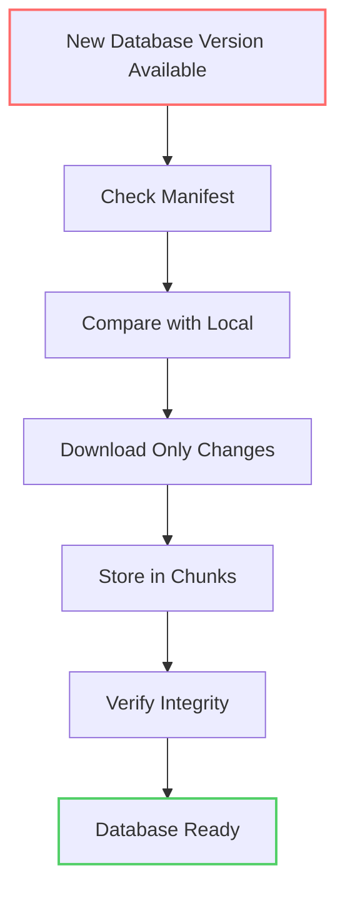
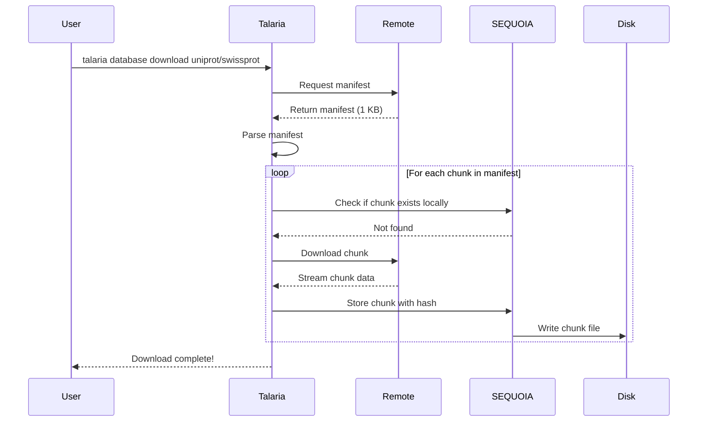
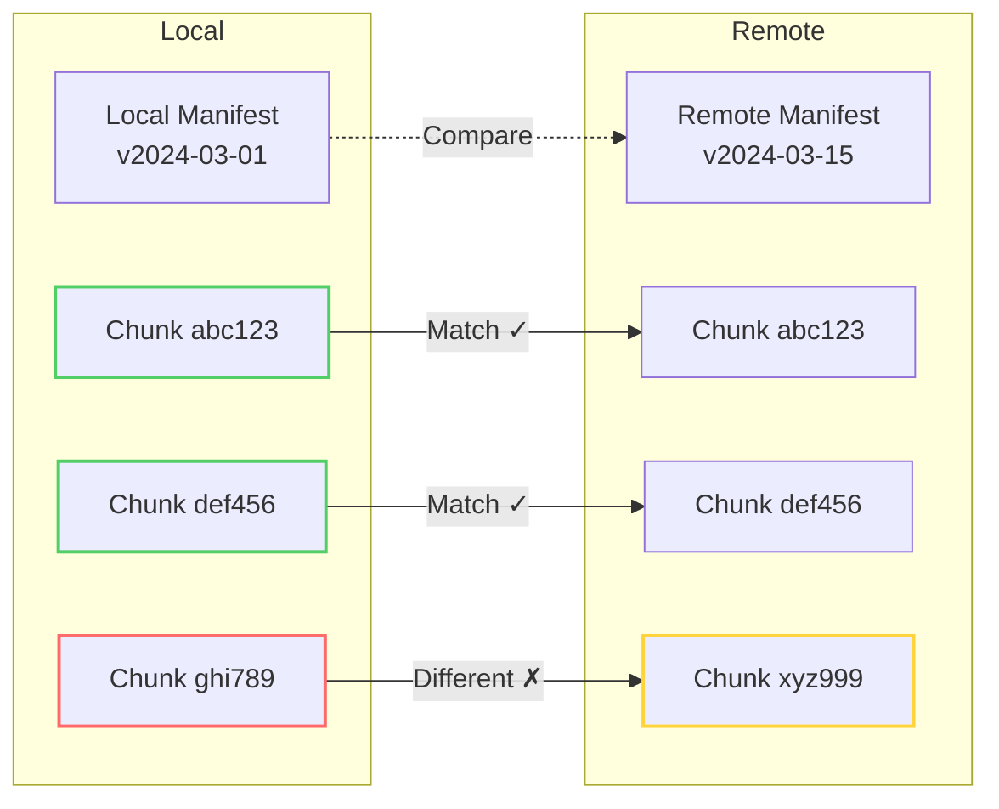
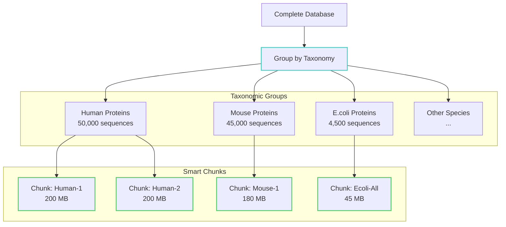
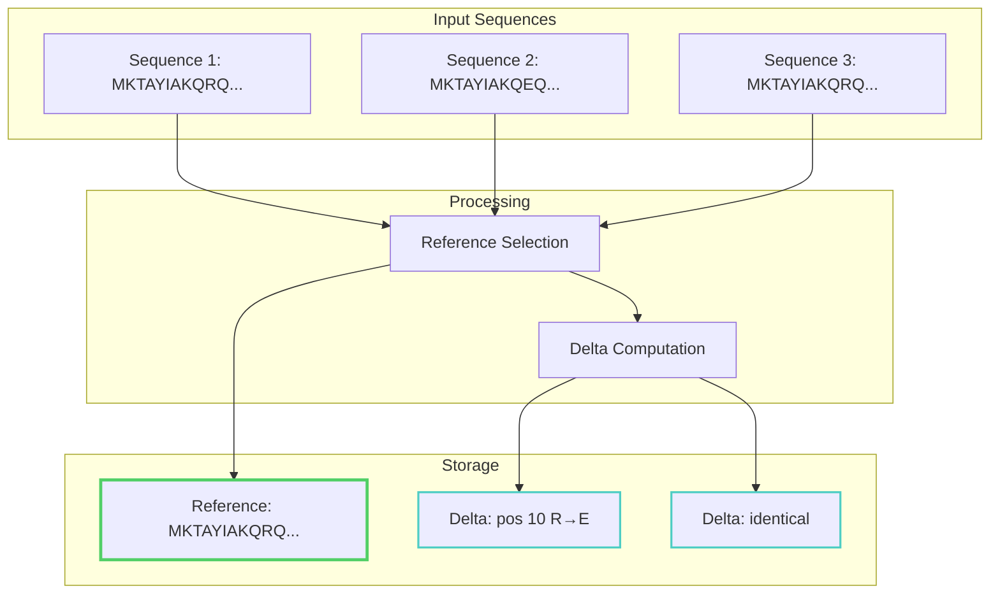
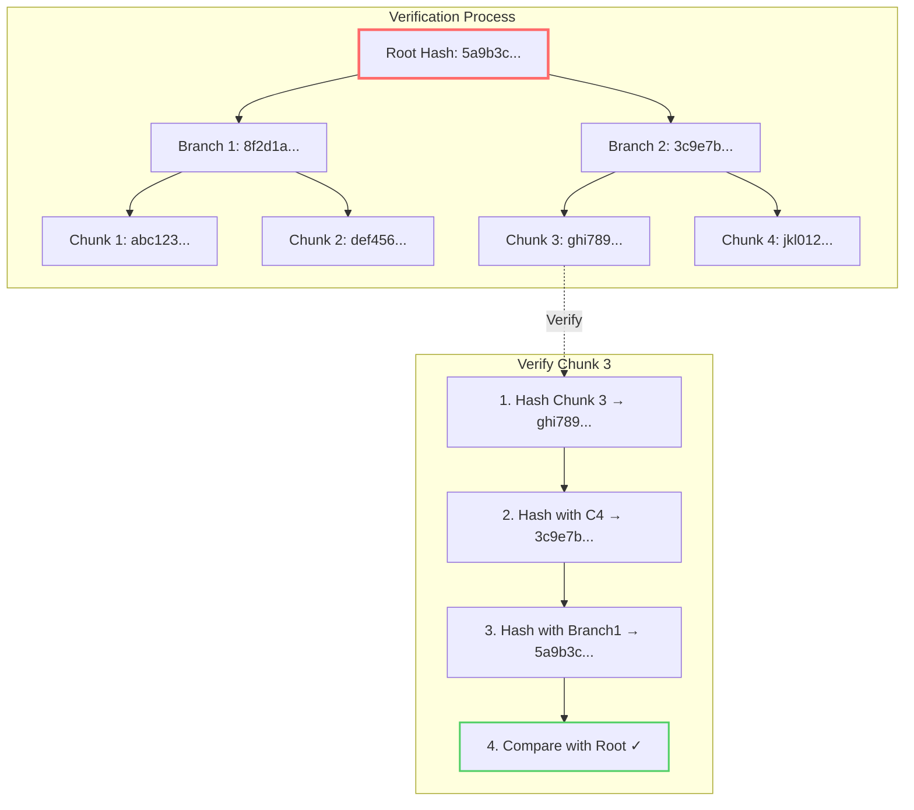
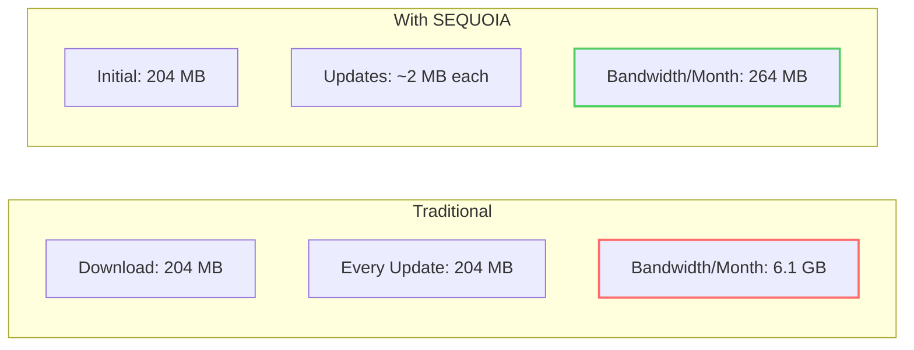

# How SEQUOIA Works

This guide walks through exactly how SEQUOIA operates, step by step, with visual examples.

## The Complete SEQUOIA Workflow



## Step-by-Step Breakdown

### Step 1: Initial Database Download

When you first download a database, here's what happens behind the scenes:



**What's Really Happening:**

1. **Manifest First**: Always download the tiny manifest (1-10 KB) first
2. **Smart Checking**: Check which chunks you already have
3. **Parallel Downloads**: Download multiple chunks simultaneously
4. **Verification**: Each chunk is verified against its hash
5. **Storage**: Chunks stored by their content hash

### Step 2: Checking for Updates

The magic happens when checking for updates:

```bash
talaria database update uniprot/swissprot
```



**Result**: Only download chunk xyz999 (the new one)!

### Step 3: Chunking Process

How does SEQUOIA decide what goes in each chunk?



**Why Taxonomic Chunking?**
- Similar organisms have similar proteins
- Better compression ratios
- Researchers often query specific species
- Updates often affect specific taxonomic groups

### Step 4: Delta Compression in Action

For similar sequences, SEQUOIA uses delta compression:



**Storage Savings**: 3 sequences → 1 reference + 2 tiny deltas

### Step 5: Verification with Merkle Trees

How SEQUOIA ensures data integrity:



## Real-World Example: Daily UniProt Update

Let's walk through an actual update scenario:

### Day 1: Initial Download
```bash
$ talaria database download uniprot/swissprot
```
- Downloads 571,282 sequences
- Creates 127 chunks (grouped by taxonomy)
- Total size: 204 MB compressed
- Time: ~5 minutes

### Day 7: Weekly Update
```bash
$ talaria database update uniprot/swissprot
```

What happens:
1. **Check Manifest** (0.1 seconds)
   - Remote: 571,419 sequences
   - Local: 571,282 sequences
   - Difference: 137 new, 12 updated

2. **Compare Chunks** (0.2 seconds)
   - 124 chunks unchanged ✓
   - 3 chunks modified ✗

3. **Download Changes** (3 seconds)
   - Only 3 chunks needed
   - ~2.4 MB download (not 204 MB!)

4. **Update Complete** (5 seconds total)
   - 99% bandwidth saved
   - Perfect integrity verified

## Performance Comparison



**Savings**: 96% reduction in bandwidth!

## Under the Hood: File Structure

Here's how SEQUOIA organizes files on disk:

```
~/.talaria/
├── databases/
│   ├── manifests/
│   │   ├── uniprot_swissprot_2024-03-15.manifest
│   │   └── ncbi_nr_2024-03-14.manifest
│   └── chunks/
│       ├── ab/
│       │   └── abc123def456.chunk  # Human proteins
│       ├── de/
│       │   └── def789ghi012.chunk  # Mouse proteins
│       └── ... (more chunks)
└── cache/
    └── indices/  # Optional index cache
```

Each chunk is stored in RocksDB column family with hash-based keys for efficient access.

## Summary

SEQUOIA works by:

1. **Breaking databases into smart chunks** based on biological relationships
2. **Identifying each chunk uniquely** with cryptographic hashes
3. **Downloading only what changed** during updates
4. **Verifying everything** with Merkle tree proofs
5. **Storing efficiently** with delta compression

The result? Faster updates, less storage, perfect verification, and better science.

Ready to try it yourself? Continue to [Getting Started](./getting-started.md)