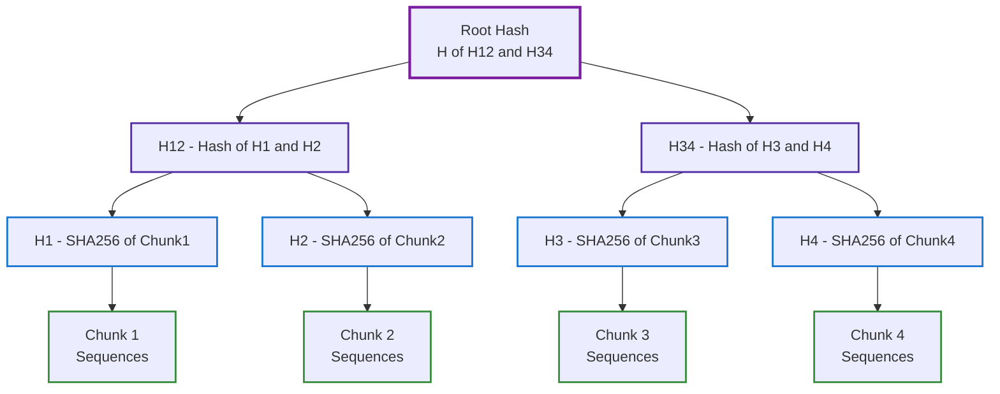
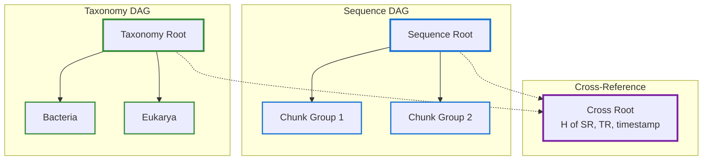
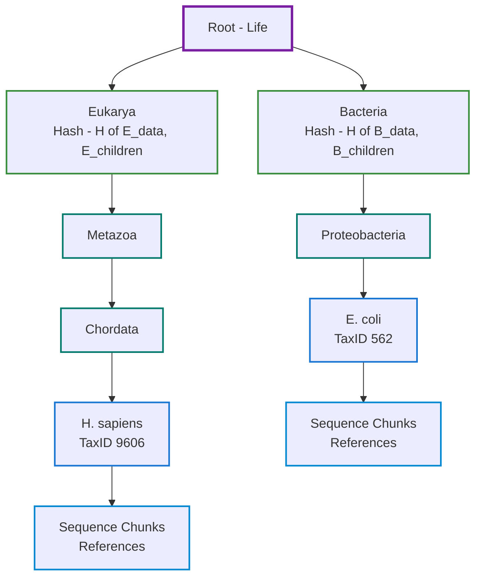
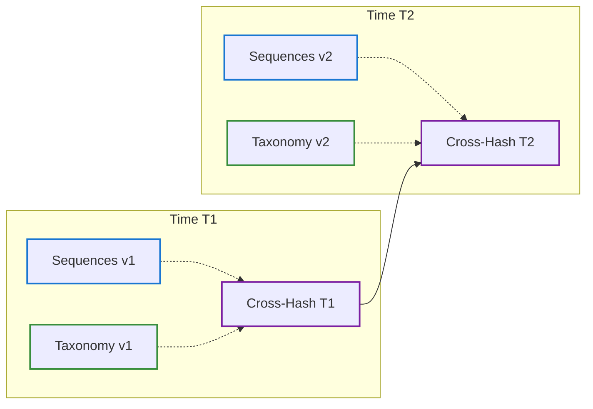
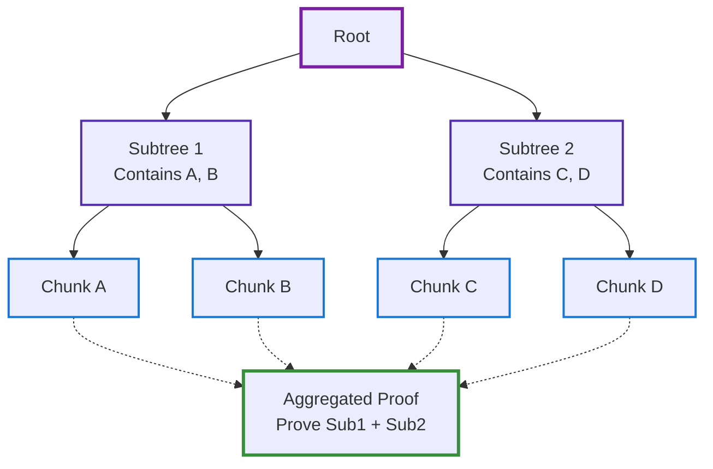

# Merkle DAG and Cryptographic Proofs

## Overview

The Merkle Directed Acyclic Graph (DAG) provides cryptographic integrity and efficient verification for the entire SEQUOIA system. Every piece of data can be verified independently while maintaining proof of membership in the complete dataset.

## Merkle Tree Construction

### Basic Structure



### Mathematical Foundation

For leaves $L = \{l_1, l_2, ..., l_n\}$:

#### Hash Function
$$H: \{0,1\}^* \rightarrow \{0,1\}^{256}$$

Using SHA256 as our cryptographic hash function.

#### Tree Construction
$$\text{MerkleRoot}(L) = \begin{cases}
H(l_1) & \text{if } |L| = 1 \\
H(\text{MerkleRoot}(L_{left}), \text{MerkleRoot}(L_{right})) & \text{if } |L| > 1
\end{cases}$$

#### Proof Generation
For leaf $l_i$ at position $i$:
$$\text{Proof}(l_i) = [h_{sibling(i)}, h_{parent(sibling(i))}, ..., h_{co-path}]$$

## Dual Merkle DAGs

SEQUOIA maintains two parallel DAGs:



## Proof of Inclusion

### Generating a Proof

```rust
impl MerkleDAG {
    pub fn generate_proof(&self, leaf_data: &[u8]) -> MerkleProof {
        let leaf_hash = SHA256::hash(leaf_data);
        let mut path = Vec::new();

        let mut current = leaf_hash;
        let mut level = 0;

        while level < self.height() {
            let sibling = self.get_sibling(current, level);
            path.push(ProofStep {
                hash: sibling,
                position: if self.is_left(current, level) {
                    Position::Right
                } else {
                    Position::Left
                },
            });

            current = SHA256::hash(&[current, sibling]);
            level += 1;
        }

        MerkleProof {
            leaf_hash,
            root_hash: self.root(),
            path,
        }
    }
}
```

### Verifying a Proof

```rust
pub fn verify_proof(proof: &MerkleProof) -> bool {
    let mut current = proof.leaf_hash;

    for step in &proof.path {
        current = match step.position {
            Position::Left => SHA256::hash(&[step.hash, current]),
            Position::Right => SHA256::hash(&[current, step.hash]),
        };
    }

    current == proof.root_hash
}
```

### Proof Size

For $n$ chunks:
- Proof size: $O(\log n)$ hashes
- Verification time: $O(\log n)$ hash operations

Example for 1 million chunks:
- Tree height: $\lceil \log_2(1,000,000) \rceil = 20$
- Proof size: $20 \times 32 \text{ bytes} = 640 \text{ bytes}$

## Taxonomy DAG

The taxonomy follows the tree of life structure:



### Taxonomy Node Hash

$$H_{node} = H(taxon\_id || parent\_id || name || rank || H(children))$$

## Temporal Proofs

### Bi-Temporal Merkle Structure



### Temporal Proof Generation

```rust
pub struct TemporalProof {
    pub sequence_proof: MerkleProof,
    pub taxonomy_proof: MerkleProof,
    pub temporal_link: CrossTimeHash,
    pub timestamp: DateTime<Utc>,
    pub attestation: CryptographicSeal,
}

impl TemporalProof {
    pub fn generate(
        sequence_dag: &MerkleDAG,
        taxonomy_dag: &MerkleDAG,
        timestamp: DateTime<Utc>,
    ) -> Self {
        let cross_hash = SHA256::hash(&[
            sequence_dag.root().as_bytes(),
            taxonomy_dag.root().as_bytes(),
            timestamp.to_rfc3339().as_bytes(),
        ]);

        TemporalProof {
            sequence_proof: sequence_dag.generate_proof(data),
            taxonomy_proof: taxonomy_dag.generate_proof(taxon),
            temporal_link: CrossTimeHash {
                sequence_time: timestamp,
                taxonomy_time: timestamp,
                combined_hash: cross_hash,
            },
            timestamp,
            attestation: self.sign(cross_hash),
        }
    }
}
```

## Proof Aggregation

### Batch Proofs

For proving multiple chunks efficiently:



### Aggregation Benefits

| Chunks to Prove | Individual Proofs | Aggregated Proof | Savings |
|-----------------|------------------|------------------|---------|
| 10 | 10 × 640B = 6.4KB | 1.2KB | 81% |
| 100 | 100 × 640B = 64KB | 3.5KB | 95% |
| 1000 | 1000 × 640B = 640KB | 8KB | 99% |

## Verification Algorithms

### Parallel Verification

```rust
use rayon::prelude::*;

pub fn verify_batch(proofs: &[MerkleProof]) -> Vec<bool> {
    proofs
        .par_iter()
        .map(|proof| verify_proof(proof))
        .collect()
}
```

### Incremental Verification

```rust
pub struct IncrementalVerifier {
    verified_hashes: HashSet<SHA256Hash>,
    root: SHA256Hash,
}

impl IncrementalVerifier {
    pub fn verify_incremental(&mut self, proof: &MerkleProof) -> bool {
        // Skip already verified portions
        for step in &proof.path {
            if self.verified_hashes.contains(&step.hash) {
                return true; // Already verified this subtree
            }
        }

        let result = verify_proof(proof);
        if result {
            self.cache_verified_path(proof);
        }
        result
    }
}
```

## Security Properties

### Collision Resistance

Probability of finding two different inputs with same hash:
$$P(collision) < 2^{-128}$$

For SHA256 with $2^{256}$ possible outputs.

### Preimage Resistance

Given hash $h$, finding input $x$ such that $H(x) = h$:
$$\text{Complexity} = O(2^{256})$$

### Second Preimage Resistance

Given input $x_1$, finding different $x_2$ where $H(x_1) = H(x_2)$:
$$\text{Complexity} = O(2^{256})$$

## Optimization Techniques

### Sparse Merkle Trees

For large, sparse datasets:

```rust
pub struct SparseMerkleTree {
    default_hash: SHA256Hash,
    non_empty: HashMap<u64, SHA256Hash>,
}

impl SparseMerkleTree {
    pub fn insert(&mut self, index: u64, value: Vec<u8>) {
        let hash = SHA256::hash(&value);
        self.non_empty.insert(index, hash);
    }

    pub fn root(&self) -> SHA256Hash {
        self.compute_root(0, 2_u64.pow(self.height))
    }
}
```

### Caching Strategies

```rust
pub struct CachedMerkleDAG {
    cache: LruCache<(Level, Index), SHA256Hash>,
    storage: Storage,
}

impl CachedMerkleDAG {
    pub fn get_hash(&mut self, level: u32, index: u64) -> SHA256Hash {
        let key = (level, index);

        if let Some(hash) = self.cache.get(&key) {
            return *hash;
        }

        let hash = self.compute_hash(level, index);
        self.cache.put(key, hash);
        hash
    }
}
```

## Performance Metrics

### Construction Performance

| Dataset Size | Chunks | Construction Time | Memory Usage |
|-------------|--------|------------------|--------------|
| 1GB | 20 | 50ms | 10MB |
| 10GB | 200 | 500ms | 50MB |
| 100GB | 2,000 | 5s | 200MB |
| 1TB | 20,000 | 50s | 1GB |

### Verification Performance

| Operation | Time | Comparisons |
|-----------|------|-------------|
| Single proof (20 levels) | <1ms | 20 |
| Batch (100 proofs) | 10ms | 2000 |
| Incremental (cached) | <0.1ms | 2-3 |

## Advanced Topics

### Zero-Knowledge Proofs

Prove possession without revealing content:

```rust
pub struct ZKProof {
    commitment: SHA256Hash,
    challenge: Vec<u8>,
    response: Vec<u8>,
}

impl ZKProof {
    pub fn prove_knowledge(secret: &[u8]) -> Self {
        // Schnorr-style proof
        let r = random_bytes(32);
        let commitment = SHA256::hash(&r);
        let challenge = SHA256::hash(&[commitment.as_bytes(), PUBLIC_PARAM]);
        let response = combine(r, secret, challenge);

        ZKProof {
            commitment,
            challenge,
            response,
        }
    }
}
```

### Blockchain Integration

Anchor Merkle roots on-chain:

```solidity
contract SEQUOIAAnchor {
    mapping(bytes32 => uint256) public roots;

    function anchor(bytes32 root) external {
        roots[root] = block.timestamp;
    }

    function verify(bytes32 root) external view returns (bool) {
        return roots[root] > 0;
    }
}
```

## See Also

- [Overview](overview.md)
- [Storage Layer](storage.md)
- [Verification API](../api/verification.md)
- [Security Model](../security/merkle-security.md)