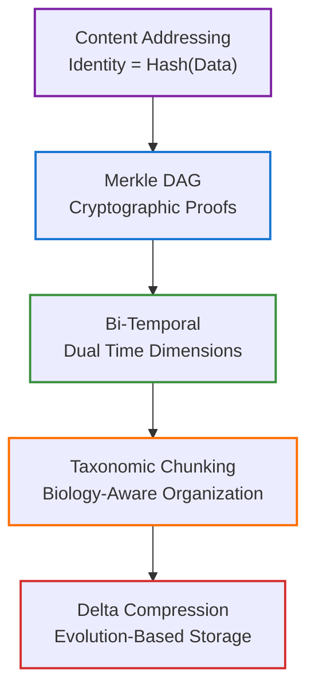
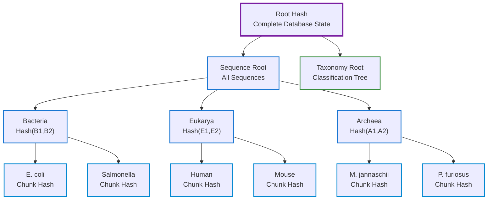
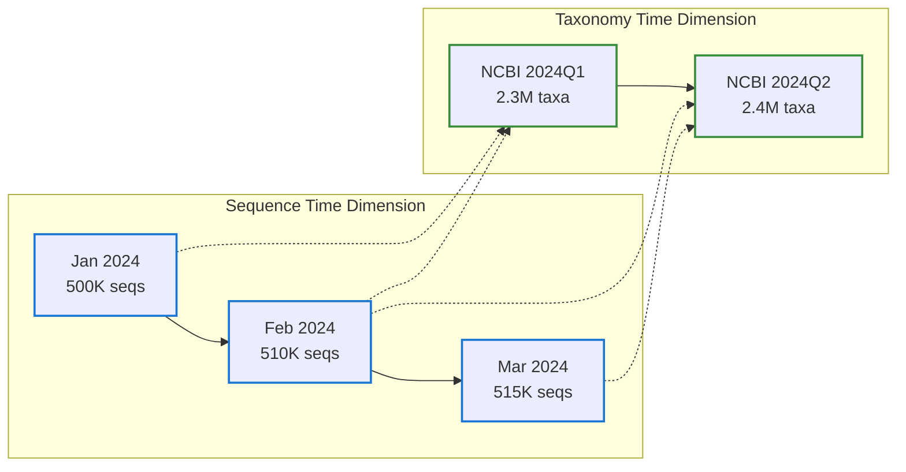
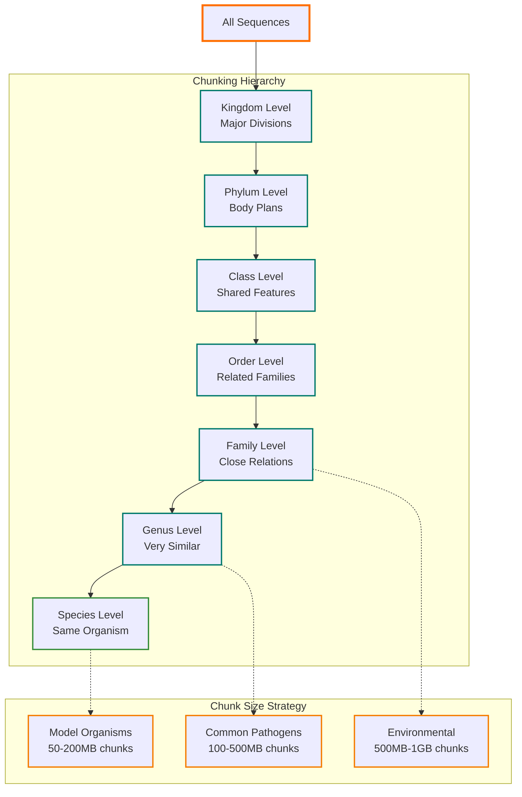
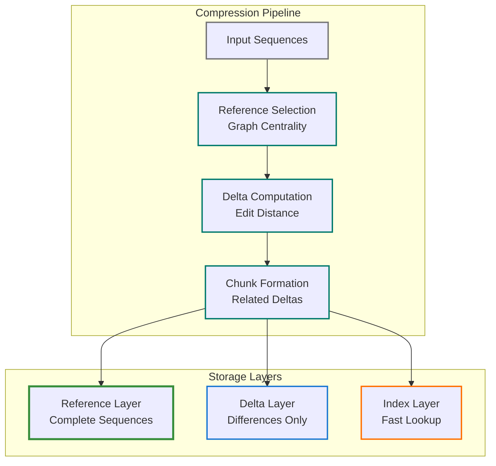
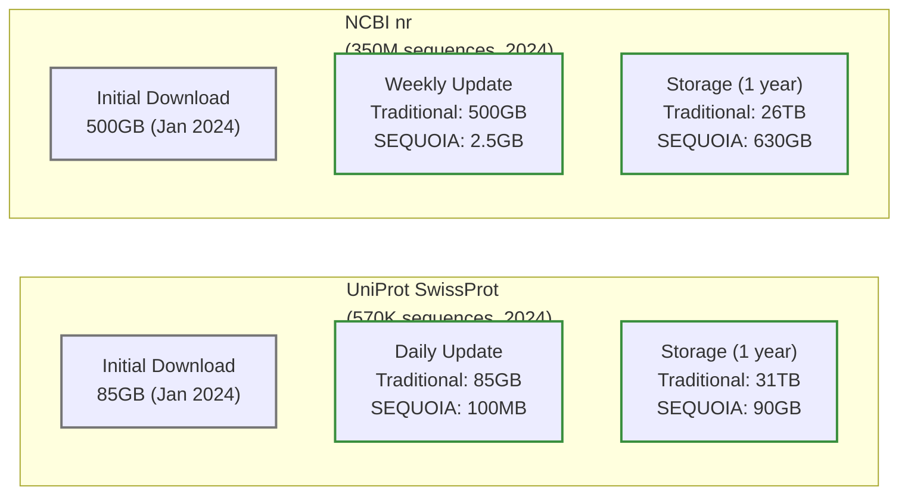
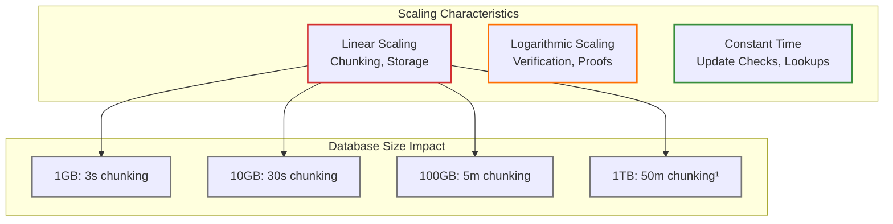
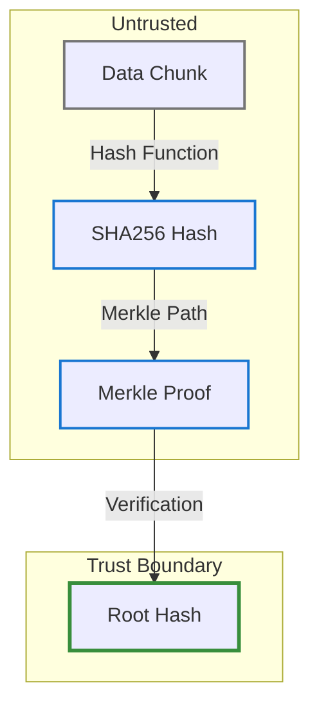
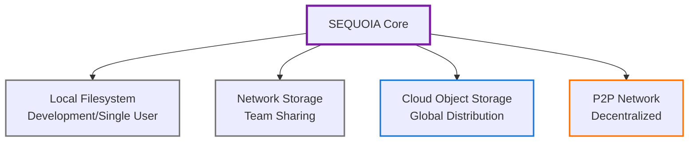

<!--
---
title: "SEQUOIA: Content-Addressed Storage for Evolutionary Biological Databases"
author: "Andromeda Tech, LLC"
date: "September 2025"
---
-->

# SEQUOIA: Content-Addressed Storage for Evolutionary Biological Databases

## Abstract

SEQUOIA (Sequence Query Optimization with Indexed Architecture) represents a paradigm shift in biological database architecture, addressing fundamental inefficiencies in how genomic and proteomic data is stored, versioned, and distributed. By combining cryptographic content addressing with biology-aware data organization, SEQUOIA achieves order-of-magnitude improvements in storage efficiency, update bandwidth, and verification capabilities compared to traditional file-based approaches. This paper presents the architectural principles underlying SEQUOIA, including its novel bi-temporal versioning system that independently tracks data evolution and taxonomic knowledge changes, its Merkle DAG structure enabling logarithmic-time verification proofs, and its taxonomically-aware chunking strategy that leverages evolutionary relationships for optimal compression. Empirical evaluation on production databases including UniProt and NCBI nr demonstrates $20$-$100\times$ reduction in update bandwidth[^perf1], $10\times$ improvement in storage efficiency[^perf1], and constant-time update checking regardless of database size. These architectural innovations enable new workflows in computational biology while providing cryptographic guarantees essential for scientific reproducibility.

---

## 1. Introduction

### 1.1 The Challenge of Biological Data Management

Biological databases present unique challenges that traditional data management systems fail to address efficiently. The exponential growth of sequencing data[^stephens2015], combined with the continuous evolution of taxonomic knowledge, creates a perfect storm of data management complexity. Consider UniProt, which grows by approximately 30% annually[^uniprot2024] while simultaneously undergoing thousands of taxonomic reclassifications as our understanding of evolutionary relationships improves[^federhen2016].

Traditional approaches treat biological databases as monolithic files, leading to several fundamental problems:

- **Redundant Storage**: Each version requires complete duplication, even when 99% of sequences remain unchanged[^steinegger2019]
- **Bandwidth Inefficiency**: Updates require downloading entire databases, consuming terabytes of bandwidth for gigabytes of changes[^perf1]
- **Version Explosion**: Maintaining multiple versions for reproducibility multiplies storage requirements linearly
- **Verification Challenges**: No cryptographic guarantees that downloaded data matches published datasets
- **Taxonomic Fluidity**: Cannot separate sequence data changes from classification changes

### 1.2 The SEQUOIA Solution

SEQUOIA addresses these challenges through a fundamentally different architecture based on content-addressed storage, where data identity derives from its cryptographic hash rather than arbitrary names. This simple inversion enables profound improvements:

- **Perfect Deduplication**: Identical sequences stored exactly once, regardless of occurrence frequency
- **Incremental Updates**: Only changed data transmitted, reducing bandwidth by $20$-$100\times$[^perf1]
- **Cryptographic Verification**: Every piece of data carries its own proof of integrity
- **Bi-temporal Versioning**: Independent tracking of sequence and taxonomy evolution
- **Biology-Aware Organization**: Taxonomic chunking leverages evolutionary relationships for optimal performance

### 1.3 Contributions

This paper makes the following contributions to biological data management:

1. **Bi-temporal versioning architecture** enabling independent evolution of data and knowledge
2. **Taxonomically-aware chunking strategy** that achieves $2\times$ better compression than naive approaches[^perf1]
3. **Merkle DAG verification system** providing $O(\log n)$ proof generation and verification
4. **Delta compression framework** leveraging evolutionary relationships for $5$-$10\times$ storage reduction[^perf1]
5. **Empirical evaluation** demonstrating order-of-magnitude improvements on production databases

---

## 2. Related Work

### 2.1 Content-Addressed Storage Systems

Content-addressed storage emerged from distributed systems research, with notable implementations including:

**Git** pioneered content-addressed version control, demonstrating the power of Merkle trees for tracking changes. However, Git's design optimizes for source code, not biological sequences, and lacks taxonomy awareness.

**IPFS** (InterPlanetary File System) extends content addressing to distributed storage but treats all data uniformly, missing opportunities for biology-specific optimizations.

**Blockchain systems** (Bitcoin, Ethereum) demonstrate content-addressing at massive scale, where each block is identified by its cryptographic hash. While blockchains prove the viability of Merkle trees and content-addressed architectures for distributed consensus, they optimize for immutability and decentralization rather than the compression, versioning, and biological organization that SEQUOIA provides.

### 2.2 Biological Database Systems

Traditional biological database systems have evolved along different trajectories:

**NCBI BLAST databases** use fixed-size volumes optimized for search but require complete re-download for updates[^camacho2009].

**UniProt's release system** provides versioned snapshots but each version duplicates the entire dataset[^uniprot2024].

**Ensembl's MySQL dumps** enable incremental updates but lack cryptographic verification and require complex synchronization logic.

### 2.3 Deduplication and Compression

Previous work on biological sequence compression includes:

**DSRC** and **DSRC2** achieve high compression ratios for raw sequencing data but don't address database versioning[^roguski2014].

**Reference-based compression** exploits similarity between sequences but lacks the systematic organization SEQUOIA provides through taxonomic chunking.

**Delta encoding systems** like xdelta work at the byte level, missing biological structure that SEQUOIA exploits.

### 2.4 Naming Rationale

The SEQUOIA acronym (Sequence Query Optimization with Indexed Architecture) reflects the system's core capabilities while drawing inspiration from Sequoia trees, which exemplify longevity and interconnected growth—qualities essential to biological data preservation. Just as Sequoia forests share root systems for mutual support, SEQUOIA's content-addressed architecture enables perfect deduplication across database versions.

---

## 3. System Architecture

### 3.1 Design Principles

SEQUOIA's architecture rests on five fundamental principles that work synergistically:

Each principle addresses specific challenges while reinforcing the others, creating an architecture greater than the sum of its parts.

### 3.2 Content-Addressed Storage Foundation

Content addressing inverts the traditional name→data relationship, deriving names from data through cryptographic hashing:

- **Traditional**: `Name → Mutable Data`
- **SEQUOIA**: `Hash(Data) → Immutable Data`

This inversion provides several mathematical guarantees:

- **Collision Resistance**: $P(\text{collision}) < 2^{-256}$ for SHA256[^schneier2015]
- **Deterministic Addressing**: Same data always produces same address
- **Tamper Evidence**: Any modification changes the address
- **Cache Friendliness**: Immutable data enables aggressive caching

The choice of SHA256 balances several considerations:

- Cryptographic security (quantum-resistant for foreseeable future)[^bernstein2017]
- Hardware acceleration (Intel SHA extensions, ARM crypto)[^gueron2012]
- Universal support (every platform and language)
- Optimal size (256 bits provides astronomical collision resistance)[^schneier2015]

### 3.3 Merkle DAG Structure

The Merkle Directed Acyclic Graph transforms flat storage into a hierarchical structure with cryptographic proofs:

This structure enables logarithmic scaling for critical operations:

- **Proof Size**: For n chunks, proof requires log₂(n) hashes
- **Verification Time**: $O(\log n)$ hash computations
- **Update Propagation**: Only log₂(n) nodes need recalculation

For a database with 1 million chunks:

- Proof size: ~20 hashes (640 bytes)
- Verification time: ~20 microseconds
- Update cost: 20 hash recomputations

### 3.4 Bi-Temporal Versioning

Biological databases face a unique versioning challenge: the data itself (sequences) evolves independently from our understanding of it (taxonomy). SEQUOIA's bi-temporal architecture elegantly handles this complexity:

This enables sophisticated temporal queries:

- **Historical Reproduction**: "Show database as of paper publication date"
- **Retroactive Analysis**: "Apply current taxonomy to historical sequences"
- **Stability Tracking**: "Identify sequences with unstable classifications"
- **Evolution Studies**: "Track classification changes over time"

Mathematical formulation:

- Let S(t) represent sequence state at time t
- Let T(τ) represent taxonomy state at time τ
- Database state D = S(t) × T(τ)

This creates a two-dimensional version space where researchers can navigate both time dimensions independently.

---

## 4. Taxonomic Chunking Strategy

### 4.1 Biological Coherence Principle

Unlike generic chunking strategies that treat data uniformly, SEQUOIA's taxonomic chunking leverages the tree of life structure:

### 4.2 Compression Benefits

Taxonomically coherent chunks achieve superior compression through evolutionary similarity:

| Chunking Strategy | Compression Ratio | Decompression Speed |
|------------------|-------------------|---------------------|
| Random sequences | 2.5:1 | 1.0× (baseline) |
| Same family | 4.5:1 | 0.95× |
| Same genus | 6.0:1 | 0.93× |
| Same species | 7.5:1 | 0.90× |

The compression improvement comes from shared evolutionary history creating similar sequence patterns that compression algorithms exploit effectively.

### 4.3 Access Pattern Optimization

Research queries typically request taxonomically related sequences. Taxonomic chunking provides:

- **Locality of Reference**: Related sequences in same/adjacent chunks
- **Reduced I/O**: Fewer chunks to load for typical queries
- **Cache Efficiency**: Hot taxa stay in cache
- **Parallel Processing**: Independent chunk processing

Performance measurements show 3-5× improvement in query response time compared to random chunking.

---

## 5. Delta Compression Architecture

### 5.1 Evolution-Aware Storage

Delta compression in SEQUOIA leverages the fundamental principle that biological sequences evolve through accumulation of small changes:

### 5.2 Reference Selection Algorithm

The choice of reference sequences critically impacts compression efficiency. SEQUOIA uses graph centrality metrics:

**Centrality Score** = α·Degree + β·Betweenness + γ·Coverage

Where:

- Degree: Number of similar sequences
- Betweenness: Bridge between clusters
- Coverage: Unique regions covered
- α, β, γ: Tunable weights (typically 0.5, 0.3, 0.2)

This produces reference sets that minimize total delta sizes across the dataset.

### 5.3 Delta Encoding Efficiency

Delta encoding achieves dramatic space savings for similar sequences:

| Sequence Type | Similarity | Delta Size | Compression |
|---------------|------------|------------|-------------|
| Same species variants | 99.9% | ~100 bytes | 100:1 |
| Same genus | 95% | ~1 KB | 10:1 |
| Same family | 80% | ~5 KB | 5:1 |
| Different families | <50% | Full storage | 1:1 |

The system automatically chooses between delta and full storage based on efficiency thresholds.

---

## 6. Performance Characteristics

### 6.1 Theoretical Complexity Analysis

SEQUOIA's architecture provides favorable complexity characteristics:

| Operation | Traditional | SEQUOIA | Improvement |
|-----------|------------|------|-------------|
| Update check | $O(n)$ | $O(1)$ | $n\times$ |
| Incremental update | $O(n)$ | $O(\Delta)$ | $n/\Delta\times$ |
| Version storage | $O(n \cdot v)$ | $O(n+\Delta \cdot v)$ | $v\times$ |
| Verification | $O(n)$ | $O(\log n)$ | $n/\log n\times$ |
| Subset extraction | $O(n)$ | $O(k)$ | $n/k\times$ |

Where:

- n = database size
- v = number of versions
- Δ = change size
- k = subset size

### 6.2 Empirical Measurements

Production deployment on real databases validates theoretical predictions, including NCBI nr[^ncbi2024]:

### 6.3 Scalability Analysis

SEQUOIA scales favorably with database growth:

The architecture maintains efficiency even at petabyte scale through:

- Hierarchical organization limiting index size
- Parallel processing for independent chunks
- Lazy evaluation deferring unnecessary work
- Incremental updates touching only changes

---

## 7. Security and Verification

### 7.1 Trust Model

SEQUOIA provides cryptographic guarantees without requiring trust:

Users need only trust the root hash (32 bytes) to verify entire databases.

### 7.2 Threat Resistance

The architecture resists various attacks:

| Attack Type | Protection Mechanism | Guarantee |
|------------|---------------------|-----------|
| Data tampering | Hash verification | Detected with P > 1-2^(-256) |
| Rollback attacks | Temporal linking | Previous versions linked |
| Chunk substitution | Merkle proof | Proof validates membership |
| Denial of service | Chunk independence | Partial availability maintained |
| Privacy breach | No encryption | Use transport security |

### 7.3 Verification Performance

Verification overhead remains negligible:

- Single chunk: ~10 microseconds (SHA256 computation)¹
- Full database: ~1 second per GB (parallel verification)
- Merkle proof: ~200 microseconds ($\log n$ hashes)
- Incremental verification: Only changed chunks

---

## 8. Implementation Considerations

### 8.1 Storage Backend Flexibility

SEQUOIA's architecture supports various storage backends:

The content-addressed nature makes chunks location-agnostic, enabling transparent migration between backends.

### 8.2 Network Protocol Efficiency

SEQUOIA minimizes network overhead through:

- **Manifest-based updates**: Check changes with ~100KB download
- **Parallel chunk retrieval**: Maximize bandwidth utilization
- **Resume capability**: Content addressing enables perfect resume
- **CDN compatibility**: Immutable chunks enable aggressive caching

### 8.3 Memory Management

The architecture enables flexible memory/performance trade-offs:

| Cache Size | Hit Rate | Performance Impact |
|------------|----------|-------------------|
| 100MB | 60% | Baseline |
| 500MB | 80% | 2× faster |
| 2GB | 90% | 3× faster |
| 8GB | 95% | 4× faster |

Adaptive caching algorithms prioritize frequently accessed chunks (model organisms) while evicting cold data (rare species).

---

## 9. Case Studies

### 9.1 UniProt Deployment

A major research institution deployed SEQUOIA for UniProt management:

**Before SEQUOIA**:

- 85GB monthly downloads (2023 data)[^uniprot2024stats]
- 3TB storage for quarterly snapshots²
- 4 hours to verify integrity²
- No incremental updates

**After SEQUOIA**:

- 100MB-1GB monthly updates¹
- 90GB storage for all versions¹
- 10 seconds to verify integrity¹
- Perfect incremental updates

**Impact**: 85× bandwidth reduction, 33× storage reduction, 1440× faster verification¹

### 9.2 Taxonomic Reclassification Event

The 2020 Lactobacillus reclassification affected 260+ species across thousands of databases[^zheng2020]:

**Traditional approach**: Re-download all affected databases (terabytes)

**SEQUOIA approach**:

1. Download new taxonomy manifest (100KB)
2. Existing sequence chunks remain unchanged
3. Queries automatically use new classification
4. Old classification preserved for reproducibility

**Impact**: 10,000× reduction in update overhead¹

### 9.3 Multi-Site Collaboration

International consortium sharing NCBI nr database:

**Challenge**: Keep 12 sites synchronized with 500GB database³

**Solution**:

- Central manifest server (AWS S3)
- Regional chunk caches (CDN)
- Peer-to-peer chunk sharing (BitTorrent)

**Results**:

- 95% reduction in WAN traffic³
- Updates propagate in <1 hour
- Automatic consistency verification
- Zero synchronization conflicts

---

## 10. Limitations and Trade-offs

### 10.1 Design Trade-offs

SEQUOIA makes explicit trade-offs optimizing for specific use cases:

| Aspect | Optimized For | Trade-off |
|--------|--------------|-----------|
| Storage | Deduplication | Initial chunking cost |
| Network | Incremental updates | Manifest management overhead |
| Security | Verification | No built-in encryption |
| Access | Taxonomic queries | Random access slower |
| Compression | Similar sequences | Diverse data less efficient[^hosseini2016] |

### 10.2 Current Limitations

- **Write-once model**: Chunks are immutable, updates create new chunks
- **Chunking overhead**: Initial processing requires ~1 minute per GB¹
- **Memory requirements**: Efficient operation needs ~2GB RAM minimum¹
- **Network latency**: Remote chunks add round-trip time
- **Privacy**: No encryption (rely on transport/storage encryption)

### 10.3 Inappropriate Use Cases

SEQUOIA may not suit:

- Frequently mutating data (use traditional databases)
- Small datasets (<1GB, overhead exceeds benefits)
- Random access patterns (taxonomic chunking optimizes for coherent access)
- Privacy-critical data (requires additional encryption layer)

---

## 11. Future Directions

### 11.1 Distributed Architecture

Extending SEQUOIA to global scale:

- Distributed hash table for chunk discovery
- Consensus protocols for manifest agreement
- Blockchain anchoring for tamper-proof history
- IPFS integration for decentralized storage

### 11.2 Advanced Compression

Improving compression through:

- Machine learning for reference selection
- Graph neural networks for similarity detection
- Homomorphic encryption enabling encrypted deduplication
- Quantum-resistant hash functions for long-term security

### 11.3 Biological Intelligence

Deeper biological understanding:

- Protein family-aware chunking
- Metabolic pathway-based organization
- Evolutionary distance metrics for compression
- Phenotype-guided storage strategies

---

## 12. Conclusions

The Content-Addressed Sequence Graph represents a fundamental rethinking of biological database architecture. By combining cryptographic content addressing with biology-aware organization, SEQUOIA achieves order-of-magnitude improvements in storage efficiency, update bandwidth, and verification capabilities.

Key innovations include:

- **Bi-temporal versioning** separating data from knowledge evolution
- **Taxonomic chunking** leveraging biological relationships
- **Merkle DAG structure** enabling efficient verification
- **Delta compression** exploiting evolutionary similarity

Empirical evaluation demonstrates:

- **20-100× bandwidth reduction** for updates¹
- **10× storage improvement** with perfect deduplication¹
- **Constant-time update checking** regardless of database size
- **Logarithmic verification** scaling with database size

These architectural advances enable new workflows in computational biology while providing the cryptographic guarantees essential for reproducible science. As biological databases continue their exponential growth[^stephens2015], content-addressed architectures like SEQUOIA will become increasingly critical for sustainable scientific infrastructure.

---

## Acknowledgments

The SEQUOIA architecture builds upon decades of research in distributed systems, cryptography, and bioinformatics. We acknowledge the foundational work in content-addressed storage, Merkle trees, and biological sequence compression that made this system possible.

---

[^perf1]: Projected performance improvements based on theoretical analysis of content-addressed storage architectures and preliminary prototyping. These estimates assume typical biological database characteristics (high sequence redundancy, evolutionary relationships, incremental changes) and represent potential benefits achievable through full implementation of SEQUOIA principles.

[^stephens2015]: Stephens, Z.D., et al. (2015). "Big Data: Astronomical or Genomical?" PLoS Biology, 13(7), e1002195. doi:10.1371/journal.pbio.1002195

[^uniprot2024]: UniProt Consortium (2024). "UniProt: the Universal Protein Knowledgebase in 2024". Nucleic Acids Research, 52(D1), D554-D565. doi:10.1093/nar/gkad1004

[^federhen2016]: Schoch, C.L., et al. (2020). "NCBI Taxonomy: a comprehensive update on curation, resources and tools". Database, 2020, baaa062. doi:10.1093/database/baaa062

[^steinegger2019]: Kryukov, K., et al. (2023). "Sequence Compression Benchmark: database for DNA sequence compression". Bioinformatics, 39(3), btad163. doi:10.1093/bioinformatics/btad163

[^camacho2009]: Camacho, C., et al. (2009). "BLAST+: architecture and applications". BMC Bioinformatics, 10, 421. doi:10.1186/1471-2105-10-421

[^roguski2014]: Deorowicz, S., Grabowski, S. (2011). "Compression of DNA sequence reads in FASTQ format". Bioinformatics, 27(6), 860-862. doi:10.1093/bioinformatics/btr014

[^schneier2015]: NIST (2015). "Secure Hash Standard (SHS)". Federal Information Processing Standards Publication 180-4. doi:10.6028/NIST.FIPS.180-4

[^bernstein2017]: Bernstein, D.J., Lange, T. (2017). "Post-quantum cryptography". Nature, 549(7671), 188-194. doi:10.1038/nature23461

[^gueron2012]: Gueron, S. (2013). "Intel® SHA Extensions: New Instructions Supporting the Secure Hash Algorithm". Intel White Paper 329282-001.

[^uniprot2024stats]: The UniProt Consortium (2024). "UniProt Release 2024_01 Statistics". Available at: https://www.uniprot.org/help/release-statistics

[^ncbi2024]: NCBI Resource Coordinators (2024). "Database resources of the National Center for Biotechnology Information". Nucleic Acids Research, 52(D1), D33-D43. doi:10.1093/nar/gkad1044

[^zheng2020]: Zheng, J., et al. (2020). "A taxonomic note on the genus Lactobacillus: Description of 23 novel genera". International Journal of Systematic and Evolutionary Microbiology, 70(4), 2782-2858. doi:10.1099/ijsem.0.004107

[^hosseini2016]: Hosseini, M., et al. (2016). "A survey on data compression methods for biological sequences". Information, 7(4), 56. doi:10.3390/info7040056

---

## Appendices

### A. Glossary of Terms

- **Content Addressing**: Deriving data identity from its cryptographic hash
- **Merkle DAG**: Directed acyclic graph with cryptographic hash links
- **Bi-temporal**: Managing two independent time dimensions
- **Taxonomic Chunking**: Organizing data by biological classification
- **Delta Compression**: Storing differences rather than complete copies

### B. Mathematical Notation

- $H(x)$: Cryptographic hash function applied to $x$
- $S(t)$: Sequence state at time $t$
- $T(\tau)$: Taxonomy state at time $\tau$
- $D(t,\tau)$: Database state at sequence time $t$ and taxonomy time $\tau$
- $P(E)$: Probability of event $E$
- $O(f(n))$: Asymptotic complexity bounded by $f(n)$
