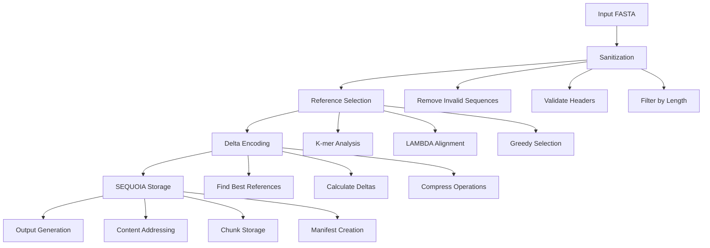

# Reduction Workflow - Complete Guide

This document provides a comprehensive, step-by-step guide to Talaria's database reduction workflow, from input to output.

## Overview

Talaria's reduction workflow transforms large sequence databases into compact, searchable representations while maintaining the ability to reconstruct original sequences. The process leverages SEQUOIA (Sequence Query Optimization with Indexed Architecture) for efficient storage and LAMBDA for accurate alignment-based selection.

## Architecture Overview



## Environment Setup

Before starting, ensure proper environment configuration:

```bash
# Set Talaria home directory (defaults to $HOME/.talaria)
export TALARIA_HOME="/path/to/talaria/home"

# Optional: Configure workspace preservation for debugging
export TALARIA_PRESERVE_ON_FAILURE=1  # Keep workspace on errors
export TALARIA_LAMBDA_VERBOSE=1       # Show detailed LAMBDA output

# Performance tuning
export TALARIA_THREADS=16             # Number of parallel threads
```

## Step-by-Step Reduction Process

### Step 1: Initialize Workspace

When reduction begins, Talaria creates a structured temporary workspace. The location is configurable via the `TALARIA_WORKSPACE_DIR` environment variable (default: `/tmp/talaria`):

```bash
# Configure custom workspace location (optional)
export TALARIA_WORKSPACE_DIR=/fast/ssd/talaria  # Use fast SSD
# or
export TALARIA_WORKSPACE_DIR=/scratch/talaria   # Use scratch space on HPC
```

Workspace structure:
```
${TALARIA_WORKSPACE_DIR}/{timestamp}_{uuid}/    # Default: /tmp/talaria/{timestamp}_{uuid}/
├── input/                 # Original input files
├── sanitized/            # Cleaned sequences
├── reference_selection/  # Selection process files
├── alignments/           # LAMBDA alignment data
│   ├── iterations/       # Per-iteration results
│   ├── indices/         # LAMBDA indices
│   └── temp/           # Temporary alignment files
├── output/              # Final output files
├── logs/               # Process logs
└── metadata/           # Workspace metadata
```

**Code Location**: `src/utils/temp_workspace.rs`

### Step 2: Input Sanitization

The sanitization phase ensures input data quality:

1. **Load sequences** from input FASTA
2. **Validate headers** - Remove invalid characters
3. **Filter sequences** by minimum length (default: 50bp)
4. **Remove duplicates** based on sequence content
5. **Handle special characters** in sequences

**Example**:
```rust
// From src/core/reducer.rs
let sanitized = sequences.into_iter()
    .filter(|seq| seq.len() >= min_length)
    .filter(|seq| is_valid_sequence(seq))
    .collect();
```

**Output**: Sanitized sequences in `workspace/sanitized/sanitized.fasta`

### Step 3: Reference Selection

This is the core of the reduction process, using intelligent algorithms to select representative sequences.

#### 3.1 K-mer Analysis (Preparation)

```rust
// Generate k-mer profiles for all sequences
let kmer_size = 5;
let kmer_profiles = sequences.par_iter()
    .map(|seq| generate_kmer_profile(seq, kmer_size))
    .collect();
```

#### 3.2 LAMBDA Alignment (If Available)

When LAMBDA is installed, Talaria uses it for accurate similarity scoring:

```bash
# Build LAMBDA index
lambda3 mkindexp -d ${workspace}/indices/lambda_index -i ${workspace}/sanitized/sanitized.fasta

# Perform all-vs-all search
lambda3 searchp \
    -q ${workspace}/sanitized/sanitized.fasta \
    -d ${workspace}/indices/lambda_index \
    -o ${workspace}/alignments/results.m8
```

**Progress Tracking**: Instead of verbose LAMBDA output, users see structured progress:
```
[====================] 100% | Selected 50000/150000 references | Coverage: 95.2%
```

#### 3.3 Greedy Selection Algorithm

The selection process iteratively chooses references that maximize coverage:

```rust
// Pseudocode from src/core/reference_selector.rs
while coverage < target_coverage && references.len() < max_references {
    // Find sequence that covers most uncovered sequences
    let best = find_best_candidate(&remaining_sequences, &current_references);

    // Add to references
    references.push(best);

    // Update coverage
    coverage = calculate_coverage(&references, &all_sequences);

    // Update progress
    progress.update(references.len(), coverage);
}
```

**Key Metrics**:
- **Coverage**: Percentage of sequences within similarity threshold of a reference
- **Redundancy**: Overlap between selected references
- **Diversity**: Taxonomic/functional representation

### Step 4: Delta Encoding

Non-reference sequences are encoded as differences from their closest references:

#### 4.1 Reference Assignment

```rust
// For each non-reference sequence
for sequence in non_references {
    // Find best matching reference
    let (best_ref, similarity) = find_best_reference(&sequence, &references);

    if similarity >= threshold {
        // Encode as delta
        let delta = calculate_delta(&sequence, &best_ref);
        deltas.push(delta);
    } else {
        // Too different - keep as reference
        additional_references.push(sequence);
    }
}
```

#### 4.2 Delta Operations

Deltas are encoded as edit operations:

```rust
pub enum DeltaOp {
    Insert { position: usize, sequence: String },
    Delete { position: usize, length: usize },
    Replace { position: usize, old: String, new: String },
}
```

**Example Delta**:
```json
{
  "reference_id": "sp|P12345|PROT_HUMAN",
  "operations": [
    {"type": "replace", "pos": 42, "old": "ACGT", "new": "TGCA"},
    {"type": "insert", "pos": 156, "seq": "GGG"},
    {"type": "delete", "pos": 203, "len": 5}
  ],
  "similarity": 0.95
}
```

### Step 5: SEQUOIA Storage

The Sequence Query Optimization with Indexed Architecture stores data efficiently:

#### 5.1 Chunk Creation

```rust
// Group sequences by taxonomy for better compression
let chunks = TaxonomicChunker::new()
    .chunk_sequences(sequences)?;

// Store each chunk with content addressing
for chunk in chunks {
    let compressed = compress_chunk(&chunk)?;
    let hash = calculate_sha256(&compressed);
    storage.store_chunk(hash, compressed)?;
}
```

#### 5.2 Manifest Generation

```json
{
  "version": "1.0.0",
  "created": "2024-03-15T10:30:00Z",
  "source": "uniprot",
  "dataset": "swissprot",
  "statistics": {
    "total_sequences": 565928,
    "reference_sequences": 169778,
    "delta_sequences": 396150,
    "compression_ratio": 0.7
  },
  "chunks": [
    {
      "hash": "sha256:abcd1234...",
      "type": "reference",
      "taxonomy": "bacteria",
      "sequences": 50000
    }
  ],
  "merkle_root": "sha256:root1234..."
}
```

### Step 6: Output Generation

Finally, Talaria produces the reduced database and metadata:

#### 6.1 For Database Reductions (from SEQUOIA)
When reducing a database from the repository (e.g., `talaria reduce custom/cholera`):
- **Profile Storage**: Reduction is stored as a profile in `${TALARIA_HOME}/databases/profiles/`
- **No New Database**: Does NOT create a separate database entry
- **Association**: Profile is associated with the original database

```bash
# Example: After reducing custom/cholera
${TALARIA_HOME}/databases/
├── profiles/
│   └── auto-detect          # Hash reference to reduction manifest
├── manifests/
│   └── custom-cholera.json  # Original database (unchanged)
└── chunks/                  # Shared chunk storage
```

#### 6.2 For File-based Reductions
When reducing a standalone FASTA file with `-o` option:

##### Reference FASTA
```bash
# Output location: specified output file
>sp|P12345|PROT_HUMAN Human protein
MKTIIALSYIFCLVFADYKDDDDK...
>sp|Q67890|PROT_MOUSE Mouse protein
MKTIIALSYIFCLVFADYKDDDDK...
```

##### Delta File
```bash
# Automatically generated: output.deltas.tal
{
  "version": "1.0",
  "reference_file": "output.fasta",
  "deltas": [...],
  "metadata": {
    "workspace_id": "20240315_123456_uuid",
    "preserved": false
  }
}
```

#### 6.3 Statistics Report
```
Reduction Statistics:
━━━━━━━━━━━━━━━━━━━━━━━━━━━━━━━━━━━━━━
Input sequences:        565,928
Reference sequences:    169,778 (30.0%)
Delta sequences:       396,150 (70.0%)
Compression ratio:     70.0%
Coverage achieved:     95.2%
Processing time:       12m 34s
━━━━━━━━━━━━━━━━━━━━━━━━━━━━━━━━━━━━━━
```

## Workspace Management

### Preservation for Debugging

When errors occur or debugging is needed:

```bash
# Enable preservation
export TALARIA_PRESERVE_ON_FAILURE=1

# Run reduction
talaria reduce -i input.fasta -o output.fasta

# If error occurs, workspace is preserved
Workspace preserved at: ${TALARIA_HOME}/sequoia/preserved/20240315_123456_uuid
To inspect: talaria tools workspace inspect 20240315_123456_uuid
```

### Manual Inspection

```bash
# List all workspaces
talaria tools workspace list

# Inspect specific workspace
talaria tools workspace inspect 20240315_123456_uuid

# Clean old workspaces
talaria tools workspace clean --older-than 7d
```

## Performance Optimization

### Memory Management

```toml
# talaria.toml
[performance]
chunk_size = 10000        # Sequences per chunk
batch_size = 1000        # Alignment batch size
max_align_length = 5000  # Max sequence length for alignment
cache_alignments = true  # Cache alignment results
```

### Parallel Processing

```rust
// Automatic parallelization using Rayon
sequences.par_iter()
    .map(|seq| process_sequence(seq))
    .collect()
```

### Large Dataset Handling

For very large datasets (>1M sequences):

```bash
# Use streaming mode
talaria reduce \
    -i huge_database.fasta \
    -o reduced.fasta \
    --streaming \
    --chunk-size 50000

# Skip delta encoding for speed
talaria reduce \
    -i huge_database.fasta \
    -o reduced.fasta \
    --no-deltas
```

## Troubleshooting

### Common Issues and Solutions

#### 1. Out of Memory
```bash
# Reduce parallelism
export TALARIA_THREADS=4

# Increase chunk size
talaria reduce --chunk-size 5000
```

#### 2. LAMBDA Not Found
```bash
# Install LAMBDA
talaria tools install lambda

# Or use fallback k-mer mode
talaria reduce --no-align-select
```

#### 3. Workspace Errors
```bash
# Check workspace
ls -la ${TALARIA_WORKSPACE_DIR}/
# or if using default
ls -la /tmp/talaria/

# Clean corrupted workspaces
rm -rf ${TALARIA_WORKSPACE_DIR}/*
# or if using default
rm -rf /tmp/talaria/*

# Check disk space
df -h ${TALARIA_HOME}
```

## Integration with Search Tools

### BLAST Integration
```bash
# Create BLAST database from reduced set
makeblastdb -in reduced.fasta -dbtype prot -out reduced_db

# Search with expansion
talaria search \
    --query queries.fasta \
    --db reduced_db \
    --deltas output.deltas.tal \
    --tool blast
```

### DIAMOND Integration
```bash
# Build DIAMOND database
diamond makedb --in reduced.fasta --db reduced

# Search
diamond blastp \
    --db reduced \
    --query queries.fasta \
    --out results.tsv
```

### Kraken Integration
```bash
# Add to Kraken library
kraken2-build \
    --add-to-library reduced.fasta \
    --db kraken_db

# Build database
kraken2-build --build --db kraken_db
```

## Best Practices

1. **Always validate input**: Use `--validate` flag for new datasets
2. **Monitor coverage**: Aim for >90% coverage for general use
3. **Test search sensitivity**: Validate with known queries
4. **Regular updates**: Re-reduce when database grows >20%
5. **Preserve taxonomic diversity**: Use `--taxonomy-aware` for diverse datasets
6. **Document parameters**: Save reduction config for reproducibility

## See Also

- [SEQUOIA Architecture](../sequoia/architecture.md) - Storage system details
- [LAMBDA Workflow](lambda-workflow.md) - LAMBDA-specific optimization
- [Performance Guide](../advanced/performance.md) - Optimization techniques
- [API Reference](../api/cli.md) - Complete CLI documentation