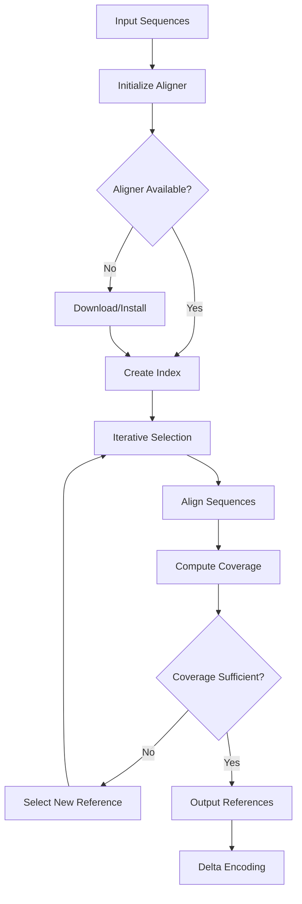

# Talaria Tools Module

## Overview

The `talaria-tools` module provides a comprehensive framework for managing, installing, and interfacing with external bioinformatics alignment tools. This module serves as the bridge between Talaria's sequence reduction algorithms and high-performance alignment tools like LAMBDA, BLAST, DIAMOND, and MMseqs2.

### Key Features

- **Tool Management**: Automated download, installation, and version management
- **Aligner Abstraction**: Unified interface for different alignment tools
- **Parser Framework**: Comprehensive accession parsing for various sequence databases (UniProt, NCBI, PDB, generic)
- **Sequence Optimizers**: Tool-specific sequence optimization for improved alignment performance
- **Batch Processing**: Efficient handling of large sequence datasets
- **Error Recovery**: Robust error handling with workspace preservation
- **Comprehensive Testing**: 140+ tests including unit, integration, and benchmarks

## Architecture

```
talaria-tools/
├── src/
│   ├── aligners/            # Aligner implementations
│   │   ├── lambda/          # LAMBDA aligner integration
│   │   │   ├── mod.rs       # Main LAMBDA aligner implementation
│   │   │   ├── parser.rs    # Accession parsing utilities
│   │   │   └── utils.rs     # LAMBDA-specific utilities
│   │   └── mod.rs           # Aligner module exports
│   ├── manager/             # Tool management
│   │   ├── mod.rs           # Tool manager implementation
│   │   └── installer.rs     # Tool installation logic
│   ├── optimizers/          # Sequence optimization strategies
│   │   ├── mod.rs           # Optimizer module exports
│   │   ├── blast.rs         # BLAST-specific optimizations
│   │   ├── diamond.rs       # DIAMOND-specific optimizations
│   │   ├── generic.rs       # Generic optimization strategies
│   │   ├── kraken.rs        # Kraken-specific optimizations
│   │   ├── lambda.rs        # LAMBDA-specific optimizations
│   │   └── mmseqs2.rs       # MMseqs2-specific optimizations
│   ├── testing/             # Testing utilities
│   │   ├── mod.rs           # Testing module exports
│   │   └── mock.rs          # Mock aligner for testing
│   ├── traits/              # Core trait definitions
│   │   ├── mod.rs           # Trait module exports
│   │   └── aligner.rs       # Aligner trait definitions
│   ├── types.rs             # Common type definitions
│   └── lib.rs               # Module exports
├── tests/                   # Integration tests
│   └── integration_tests.rs # Comprehensive integration tests
├── benches/                 # Benchmark tests
│   └── tools_benchmarks.rs  # Performance benchmarks
└── Cargo.toml               # Package configuration
```

## Core Components

### 1. Aligner Trait System (`traits/`)

The foundation of the module's abstraction layer, providing a unified interface for all alignment tools.

#### Core Traits

```rust
pub trait Aligner: Send + Sync {
    /// Perform sequence alignment search
    fn search(
        &mut self,
        query: &[Sequence],
        reference: &[Sequence],
    ) -> Result<Vec<AlignmentSummary>>;

    /// Get aligner version information
    fn version(&self) -> Result<String>;

    /// Check if the aligner is available
    fn is_available(&self) -> bool;
}

pub trait ConfigurableAligner: Aligner {
    /// Get current configuration
    fn config(&self) -> &AlignmentConfig;

    /// Update configuration
    fn set_config(&mut self, config: AlignmentConfig);
}
```

#### Alignment Results

```rust
pub struct AlignmentSummary {
    pub query_id: String,
    pub reference_id: String,
    pub score: f64,
    pub e_value: f64,
    pub bit_score: f64,
    pub percent_identity: f64,
    pub alignment_length: usize,
    pub query_start: usize,
    pub query_end: usize,
    pub reference_start: usize,
    pub reference_end: usize,
    pub gaps: usize,
    pub mismatches: usize,
}

pub struct AlignmentConfig {
    pub threads: usize,
    pub e_value_threshold: f64,
    pub max_targets: usize,
    pub sensitivity: SensitivityMode,
    pub output_format: OutputFormat,
    pub batch_size: usize,
    pub preserve_on_failure: bool,
}
```

### 2. LAMBDA Aligner (`aligners/lambda/`)

The primary aligner implementation, optimized for protein sequence alignment with Herald integration.

#### Key Features

- **High Performance**: Utilizes LAMBDA's optimized indexing for fast searches
- **Taxonomy Integration**: Supports NCBI taxonomy for taxonomic filtering
- **Batch Processing**: Handles large datasets through intelligent batching
- **Memory Management**: Configurable memory limits and batch sizing
- **Progress Tracking**: Real-time progress monitoring during alignment

#### Implementation Details

```rust
pub struct LambdaAligner {
    workspace: PathBuf,
    config: AlignmentConfig,
    acc_tax_map: Option<PathBuf>,
    tax_dump_dir: Option<PathBuf>,
    batch_enabled: bool,
    batch_size: usize,
    preserve_on_failure: bool,
    failed: AtomicBool,
}
```

#### Workspace Structure

```
${TALARIA_WORKSPACE_DIR}/lambda_{id}/
├── indices/            # LAMBDA index files
│   ├── db.fasta        # Reference sequences
│   ├── db.idx.*        # LAMBDA index files
│   └── acc_tax.tsv     # Accession-taxonomy mapping
├── temp/               # Temporary processing files
│   ├── batch_*.fasta   # Batch query files
│   └── results_*.m8    # Batch results
├── iterations/         # Per-iteration results
│   ├── iter_0/         # First iteration
│   │   ├── query.fasta
│   │   ├── results.m8
│   │   └── stats.json
│   └── iter_N/         # Nth iteration
└── logs/               # Execution logs
    ├── lambda.log
    └── error.log
```

#### Accession Parser Framework

The parser framework handles various sequence database formats:

```rust
pub trait AccessionParser: Send + Sync {
    fn parse_header(&self, header: &str) -> Vec<String>;
    fn parse_accession(&self, text: &str) -> Option<String>;
    fn extract_all_forms(&self, accession: &str) -> Vec<String>;
}

// Implementations
pub struct UniProtParser; // sp|P12345|PROT_HUMAN
pub struct NCBIParser;    // NP_001234.1, XP_567890.2
pub struct PDBParser;     // pdb|1ABC|A
pub struct GenericParser; // Generic patterns

pub struct ComprehensiveAccessionParser {
    parsers: Vec<Box<dyn AccessionParser>>,
}
```

### 3. Tool Manager (`manager/`)

Handles the lifecycle of external bioinformatics tools.

#### Core Functionality

```rust
pub struct ToolManager {
    tools_dir: PathBuf,
    tools: HashMap<Tool, ToolInfo>,
}

pub struct ToolInfo {
    pub name: String,
    pub version: String,
    pub path: PathBuf,
    pub installed: bool,
    pub last_updated: Option<DateTime<Utc>>,
    pub metadata: HashMap<String, String>,
}

impl ToolManager {
    /// Install a specific tool
    pub async fn install(&mut self, tool: Tool) -> Result<()>;

    /// Update an installed tool
    pub async fn update(&mut self, tool: Tool) -> Result<()>;

    /// Remove an installed tool
    pub fn remove(&mut self, tool: Tool) -> Result<()>;

    /// Check if a tool is installed
    pub fn is_installed(&self, tool: Tool) -> bool;

    /// Get tool executable path
    pub fn get_path(&self, tool: Tool) -> Option<PathBuf>;

    /// List all managed tools
    pub fn list(&self) -> Vec<ToolInfo>;
}
```

#### Installation Process

1. **Version Detection**: Query GitHub API for latest release
2. **Download**: Fetch appropriate binary for platform
3. **Verification**: Checksum validation
4. **Installation**: Extract and set permissions
5. **Registration**: Update tool registry

#### Platform Support

```rust
#[cfg(target_os = "linux")]
fn get_platform_suffix() -> &'static str {
    match std::env::consts::ARCH {
        "x86_64" => "linux-x86_64",
        "aarch64" => "linux-aarch64",
        _ => "linux-generic",
    }
}

#[cfg(target_os = "macos")]
fn get_platform_suffix() -> &'static str {
    match std::env::consts::ARCH {
        "x86_64" => "darwin-x86_64",
        "aarch64" => "darwin-aarch64",
        _ => "darwin-universal",
    }
}
```

### 4. Sequence Optimizers (`optimizers/`)

Provides tool-specific sequence optimization strategies to improve alignment performance.

#### Optimizer Implementations

```rust
// BLAST Optimizer - sorts by sequence length for better sensitivity
pub struct BlastOptimizer;

impl BlastOptimizer {
    pub fn optimize_for_blast(&self, sequences: &mut Vec<Sequence>) {
        // Sort by length ascending for BLAST
        sequences.sort_by_key(|s| s.len());
    }
}

// LAMBDA Optimizer - groups by taxonomy for better k-mer locality
pub struct LambdaOptimizer;

impl LambdaOptimizer {
    pub fn optimize_for_lambda(&self, sequences: &mut Vec<Sequence>) {
        // Sort by taxon ID for taxonomic grouping
        sequences.sort_by_key(|s| s.taxon_id.unwrap_or(0));
    }

    pub fn prepare_taxonomy_mapping(&self, sequences: &[Sequence])
        -> Vec<(String, u32)> {
        // Extract taxonomy mappings for alignment
        sequences.iter()
            .filter_map(|s| s.taxon_id.map(|t| (s.id.clone(), t)))
            .collect()
    }
}

// Kraken Optimizer - optimizes for k-mer classification
pub struct KrakenOptimizer;

impl KrakenOptimizer {
    pub fn optimize_for_kraken(&self, sequences: &mut Vec<Sequence>) {
        // Sort by (taxon, length) for k-mer locality
        sequences.sort_by_key(|s| (s.taxon_id.unwrap_or(0), s.len()));
    }
}

// Generic Optimizer - general-purpose optimization
pub struct GenericOptimizer;

impl GenericOptimizer {
    pub fn optimize(&self, sequences: &mut Vec<Sequence>) {
        // Sort by length descending for general use
        sequences.sort_by(|a, b| b.len().cmp(&a.len()));
    }
}
```

### 5. Tool Types (`types.rs`)

Defines the supported tools and their metadata.

```rust
#[derive(Debug, Clone, Copy, PartialEq, Eq, Serialize, Deserialize)]
pub enum Tool {
    Lambda,  // LAMBDA aligner
    Blast,   // NCBI BLAST+
    Diamond, // DIAMOND aligner
    Mmseqs2, // MMseqs2 aligner
}

impl Tool {
    pub fn name(&self) -> &'static str;
    pub fn display_name(&self) -> &'static str;
    pub fn github_repo(&self) -> &'static str;
    pub fn binary_name(&self) -> &'static str;
    pub fn download_url(&self, version: &str) -> String;
    pub fn minimum_version(&self) -> &'static str;
}
```

### 6. Testing Framework (`testing/`)

Provides mock implementations for testing without external dependencies.

```rust
pub struct MockAligner;

impl Aligner for MockAligner {
    fn search(
        &mut self,
        query: &[Sequence],
        reference: &[Sequence],
    ) -> Result<Vec<AlignmentResult>> {
        // Return mock results for testing
        Ok(generate_mock_results(query, reference))
    }
}
```

## Integration with Talaria

### 1. Reference Selection Pipeline

The tools module integrates with Talaria's reference selection algorithm:

```rust
// In talaria-cli/src/core/reference_selector.rs
use talaria_tools::{LambdaAligner, Aligner};

pub struct ReferenceSelector {
    aligner: Box<dyn Aligner>,
    config: SelectionConfig,
}

impl ReferenceSelector {
    pub fn select_references(
        &mut self,
        sequences: &[Sequence],
    ) -> Result<Vec<usize>> {
        // Iterative selection using aligner
        let mut selected = Vec::new();
        let mut remaining = sequences.to_vec();

        while !remaining.is_empty() {
            // Align remaining against selected
            let results = self.aligner.search(&remaining, &selected)?;

            // Select best reference
            let best_ref = self.find_best_reference(&results);
            selected.push(best_ref);

            // Update remaining sequences
            remaining = self.filter_covered(&remaining, &results);
        }

        Ok(selected)
    }
}
```

### 2. Reduction Workflow



### 3. Configuration

Tools are configured through environment variables and configuration files:

```toml
# ~/.talaria/config.toml
[tools]
directory = "/home/user/.talaria/tools"
auto_update = true
update_check_interval = 86400  # seconds

[tools.lambda]
version = "3.0.0"
threads = 8
memory_limit = "16G"
batch_size = 100000
preserve_workspace = false

[tools.blast]
version = "2.14.0"
threads = 4
e_value = 0.001
max_targets = 500

[tools.diamond]
version = "2.1.8"
sensitivity = "sensitive"
threads = 8
block_size = 2.0
```

## Usage Examples

### Basic Tool Installation

```rust
use talaria_tools::{ToolManager, Tool};

#[tokio::main]
async fn main() -> Result<()> {
    let mut manager = ToolManager::new()?;

    // Install LAMBDA
    manager.install(Tool::Lambda).await?;

    // Check installation
    if manager.is_installed(Tool::Lambda) {
        let path = manager.get_path(Tool::Lambda).unwrap();
        println!("LAMBDA installed at: {:?}", path);
    }

    Ok(())
}
```

### Sequence Alignment

```rust
use talaria_tools::{LambdaAligner, Aligner, AlignmentConfig};
use talaria_bio::sequence::Sequence;

fn align_sequences(
    queries: Vec<Sequence>,
    references: Vec<Sequence>,
) -> Result<Vec<AlignmentResult>> {
    let config = AlignmentConfig {
        threads: 8,
        e_value_threshold: 0.001,
        max_targets: 100,
        batch_size: 50000,
        ..Default::default()
    };

    let mut aligner = LambdaAligner::new(config)?;
    aligner.search(&queries, &references)
}
```

### Custom Aligner Implementation

```rust
use talaria_tools::traits::{Aligner, AlignmentResult};

struct CustomAligner {
    // Custom fields
}

impl Aligner for CustomAligner {
    fn search(
        &mut self,
        query: &[Sequence],
        reference: &[Sequence],
    ) -> Result<Vec<AlignmentResult>> {
        // Custom alignment logic
        todo!()
    }

    fn version(&self) -> Result<String> {
        Ok("Custom Aligner v1.0.0".to_string())
    }

    fn is_available(&self) -> bool {
        // Check if custom aligner is available
        true
    }
}
```

### Batch Processing

```rust
use talaria_tools::LambdaAligner;

fn process_large_dataset(
    sequences: Vec<Sequence>,
    references: Vec<Sequence>,
) -> Result<()> {
    let mut aligner = LambdaAligner::builder()
        .batch_enabled(true)
        .batch_size(100_000_000) // 100M amino acids per batch
        .threads(16)
        .preserve_on_failure(true)
        .build()?;

    // Process in batches automatically
    let results = aligner.search(&sequences, &references)?;

    println!("Processed {} alignments", results.len());
    Ok(())
}
```

## Performance Optimization

### 1. Index Caching

LAMBDA indices are cached to avoid rebuilding:

```rust
fn get_or_create_index(
    reference: &[Sequence],
    cache_dir: &Path,
) -> Result<PathBuf> {
    let hash = compute_hash(reference);
    let index_path = cache_dir.join(format!("index_{}.idx", hash));

    if index_path.exists() {
        // Use cached index
        Ok(index_path)
    } else {
        // Build new index
        build_lambda_index(reference, &index_path)?;
        Ok(index_path)
    }
}
```

### 2. Memory Management

```rust
impl LambdaAligner {
    fn estimate_memory_usage(&self, sequences: &[Sequence]) -> usize {
        let seq_memory = sequences.iter()
            .map(|s| s.sequence.len())
            .sum::<usize>();

        let index_memory = self.estimate_index_memory();
        let working_memory = seq_memory * 4; // Estimate

        seq_memory + index_memory + working_memory
    }

    fn adjust_batch_size(&mut self, available_memory: usize) {
        let estimated = self.estimate_memory_usage(&self.current_batch);
        if estimated > available_memory {
            self.config.batch_size /= 2;
        }
    }
}
```

### 3. Parallel Processing

```rust
use rayon::prelude::*;

fn parallel_alignment(
    queries: Vec<Sequence>,
    references: Vec<Sequence>,
    num_threads: usize,
) -> Result<Vec<AlignmentResult>> {
    let chunk_size = queries.len() / num_threads;

    queries
        .par_chunks(chunk_size)
        .map(|chunk| {
            let mut aligner = LambdaAligner::new(config)?;
            aligner.search(chunk, &references)
        })
        .collect::<Result<Vec<_>>>()?
        .into_iter()
        .flatten()
        .collect()
}
```

## Error Handling

### Workspace Preservation

```rust
impl Drop for LambdaAligner {
    fn drop(&mut self) {
        if self.preserve_on_failure && self.failed.load(Ordering::Relaxed) {
            eprintln!("Preserving workspace at: {:?}", self.workspace);
        } else {
            let _ = std::fs::remove_dir_all(&self.workspace);
        }
    }
}
```

### Error Recovery

```rust
pub enum AlignmentError {
    ToolNotFound(Tool),
    IndexCreationFailed(String),
    AlignmentFailed(String),
    ParseError(String),
    IoError(std::io::Error),
    MemoryExceeded(usize),
}

impl LambdaAligner {
    fn recover_from_error(&mut self, error: &AlignmentError) -> Result<()> {
        match error {
            AlignmentError::MemoryExceeded(required) => {
                // Reduce batch size and retry
                self.config.batch_size /= 2;
                Ok(())
            }
            AlignmentError::IndexCreationFailed(_) => {
                // Clear cache and rebuild
                self.clear_index_cache()?;
                Ok(())
            }
            _ => Err(error.clone().into()),
        }
    }
}
```

## Testing

The talaria-tools module includes comprehensive testing coverage with 140+ tests:

### Test Categories

- **Unit Tests (127 tests)**: Located in `src/` files
  - `aligners/lambda/mod.rs`: 20 tests for LAMBDA aligner functionality
  - `aligners/lambda/parser.rs`: 35 tests for accession parsing
  - `manager/installer.rs`: 22 tests for tool management
  - `traits/aligner.rs`: 25 tests for alignment traits
  - `optimizers/*.rs`: 30 tests for sequence optimizers

- **Integration Tests (13 tests)**: Located in `tests/integration_tests.rs`
  - End-to-end workflow testing
  - Cross-component integration
  - Error handling scenarios

- **Benchmarks**: Located in `benches/tools_benchmarks.rs`
  - Sequence optimization performance
  - Taxonomy mapping efficiency
  - Critical path workflows

### Running Tests

```bash
# Run all tests
cargo test

# Run specific test module
cargo test --lib aligners::lambda::tests

# Run integration tests only
cargo test --test integration_tests

# Run with output for debugging
cargo test -- --nocapture

# Run benchmarks
cargo bench
```

### Unit Test Examples

```rust
#[cfg(test)]
mod tests {
    use super::*;

    #[test]
    fn test_lambda_optimizer_sorts_by_taxon() {
        let optimizer = LambdaOptimizer::new();
        let mut sequences = create_test_sequences();

        optimizer.optimize_for_lambda(&mut sequences);

        // Verify sorted by taxon
        for i in 1..sequences.len() {
            let prev_taxon = sequences[i-1].taxon_id.unwrap_or(0);
            let curr_taxon = sequences[i].taxon_id.unwrap_or(0);
            assert!(prev_taxon <= curr_taxon);
        }
    }

    #[test]
    fn test_uniprot_parser_handles_edge_cases() {
        let parser = UniProtParser;

        // Test various UniProt formats
        assert_eq!(
            parser.parse_accession("sp|P12345|PROT_HUMAN"),
            Some("P12345".to_string())
        );

        assert_eq!(
            parser.parse_accession("tr|A0A000|A0A000_HUMAN"),
            Some("A0A000".to_string())
        );
    }

    #[test]
    fn test_tool_manager_version_comparison() {
        let manager = ToolManager::new().unwrap();

        assert_eq!(
            manager.compare_versions("1.2.3", "1.2.4"),
            Ordering::Less
        );

        assert_eq!(
            manager.compare_versions("2.0.0", "1.9.9"),
            Ordering::Greater
        );
    }
}
```

### Integration Test Examples

```rust
#[test]
fn test_optimizer_workflow_integration() {
    // Test complete optimization workflow
    let mut sequences = create_diverse_sequences();
    let original_count = sequences.len();

    // Apply lambda optimization
    let lambda_opt = LambdaOptimizer::new();
    lambda_opt.optimize_for_lambda(&mut sequences);

    // Extract taxonomy mapping
    let mapping = lambda_opt.prepare_taxonomy_mapping(&sequences);

    // Verify integrity
    assert_eq!(sequences.len(), original_count);
    assert!(!mapping.is_empty());
}

#[test]
fn test_tool_manager_workflow() {
    let temp_dir = TempDir::new().unwrap();
    let manager = ToolManager::with_directory(temp_dir.path());

    // Test tool directory creation
    let lambda_dir = manager.tool_dir(Tool::Lambda);
    assert!(lambda_dir.to_str().unwrap().contains("lambda"));

    // Test version management
    assert_eq!(
        manager.compare_versions("1.0.0", "2.0.0"),
        Ordering::Less
    );
}

#[test]
fn test_large_dataset_optimization() {
    // Test with 1000 sequences
    let mut sequences = (0..1000)
        .map(|i| {
            let seq = vec![b'A'; (i % 100) + 1];
            Sequence::new(format!("seq_{}", i), seq)
                .with_taxon((i % 10) as u32)
        })
        .collect::<Vec<_>>();

    // Apply all optimizers
    BlastOptimizer::new().optimize_for_blast(&mut sequences);
    assert_eq!(sequences.len(), 1000);

    LambdaOptimizer::new().optimize_for_lambda(&mut sequences);
    assert_eq!(sequences.len(), 1000);

    KrakenOptimizer::new().optimize_for_kraken(&mut sequences);
    assert_eq!(sequences.len(), 1000);
}
```

### Benchmark Examples

```rust
use criterion::{black_box, criterion_group, criterion_main, Criterion};

fn bench_sequence_optimization(c: &mut Criterion) {
    let mut group = c.benchmark_group("sequence_optimization");

    for size in [100, 1000, 10000] {
        let sequences = create_test_sequences(size);

        group.bench_with_input(
            BenchmarkId::new("blast_optimizer", size),
            &sequences,
            |b, seqs| {
                let optimizer = BlastOptimizer::new();
                b.iter(|| {
                    let mut s = seqs.clone();
                    optimizer.optimize_for_blast(black_box(&mut s))
                })
            }
        );

        group.bench_with_input(
            BenchmarkId::new("lambda_optimizer", size),
            &sequences,
            |b, seqs| {
                let optimizer = LambdaOptimizer::new();
                b.iter(|| {
                    let mut s = seqs.clone();
                    optimizer.optimize_for_lambda(black_box(&mut s))
                })
            }
        );
    }

    group.finish();
}

fn bench_critical_workflows(c: &mut Criterion) {
    let mut group = c.benchmark_group("critical_workflows");

    group.bench_function("multistage_optimization", |b| {
        let sequences = create_test_sequences(500);

        b.iter(|| {
            let mut seqs = sequences.clone();

            // Stage 1: Generic optimization
            GenericOptimizer::new().optimize(black_box(&mut seqs));

            // Stage 2: Tool-specific optimization
            LambdaOptimizer::new().optimize_for_lambda(black_box(&mut seqs));

            // Stage 3: Extract metadata
            let mapping = LambdaOptimizer::new()
                .prepare_taxonomy_mapping(&seqs);

            black_box(mapping);
        })
    });

    group.finish();
}

criterion_group!(benches, bench_sequence_optimization, bench_critical_workflows);
criterion_main!(benches);
```

## Troubleshooting

### Common Issues

1. **Tool Not Found**
   ```
   Error: Tool 'lambda' not found
   Solution: Run 'talaria tools install lambda'
   ```

2. **Memory Exceeded**
   ```
   Error: Memory limit exceeded during alignment
   Solution: Reduce batch size or increase memory limit
   ```

3. **Index Creation Failed**
   ```
   Error: Failed to create LAMBDA index
   Solution: Check disk space and permissions
   ```

### Debug Mode

Enable detailed logging:

```bash
export TALARIA_LOG=trace
export TALARIA_LAMBDA_VERBOSE=1
export TALARIA_PRESERVE_ON_FAILURE=1
```

### Performance Tuning

```toml
# Optimize for speed
[tools.lambda]
threads = 32
batch_size = 500_000_000
sensitivity = "fast"

# Optimize for sensitivity
[tools.lambda]
threads = 16
batch_size = 50_000_000
sensitivity = "very-sensitive"
```

## API Reference

### Core Types

- `Tool`: Enumeration of supported tools
- `ToolInfo`: Tool metadata and status
- `AlignmentResult`: Alignment search result
- `AlignmentConfig`: Alignment configuration
- `AlignmentError`: Error types

### Traits

- `Aligner`: Core aligner interface
- `ConfigurableAligner`: Extended configuration interface
- `AccessionParser`: Sequence header parsing

### Implementations

- `LambdaAligner`: LAMBDA aligner implementation
- `MockAligner`: Mock aligner for testing
- `ToolManager`: Tool lifecycle management

## Contributing

### Adding New Components

#### New Aligners
1. Implement the `Aligner` trait in `src/aligners/`
2. Add tool definition to `types.rs`
3. Update `ToolManager` for installation
4. Add comprehensive tests (unit + integration)
5. Add benchmarks for critical paths

#### New Optimizers
1. Create optimizer struct in `src/optimizers/`
2. Implement optimization logic for specific tool
3. Add unit tests with various scenarios
4. Benchmark against other optimizers

#### Parser Extensions
1. Implement `AccessionParser` trait
2. Add to `ComprehensiveAccessionParser`
3. Add test cases for edge cases and formats
4. Test with real-world headers

## Dependencies

- `anyhow`: Error handling
- `serde`: Serialization
- `tokio`: Async runtime
- `reqwest`: HTTP client for downloads
- `tempfile`: Temporary file management
- `rayon`: Parallel processing
- `regex`: Pattern matching
- `chrono`: Date/time handling

## License

Part of the Talaria project. See main repository for license information.

## See Also

- [Talaria CLI Documentation](../talaria-cli/README.md)
- [Talaria Herald Documentation](../talaria-herald/README.md)
- [Talaria Bio Documentation](../talaria-bio/README.md)
- [LAMBDA Aligner](https://github.com/seqan/lambda)
- [NCBI BLAST+](https://blast.ncbi.nlm.nih.gov/)
- [DIAMOND](https://github.com/bbuchfink/diamond)
- [MMseqs2](https://github.com/soedinglab/MMseqs2)
